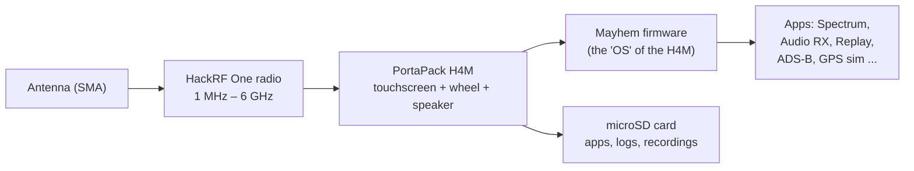
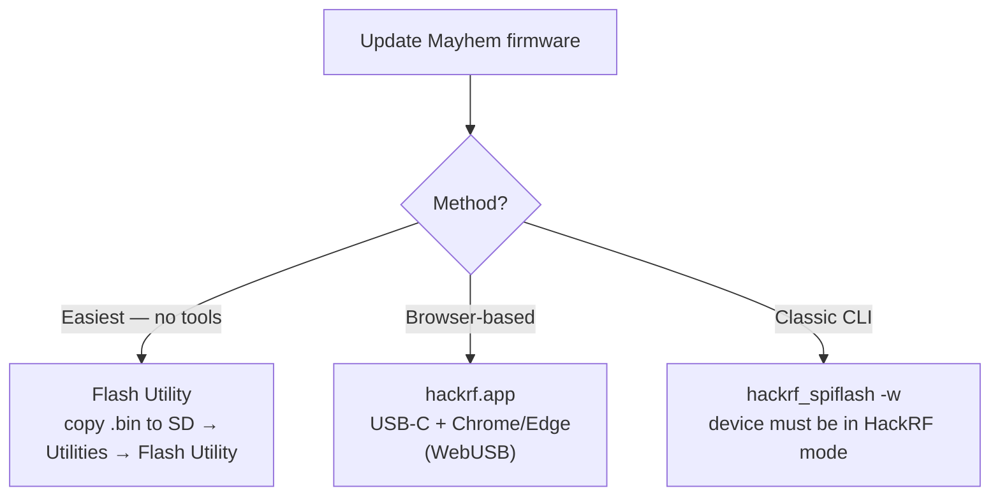

# SDRLab H4M（HackRF PortaPack）——完整指南

> **一句话**：H4M 是 HackRF One 的现行 PortaPack——一个 3.2″ 触摸屏外壳，把 1 MHz–6 GHz 的 SDR 收发信机变成一台**独立的手持无线电实验室**，靠电池运行，无需连接电脑。Mayhem 固件把它变成音频接收机、频谱分析仪、信号记录器等等。

## 包装内容

| 物品 | 典型内容 |
|---|---|
| PortaPack H4M | 扩展外壳，带 3.2″ 磨砂触摸屏、旋轮、扬声器、麦克风 |
| HackRF One（或 R10C） | H4M 所搭载的 SDR 板卡 |
| 天线 | 宽带伸缩天线（40–6000 MHz）+ 频段专用天线（5dBi、12dBi、8dBi、35dBi 变体） |
| 线缆 | USB-C 线缆、SMA 公对公 |
| 附加件（视套装而定） | 20 dB 功率放大器、电池、外壳 |

## 规格速览

### HackRF One（无线电核心）

| 项目 | 规格 |
|---|---|
| 频率范围 | 1 MHz – 6 GHz |
| 工作模式 | 半双工收发信机 |
| 采样率 | 2 – 20 Msps（正交） |
| 分辨率 | 8 位 I / 8 位 Q |
| 接口 | 高速 USB（H4M 套装为 USB-C） |
| 天线端口 | SMA 母头，50 Ω |
| 天线端口供电 | 软件控制，最大 50 mA @ 3.0–3.3 V |
| 最大 RX 输入 | -5 dBm（超过可能永久损坏设备！） |
| 最大 TX 输出 | +10 dBm（10 mW）；典型 0 至 +5 dBm |
| 时钟 | CLK IN / CLK OUT 用于同步 |

### PortaPack H4M（外壳）

| 项目 | 规格 |
|---|---|
| 显示屏 | 3.2″ 240×320 磨砂 LCD 触摸屏 |
| 控制 | 方向键、360° 旋轮（平面设计）、选择按钮、电源按钮 |
| 音频 | 内置扬声器、内置麦克风（拨动开关）、3.5 mm 耳机/麦克风插孔 |
| 存储 | microSD 卡槽（应用、日志、录音必需） |
| 电池 | 2500 mAh 可充电，带管理 IC 和状态显示 |
| 充电 | USB-C，带真正的开/关开关 |
| 扩展 | GPIO 端口（支持 I2C），用于 GPS 接收机等附加件 |
| 外壳 | 透明 ABS 注塑外壳 |

### H4M 相比老款 H2 的新特性

改用 USB-C 而非 Micro-USB、真正的开/关开关、内置扬声器 + 麦克风并自动切换、支持 I2C 的 GPIO 端口、固件中显示电池信息，以及更扁平的设计。

## 概念：H4M 如何工作



HackRF 负责数字化频谱；PortaPack 提供人机界面；Mayhem 固件提供应用。不需要 PC——H4M 就是整个实验室。

## Mayhem 固件 {#mayhem-firmware}

H4M 运行开源的 **Mayhem 固件**（[portapack-mayhem/mayhem-firmware](https://github.com/portapack-mayhem/mayhem-firmware)），这是 PortaPack 软件的社区延续，包含数百个应用：频谱分析仪、音频接收/发射机、信号记录与重放、ADS-B、APRS、GPS 模拟器等。

### 第 1 步——准备 microSD 卡

1. 将一张 microSD 卡（16 GB 很充裕）格式化为 **FAT32**。
2. 从 [Mayhem 发布页](https://github.com/portapack-mayhem/mayhem-firmware/releases) 下载与你将要刷写的版本匹配的 `COPY_TO_SDCARD` 压缩包。
3. 解压到卡根目录。这一步会把应用、地图和资源放到卡上。

### 第 2 步——更新固件（三种方式）



**方式 A——Flash Utility（推荐）：**
1. 把发布包中的 `FIRMWARE_mayhem_*.bin` 复制到 microSD 卡根目录。
2. 插入卡片，给 H4M 开机。
3. `Utilities → Flash Utility` → 选择文件 → 确认。设备自动重启。

**方式 B——hackrf.app：** 连接 USB-C（数据线），在支持 WebUSB 的浏览器中打开 [https://hackrf.app/](https://hackrf.app/)，点击 *Connect Device*，选择你的 PortaPack，让它刷写。

**方式 C——经典 CLI（Linux/macOS）：**

```bash
sudo apt install hackrf          # Debian/Ubuntu/Kali; brew install hackrf on macOS
hackrf_info                      # confirm the board is seen
hackrf_spiflash -w portapack-h1_h2-mayhem.bin
```

`hackrf_info` 的预期输出：

```
Found HackRF board.
Board ID Number: 2 (HackRF One)
Firmware Version: git-... (API:1.02)
```

> ⚠️ 在 HackRF 模式下，H4M 就是一台普通 HackRF——PortaPack 界面被绕过。请让 `COPY_TO_SDCARD` 的内容与固件版本保持同步。

## 快速入门——聆听世界

1. 给电池充电（USB-C），直到指示灯显示充满。
2. 插入准备好的 microSD 卡。
3. 在 SMA 端口上接一根合适的天线。
4. 拨动电源开关。Mayhem 菜单出现。
5. 打开 **Audio RX**（或 **FM Broadcast RX**），调谐到本地 FM 电台（88–108 MHz）。调整增益；声音从内置扬声器传出。

### 命令行频谱检查（作为普通 HackRF）

```bash
hackrf_transfer -s 8M -f 100M -g 20 -r /dev/null
```

如果设备无错误地持续传输，说明无线电核心是健康的。

## 示例项目——你身边的频谱

1. **Spectrum Analyzer** 应用 → 扫描 88–108 MHz：你应该看到 FM 广播频段呈现为几个明亮的峰值。
2. 在瀑布图上调谐中心频率，用 **Audio RX** → FM 记下电台呼号。
3. 试试 1090 MHz（ADS-B）：安装 ADS-B 应用，观看飞机位置实时流入。

## 兼容性

| 平台 | 支持 | 说明 |
|---|---|---|
| 独立使用（PortaPack） | ✅ | 全部意义所在——无需 PC |
| Linux / macOS（作为 HackRF） | ✅ | `hackrf` 工具、GQRX、带 ExtIO 的 SDR# |
| Windows（作为 HackRF） | ✅ | 带 HackRF 源的 SDR# / SDR++ |
| PortaPack 的 SDR 软件 | ✅ | Mayhem 生态应用 |

## 负责任使用说明

H4M 是一台**收发信机**：配上合适的天线，它可以在业余频段及更广范围内发射。各国无线电法规各不相同——无证发射，或在未经授权的频率上发射，可能违法，并可能干扰关键服务（航空、应急）。非常适合*收听*和实验室实验；按下 TX 之前请三思。

## 故障排查

| 问题 | 原因 | 修复 |
|---|---|---|
| 无法开机 | 电池没电 / 卡在某种模式 | 充电 10 分钟以上；按住电源按钮；尝试 USB-C 接电脑 |
| 应用丢失 | microSD 缺失或过期 | 把匹配的 `COPY_TO_SDCARD` 解压到 FAT32 卡 |
| 没有声音 | 输出错误 / 增益 | 拔掉耳机重新路由到扬声器；调高增益；检查模式（FM 用 WFM） |
| 电脑看不到 HackRF | 不在 HackRF 模式 | 在 UI 中切换到 HackRF 模式后再用 USB 工具 |
| 到处是噪声底 | 没有天线 / 过载 | 接天线；降低增益；最大 RX 输入为 -5 dBm |

更多帮助：[SDRLAB 故障排查中心](/sdrlab/troubleshooting/)。

## 相关

- [SDR 软件](/sdrlab/sdr-software/) — HackRF 工具、GQRX 和 SatDump。
- [固件与驱动程序](/sdrlab/firmware/) — Mayhem 更新流程详解。
- [SDRLAB 快速入门](/sdrlab/quickstart/) — 前 30 分钟检查清单。