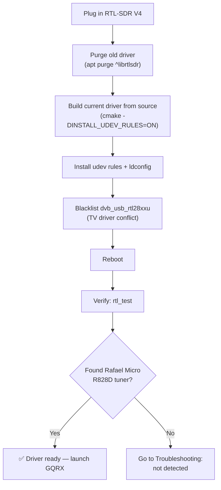

# RTL-SDR Blog V4——完整指南

> **一句话**：RTL-SDR Blog V4 是终极的 USB SDR 接收棒——对传奇 RTL2832U 设计的精炼之作，覆盖 **500 kHz 至 1.766 GHz**，内置 HF 上变频器和铝制外壳。它是学生完美的第一款 SDR：便宜、耐用，背后还有庞大的社区。

## 规格速览

| 项目 | 规格 |
|---|---|
| 解调器 / ADC | RTL2832U（8 位） |
| 调谐器芯片 | Rafael Micro R828D（三路输入，28.8 MHz HF 本振） |
| 频率范围 | 500 kHz – 1.766 GHz |
| 带宽 | 2.56 MHz 稳定（最高 3.2 MHz，会有丢包） |
| HF 实现 | 内置上变频器，带 28.8 MHz 本地振荡器（不再有直接采样混叠） |
| 输入滤波 | 三工器：HF（0–28.8 MHz）/ VHF（28.8–250 MHz）/ UHF（250 MHz–1.766 GHz）+ 可切换陷波滤波器 |
| 输入接口 | 1× SMA（50 Ω） |
| USB 接口 | USB-A 公头，USB 总线供电 |
| 电流消耗 | 典型 250–270 mA |
| 参考时钟 | 1 PPM TCXO |
| 偏置三通 | 4.5 V，180 mA（软件可切换） |
| 外壳 | 铝制，带导热垫 |
| 发射 | 无（仅接收） |

## V4 与老式接收棒有何不同

把 V4 想成"SDR 优化"的改版。老式 RTL-SDR 是为无线电破解而改造的 DVB-T 电视棒；V4 则是从头为 SDR 用户重新设计的：

1. **不再有 HF 混叠乱象。** 老式接收棒在约 24 MHz 以下使用直接采样，会把频谱折叠在 14.4 MHz 附近，让 HF 接收令人抓狂。V4 内置真正的**上变频器**（28.8 MHz 本振），把 HF 信号搬移到调谐器能妥善处理的位置。驱动会自动完成频率换算——你正常调谐即可。
2. **带三路可切换输入的三工器。** R828D 调谐器有三个 RF 输入；V4 按频段（HF / VHF / UHF）拆分它们，这样强广播 FM 电台就无法淹没你的 HF 或 UHF 接收。
3. **可切换陷波滤波器**，针对已知问题频段（AM/FM 广播、VHF 寻呼/数字频段）——同样由最新驱动自动处理。

## Linux 安装 {#linux-install}

V4 需要**最新**驱动：发行版自带的软件包有时早于 R828D 支持。以下步骤安装带 udev 规则的最新开源 Osmocom 驱动（之后运行 SDR 应用无需 root）。



### 第 1 步——移除旧驱动

```bash
sudo apt purge ^librtlsdr
sudo rm -rvf /usr/lib/librtlsdr* /usr/include/rtl-sdr* /usr/local/lib/librtlsdr* /usr/local/include/rtl-sdr* /usr/local/include/rtl_* /usr/local/bin/rtl_*
```

预期：一列被删除的文件，最后回到 shell 提示符（关于缺失文件的报错是正常的）。

### 第 2 步——编译并安装最新驱动

```bash
sudo apt-get install libusb-1.0-0-dev git cmake pkg-config build-essential
git clone https://github.com/osmocom/rtl-sdr
cd rtl-sdr
mkdir build && cd build
cmake ../ -DINSTALL_UDEV_RULES=ON
make
sudo make install
sudo cp ../rtl-sdr.rules /etc/udev/rules.d/
sudo ldconfig
```

预期输出以如下内容结尾：

```
[ 50%] Built target rtl_sdr ...
[100%] Built target rtl_fm ...
-- Install configuration: "Release"
```

### 第 3 步——屏蔽电视驱动并重启

```bash
echo 'blacklist dvb_usb_rtl28xxu' | sudo tee --append /etc/modprobe.d/blacklist-dvb_usb_rtl28xxu.conf
sudo reboot
```

### 第 4 步——验证

```bash
rtl_test
```

预期输出：

```
Found 1 device(s):
  0:  Realtek, RTL2838UHIDIR, SN: 00000001

Using device 0: Generic RTL2832U OEM
Detached kernel driver
Found Rafael Micro R828D tuner
Supported gain values (29): 0.0 0.9 1.4 2.7 ...
[R82XX] PLL not locked!
Sampling at 2048000 S/s.
```

`Found Rafael Micro R828D tuner` 这一行就是你的"V4 已识别"徽章。

> **Windows**：安装 [SDR#](https://airspy.com/download/)（或 SDR++ / SDR Console）——它们自带 V4 就绪的驱动；直接启动并选择 RTL-SDR 源即可。

## 快速入门——三下点击听到 FM

1. 启动 GQRX（见 [SDR 软件指南](/sdrlab/sdr-software/#linux-install-gqrx-recommended-starting-point)）。
2. 点击 **▶**。瀑布图应该开始流动。
3. 调谐到本地 FM 电台（88–108 MHz），选择 **WFM**，取消静音。完成——这就是你的第一个 SDR 信号。

### 命令行健全性测试（音频）

```bash
sudo apt install sox
rtl_fm -f 97.3M -M wbfm -s 200k | play -t raw -r 200k -e signed -b 16 -c 1 -V1 -
```

把 `97.3M` 换成你当地的电台。听到音乐 = 整条链路都正常。

## 使用偏置三通（为有源天线供电）

V4 可以通过天线同轴线为 LNA、有源天线和 GPS/ADS-B 放大器提供 4.5 V / 180 mA：

- **SDR# / SDR++**：在设备配置中启用 **"Offset tuning"**——在 V4 上这个选项被重新用作偏置三通开关。
- **GQRX**：设备图标 → 启用 **Bias-T**。
- **CLI**：`rtl_biast -b 1`（来自 rtl-sdr-blog 工具）或配合你偏好的客户端使用 `rtl_tcp -b`。

## 软件兼容性

| 软件 | 平台 | V4 支持 |
|---|---|---|
| GQRX | Linux / macOS / Windows | ✅ |
| SDR# | Windows | ✅（自带 V4 驱动） |
| SDR++ | Windows / Linux / macOS | ✅ |
| SDR Console V3 | Windows | ✅ |
| SDRuno / CubicSDR | Windows / 跨平台 | ✅ / ✅ |
| `rtl_*` CLI 工具 | 全部 | ✅（需最新构建） |

## 故障排查

| 问题 | 原因 | 修复 |
|---|---|---|
| `rtl_test` 报 `No devices found` | 内核 DVB 驱动占用了接收棒 | 屏蔽 `dvb_usb_rtl28xxu`（上面第 3 步），重启 |
| HF 听起来混叠 / 频率不对 | 驱动过旧（早于 R828D） | 从第 2 步重新编译驱动，验证 `Found Rafael Micro R828D tuner` |
| 到处都是幽灵电台 | 过载 / 增益过高 | 把增益降到约 20–30 dB；使用频段天线 |
| 偏置三通不给 LNA 供电 | 三通未启用 | 在应用中启用 "Offset tuning" / Bias-T |
| 随机从 USB 掉线 | 端口供电不足 | 使用直连端口或带供电的集线器 |

更多帮助：[SDRLAB 故障排查中心](/sdrlab/troubleshooting/)。

## 相关

- [SDR 软件指南](/sdrlab/sdr-software/) — GQRX/SDR#/CLI 工具详解。
- [SDRLAB 快速入门](/sdrlab/quickstart/) — 通用的前 30 分钟流程。
- [ALFA Linux 指南](/sdrlab/shared/alfa-linux-guide/) — Wi-Fi 配套适配器。