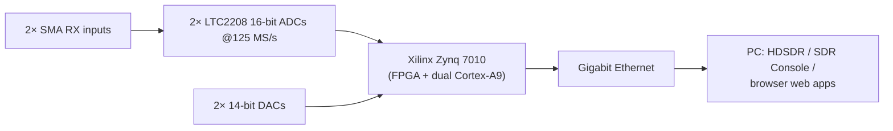
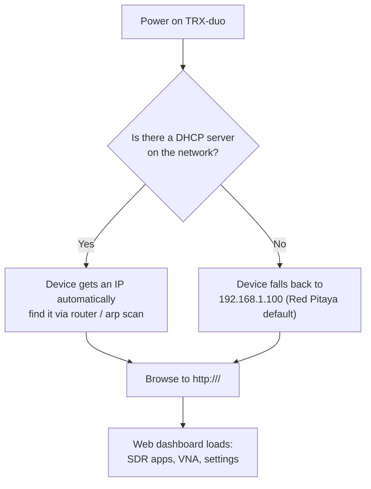

# SDRLab TRX-duo——完整指南

> **一句话**：TRX-duo 是一台严肃的双通道、双发射 SDR 收发信机，围绕 Xilinx Zynq 7010 SoC 构建，配备两个 16 位 ADC 和两个 14 位 DAC，覆盖 **10 kHz 至 60 MHz**——涵盖所有 HF 业余频段外加 6 米波段。由于它**兼容 Red Pitaya**，因此继承了整个开源 SDR、VNA 和实验室软件生态。

## 规格速览

| 项目 | 规格 |
|---|---|
| 无线电类型 | 双通道收发信机（2× RX，2× TX），直接采样 |
| 频率范围 | 10 kHz – 60 MHz（HF 到 6 米波段） |
| ADC | 2× Linear Technology LTC2208，**16 位**，125 MS/s |
| DAC | 2× Analog Devices AD9767，**14 位**，125 MS/s |
| 实时带宽 | 61.44 MHz |
| FPGA / SoC | Xilinx Zynq 7010（双核 ARM Cortex-A9） |
| 内存 | 512 MB DDR3 |
| RF 输入 | 2× SMA（50 Ω），0.5 Vpp，变压器 + 交流耦合 |
| RF 输出 | 2 通道，1 Vpp |
| 网络 | 千兆以太网（1 Gbit） |
| USB | USB 2.0 Type-C（供电 + 连接） |
| 扩展 | 16 路数字 I/O、4 路模拟输入（0–3.3 V，12 位，100 kSps）、4 路模拟输出（0–1.8 V）、I2C、UART、SPI |
| 启动介质 | microSD 卡（操作系统 + 应用都在卡上） |
| 外壳 | 铝制，115 × 70 × 25 mm（含接口） |
| 兼容性 | Red Pitaya（STEMlab 125-14 风格）软件生态 |

## TRX-duo 的特别之处

如果说 RTL-SDR V4 是一把折叠刀，那 TRX-duo 就是实验室仪器：

- **两个独立接收机**——可以做分集接收、对比两根天线，或同时抄收两个频段。非常适合大学里关于分集、测向和干扰研究的实验。
- **真正的收发信机**——两个 14 位发射通道让你可以实验真正的发射（在业余无线电规则和当地法规范围内）。
- **Red Pitaya 兼容**——在 Red Pitaya STEMlab 125-14 上运行的应用（来自 [red-pitaya-notes](https://github.com/pavel-demin/red-pitaya-notes) 项目的 SDR 接收机/收发信机、VNA、示波器应用）也能在配对了对应 SD 镜像的 TRX-duo 上运行。
- **网络原生**——它是一台无头设备，你可以从任何 PC、手机或平板浏览器通过千兆以太网驱动它。无需 USB 连接。



## 固件与 SD 镜像

> ⚠️ **SD 镜像不由我们托管。** 请只从下面的**官方厂商页面**下载。不要使用来路不明的镜像站。

| 资源 | 官方链接 | 是什么 |
|---|---|---|
| 厂商网站——TRX-DUO | [https://trx-duo.com/](https://trx-duo.com/) | 官方产品网站，含固件和入门信息 |
| 厂商产品页（SDRLab） | [https://opensourcesdrlab.com/products/trx-duo-compatible-with-red-pitaya-sdr-dual-16bit-adc-zynq7010](https://opensourcesdrlab.com/products/trx-duo-compatible-with-red-pitaya-sdr-dual-16bit-adc-zynq7010) | 官方产品页，含**固件和快速入门手册** |
| Red Pitaya 软件生态 | [https://github.com/pavel-demin/red-pitaya-notes](https://github.com/pavel-demin/red-pitaya-notes) | TRX-duo 兼容的开源应用套件（SDR RX/TX、VNA） |

**SD 卡如何工作**：TRX-duo 是一台嵌入式 Linux 计算机。microSD 卡承载操作系统、FPGA 比特流和 SDR 应用。"更新固件" = 写入一份更新的官方镜像。务必先阅读厂商的固件/快速入门说明——它们会列出该用哪个确切镜像。

### 写入镜像（通用流程）

1. 从上面的厂商页面下载官方镜像。
2. 写入 microSD 卡（≥ 4 GB；卡片会被擦除！）：

```bash
# Replace /dev/sdX with YOUR card device — double-check with lsblk!
sudo dd if=trx-duo-image.zip of=/dev/sdX bs=4M status=progress conv=fsync
```

> 压缩包镜像有时需要先解压——请遵循厂商说明。在 Windows 上，[balenaEtcher](https://etcher.balena.io/) 可以安全地处理 zip 和 img 文件。

3. 把卡片插入 TRX-duo。
4. 连接**千兆以太网**和 **USB-C 供电**，然后开机。

## 首次启动与网络



- 在有 DHCP 的网络（典型家用路由器）上：把电脑和 TRX-duo 都连到路由器，然后查找设备的 IP（路由器管理页面，或在你电脑上执行 `arp -a` / `ip neigh show`）。
- 在直连网线或隔离网络上：把你的电脑设为 `192.168.1.x` 网段的静态地址（例如 `192.168.1.10/24`），然后打开 `http://192.168.1.100`。
- 某些镜像还会响应主机名 `trx-duo-alpine`。

### 验证

```bash
ping 192.168.1.100
curl -s http://192.168.1.100/ | head
```

一台活着的板卡会响应 ping 并提供它的仪表盘 HTML。

## 与 SDR 软件配合使用

| 软件 | 连接方式 | 典型用途 |
|---|---|---|
| 浏览器 Web 应用（板载） | 直接，无需 PC 软件 | 频谱、SDR RX、VNA——最快的上手方式 |
| HDSDR | Red Pitaya 网络接口 | 经典全景显示式 HF 收发信机控制 |
| SDR Console V3 | Red Pitaya 兼容网络源 | 带数字模式的严肃接收、远程操作 |
| Red Pitaya notes 应用（板载） | 内置于 SD 镜像 | 分集接收、收发信机实验、FT8 扫描 |

更全面的图景见 [SDR 软件指南](/sdrlab/sdr-software/#trx-duo-software-notes)。

## 快速入门检查清单

- [ ] 从厂商页面下载了官方 SD 镜像
- [ ] 已写入 microSD 并插入
- [ ] 以太网 + USB-C 供电已连接
- [ ] 设备可达（DHCP IP 或 `192.168.1.100`）
- [ ] 浏览器中仪表盘加载成功
- [ ] 天线已接到 RX1/RX2（HF 天线——长线或环——不是 WiFi 天线）
- [ ] 听到了真实的 HF 信号（短波广播电台夜间很响，3–30 MHz）

## 故障排查

| 问题 | 原因 | 修复 |
|---|---|---|
| 仪表盘无法访问 | DHCP 缺失 / 子网错误 | 把 PC 设为静态 `192.168.1.x`，尝试 `http://192.168.1.100` |
| RJ45 无链路指示灯 | 线缆或端口问题 | 更换线缆/端口；确认交换机端口支持 10/100/1000 |
| 能启动但从不出现 | SD 卡不良 / 镜像错误 | 用官方镜像重写；在 PC 上测试卡片 |
| 接收端只有噪声 | 没有 HF 天线 / 衰减器开启 | 接上合适的 HF 天线；调高增益，移除衰减 |
| 应用与板卡不匹配 | 镜像变体错误 | 重新核对厂商快速入门，确认 125 MS/s 16 位板卡的正确镜像 |

更多帮助：[SDRLAB 故障排查中心](/sdrlab/troubleshooting/)。

## 相关

- [固件与驱动程序](/sdrlab/firmware/) — SD 镜像与固件更新的关系。
- [SDR 软件](/sdrlab/sdr-software/) — HDSDR / SDR Console / Red Pitaya 应用。
- [RTL-SDR Blog V4](/sdrlab/hardware/rtl-sdr-v4/) — SDR 价格谱系的另一端。