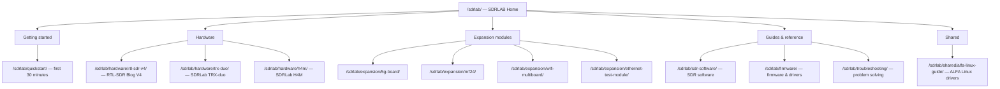

# SDRLAB

欢迎来到本维基的 **SDRLAB** 专区。本部分介绍我们销售的 SDR（软件无线电）硬件——从那个催生了无数业余无线电项目的传奇小接收棒 RTL-SDR，到足以放进大学实验室的专业双通道收发信机，再到能塞进夹克口袋的 HackRF 手持无线电。我们还整理了 **Flipper Zero 扩展模块** 的资料，这些模块能把 Flipper 变成一台口袋里的无线实验室。

> **SDR 到底是什么？** 软件无线电用宽带数字化器取代传统的模拟无线电电路（混频器、滤波器、解调器）：硬件捕获一段射频频谱，然后由计算机——或 FPGA——在软件中完成"无线电运算"。想听不同的模式或频率？改软件就行，不用动硬件。

## 本部分的组织方式

## SDR 硬件

| 产品 | 是什么 | 频率范围 | 最适合 |
|---|---|---|---|
| [RTL-SDR Blog V4](/sdrlab/hardware/rtl-sdr-v4/) | USB 接收棒（RTL2832U + R828D 调谐器） | 500 kHz – 1.766 GHz | 经典入门 SDR：ADS-B、AIS、POCSAG 寻呼机、FM、NOAA 卫星 |
| [SDRLab TRX-duo](/sdrlab/hardware/trx-duo/) | 双通道 16 位收发信机（Xilinx Zynq 7010） | 10 kHz – 60 MHz | HF 业余无线电、实验室实验、Red Pitaya 兼容应用 |
| [SDRLab H4M](/sdrlab/hardware/h4m/) | HackRF One + PortaPack 手持收发信机 | 1 MHz – 6 GHz | 现场信号搜寻、频谱分析、便携 TX/RX 实验 |

## Flipper Zero 扩展模块

| 模块 | 功能 | 无线电芯片 | 页面 |
|---|---|---|---|
| [5G 扩展板](/sdrlab/expansion/5g-board/) | 2.4/5 GHz WiFi（Marauder）+ GPS | ESP32-C5 | WiFi 侦察、战争驾驶、GPS 记录 |
| [NRF24 模块](/sdrlab/expansion/nrf24/) | 2.4 GHz 数据包无线电 | nRF24L01+ | 信道扫描、嗅探、无线鼠标/键盘测试 |
| [WiFi 多功能板](/sdrlab/expansion/wifi-multiboard/) | 2.4 GHz WiFi 工具 | ESP8266 | 解除认证测试、数据包捕获、Evil Portal 实验 |
| [以太网测试模块](/sdrlab/expansion/ethernet-test-module/) | 10/100 以太网接口 | WIZnet W5500 | 线缆测试、DHCP 检查、LAN 诊断 |

## 指南与参考

- [快速入门](/sdrlab/quickstart/) — 任何 SDRLAB 产品的第一个 30 分钟，逐步讲解。
- [SDR 软件](/sdrlab/sdr-software/) — GQRX、SDR#、SDR++、SDR Console、HDSDR 以及命令行工具，以及不同任务该选哪个。
- [固件与驱动程序](/sdrlab/firmware/) — 如何让硬件的驱动程序和固件保持最新。
- [故障排查](/sdrlab/troubleshooting/) — 带决策树和症状对照表的排障中心。
- [ALFA Linux 指南](/sdrlab/shared/alfa-linux-guide/) — 面向 Ubuntu 和 Kali 的芯片组导向 ALFA 适配器驱动（当你把 ALFA 适配器与 SDR 设备搭配使用时很有用）。

## 相关专区

- [Flipper Zero](/flipper-zero/) — 我们大多数扩展模块所插入的基础设备。
- [ALFA Network](/alfa-network/) — 高增益 Wi-Fi 适配器和天线，常与 SDR 搭配用于无线协议分析。
- [快速入门](/getting-started/) — 如果你是第一次访问本维基，请从这里开始。