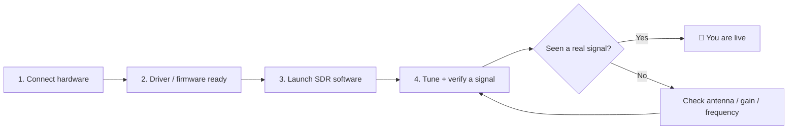

# SDRLAB 快速入门——你的前 30 分钟

> **学习目标**：读完本页后，你将能够选定一款产品，理解通用的"插入 → 驱动 → 软件 → 信号"流程，并验证你的 SDR 硬件确实能正常工作。
> **适用读者**：初次使用者 ｜ **前置条件**：一件 SDRLAB 产品、一台电脑（Windows/Linux/macOS），以及想听到无线电噪声并爱上它的意愿。

## 概念：通用的 SDR 流程

每件 SDRLAB 产品都遵循同样的三阶段旅程，尽管细节各不相同：

可以把它想象成插一个新的游戏手柄：**先硬件**（设备必须被识别）、**再驱动**（操作系统必须能与它通信）、**最后软件**（游戏——其实是无线电——必须知道怎么用它）。十次里有九次，"什么都不工作"意味着这三个阶段中有一个被跳过了。

## 第 1 步：选择你的产品并连接

| 产品 | 连接方式 | 需要额外供电？ | 第一步 |
|---|---|---|---|
| [RTL-SDR Blog V4](/sdrlab/hardware/rtl-sdr-v4/) | USB-A 接到电脑 | 不需要（USB 供电） | 插入，安装驱动 |
| [SDRLab TRX-duo](/sdrlab/hardware/trx-duo/) | 千兆以太网 + USB-C 供电 | 需要，通过 USB-C 供电 | 刷写 SD 卡，启动，浏览到 Web 界面 |
| [SDRLab H4M](/sdrlab/hardware/h4m/) | 独立手持设备（USB-C 用于充电/刷写） | 电池或 USB-C | 充电，插入 microSD，安装 Mayhem 固件 |
| [5G 扩展板](/sdrlab/expansion/5g-board/) | Flipper Zero GPIO 排针 | 不需要（Flipper/电池） | 设置 GPIO 引脚，打开 Marauder 应用 |
| [NRF24 模块](/sdrlab/expansion/nrf24/) | Flipper Zero GPIO 排针 | 不需要 | 插入，打开 NRF24 嗅探应用 |
| [WiFi 多功能板](/sdrlab/expansion/wifi-multiboard/) | Flipper Zero GPIO 排针 | 不需要 | 插入，打开 WiFi 解除认证应用 |
| [以太网测试模块](/sdrlab/expansion/ethernet-test-module/) | Flipper Zero GPIO 排针 + RJ45 线缆 | 不需要 | 接好 SPI，打开以太网应用 |

> **Flipper Zero 新手？** 先去 [Flipper Zero 专区](/flipper-zero/) 把 Flipper 更新好、用顺手。

## 第 2 步：让驱动/固件层就绪

- **Linux 上的 RTL-SDR V4**：你需要一个*最新的*驱动——旧版发行版软件包不认识 V4 的 R828D 调谐器。请按照 [RTL-SDR V4 页面上的驱动更新步骤](/sdrlab/hardware/rtl-sdr-v4/#linux-install) 操作。
- **Windows 上的 RTL-SDR V4**：现代工具（SDR#、SDR++、SDR Console）自带兼容 V4 的驱动——直接安装软件即可使用。
- **TRX-duo**：SD 卡*就是*固件。下载官方镜像（见 [TRX-duo 页面](/sdrlab/hardware/trx-duo/#firmware-and-sd-image)），写入 microSD 卡，插入，启动。
- **H4M**：安装 [Mayhem 固件](/sdrlab/hardware/h4m/#mayhem-firmware)——设备出厂即可用，但 Mayhem 才能解锁完整工具包。
- **Flipper 模块**：大多数需要*自定义* Flipper 固件（Momentum、Unleashed、Xtreme）才能使用额外应用，还需要设置 GPIO 引脚。每个[扩展页面](/sdrlab/#flipper-zero-expansion-modules)都列出了确切的引脚。

## 第 3 步：启动软件并验证信号

每种设备最快的"能用了！"测试：

| 产品 | 测试 | 预期结果 |
|---|---|---|
| RTL-SDR V4 | 终端中运行 `rtl_test` | "Supported sample rates"、`PASS` 行滚动输出 |
| TRX-duo | 浏览器 → `http://192.168.1.100` | Red Pitaya 风格的 Web 仪表盘加载成功 |
| H4M | 屏幕上的频谱应用 | 瀑布图显示 FM 广播频段的噪声/信号 |
| 5G 扩展板 | Marauder `scanap` | 附近 SSID 连同 RSSI 一起出现 |
| NRF24 模块 | 信道扫描器 | 信道 1–126 上有 2.4 GHz 活动 |
| WiFi 多功能板 | Deauther 扫描 | 接入点列表填充完成 |
| 以太网模块 | W5500 应用 → DHCP | 分配到了 IP 地址，ping 正常 |

## 第 4 步：调谐到真实信号

选一个你*知道*有信号的频率，而不是随便挑一个位置：

- **FM 广播电台**：88–108 MHz——你的第一个 SDR 信号，保证能收到。
- **NOAA 气象卫星（137 MHz）**：APT 卫星图像，周末项目的经典之选。
- **飞机（ADS-B，1090 MHz）**：飞机实时广播位置数据。
- **寻呼机（POCSAG）**：约 137 MHz 和约 466 MHz——经典的 RTL-SDR 猎奇目标。
- **飞机（HF，如果你有 TRX-duo）**：夜间 3–30 MHz 的短波广播电台。

## 第 5 步：对照检查清单

- [ ] 硬件被识别（指示灯亮 / 应用能看到设备）
- [ ] 驱动或固件版本是最新的
- [ ] SDR 软件能按名称/型号看到设备
- [ ] 瀑布图或频谱显示了*某些东西*——然后是一个真实信号
- [ ] 知道你的天线在哪里、适合哪个频段（这一点比你想的重要得多！）

## 常见的第一天错误

| 错误 | 原因 | 修复 |
|---|---|---|
| `rtl_test` 报 `No devices found` | 内核 DVB 驱动抢占了接收棒 | 屏蔽 `dvb_usb_rtl28xxu`（见 [RTL-SDR V4 页面](/sdrlab/hardware/rtl-sdr-v4/#linux-install)） |
| TRX-duo Web 界面无法访问 | 静态 IP 错误 / 网络上没有 DHCP | 检查[网络部分](/sdrlab/hardware/trx-duo/#first-boot-and-network) |
| H4M 没有应用 | microSD 缺失或过期 | 从 [Mayhem 发布页](/sdrlab/hardware/h4m/#mayhem-firmware) 复制 `COPY_TO_SDCARD` 文件 |
| Flipper 应用提示"no module" | 未为模块设置 GPIO 引脚 | 在 `Protocol Settings → GPIO Pin Settings` 下设置引脚（按各扩展页面） |
| 一切都没反应 | 没接天线 | 拧上天线——没有天线的 SDR 只是一个非常安静的镇纸 |

## 下一步

- 准备好深入了？[SDR 软件指南](/sdrlab/sdr-software/) 讲解各种工具；[固件指南](/sdrlab/firmware/) 介绍更新方法。
- 卡在某个具体问题上？[故障排查中心](/sdrlab/troubleshooting/) 按症状分类整理。
- 要把 ALFA Wi-Fi 适配器和你的 SDR 搭配使用？请看 [ALFA Linux 指南](/sdrlab/shared/alfa-linux-guide/)。