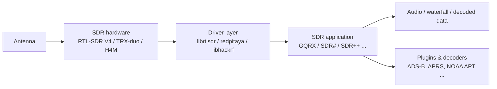
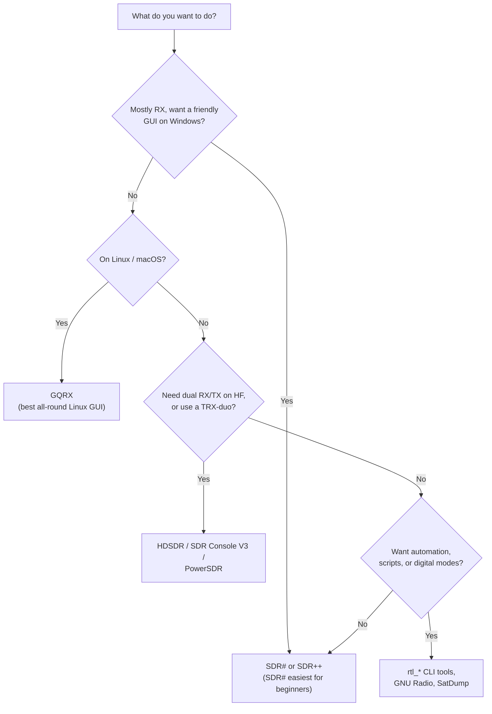

# SDR 软件——选择并安装你的工具

> **学习目标**：读完本页后，你将能够为你的设备和目标挑选合适的 SDR 应用，并在 Linux 或 Windows 上安装它。
> **适用读者**：入门到进阶 ｜ **前置条件**：一台能正常工作的 SDRLAB 设备（见 [快速入门](/sdrlab/quickstart/)）。

## 概念：软件栈

你的 SDR 硬件负责数字化射频频谱，但*总得有个东西*把这些原始采样变成瀑布图、音频或解码后的数据包。那个"东西"就是 SDR 应用：



每一层都有自己的生态。一个常见的入门陷阱：硬件没问题、应用也没问题，但夹在中间的**驱动层**过时了——RTL-SDR Blog V4 就是最典型的例子，因为旧驱动根本不认识它的调谐器。

## 我该用哪款应用？



### 快速选择表

| 工具 | 平台 | 支持的设备 | 最适合 |
|---|---|---|---|
| [GQRX](https://www.gqrx.dk/) | Linux / macOS / Windows | RTL-SDR V4、H4M（作为 HackRF） | 通用接收、频谱、FM/AM 解调、Linux 上的 SDR 新手 |
| [SDR# (SDRSharp)](https://airspy.com/download/) | Windows | RTL-SDR V4 | 经典的入门 Windows 应用；插件生态庞大 |
| [SDR++](https://www.sdrpp.org/) | Windows / Linux / macOS | RTL-SDR V4、HackRF | 跨平台现代 GUI、服务器模式、出色的瀑布图 |
| [SDR Console V3](https://www.sdr-radio.com/console) | Windows | RTL-SDR V4、TRX-duo | 严肃的接收功能、业余无线电、远程操作 |
| [HDSDR](https://www.hdsdr.de/) | Windows | TRX-duo、RTL-SDR V4 | HF 收发信机式控制、中频全景显示、TRX-duo 支持 |
| [CubicSDR](https://cubicsdr.com/) | Windows / Linux / macOS | RTL-SDR V4、HackRF | 简单的跨平台瀑布图 |
| [SatDump](https://github.com/SatDump/SatDump) | Windows / Linux | RTL-SDR V4 | 卫星解码（NOAA、MetOp、LRPT、Meteor） |
| `rtl_*` 命令行工具 | Linux / Windows / macOS | RTL-SDR V4 | 测试（`rtl_test`）、原始 IQ 捕获、脚本 |
| `hackrf_*` 工具 | Linux / Windows / macOS | H4M（作为 HackRF） | 固件刷写、原始 IQ 收发、频谱（`hackrf_transfer`） |

## Linux：安装 GQRX（推荐的起点）

GQRX 是最友好的 Linux GUI，与 RTL-SDR V4 搭配堪称完美。

### 第 1 步——安装 GQRX

```bash
# Debian / Ubuntu / Kali
sudo apt update
sudo apt install gqrx-sdr
```

预期输出（最后几行）：

```
Setting up gqrx-sdr (2.17-1) ...
Processing triggers for desktop-file-utils ...
```

### 第 2 步——安装 RTL-SDR 命令行工具（用于驱动检查）

```bash
sudo apt install rtl-sdr
rtl_test -t
```

插入 V4 且驱动为最新时的预期输出：

```
Found 1 device(s):
  0:  Realtek, RTL2838UHIDIR, SN: 00000001

Using device 0: Generic RTL2832U OEM
...
Supported sample rates: 225001-300000, 900001-3200000, ...
```

> 看到 `Found 1 device(s)` 就是值得欢呼的时刻。如果打印的是 `No devices found`，请看 [故障排查 → RTL-SDR 未被检测到](/sdrlab/troubleshooting/#rtl-sdr-not-detected)。

### 第 3 步——打开 GQRX 并找到一个信号

1. 启动 `gqrx`（或 `gqrx-sdr`）。
2. 首次运行时会出现 **Device configuration** 对话框——选择你的接收棒，I/Q 设置保持默认，点击 **OK**。
3. 点击 **▶**（播放）按钮。瀑布图开始流动。
4. 在频率框中输入 **97.3 MHz**（任何强信号 FM 电台都可以——查一下你当地的频率）。
5. 点击 **FM** 模式按钮，然后关闭**静音**图标。你应该能听到电台声音。

## Windows：安装 SDR#（推荐的起点）

1. 从 [Airspy 下载页面](https://airspy.com/download/) 下载 SDR# 压缩包。
2. 将压缩包解压到一个文件夹（例如 `C:\SDRSharp`）。
3. 运行 `sdrsharp.exe`。它需要 **.NET**——如果缺失，Windows 会提示安装。
4. 在左上角的 **Source** 下拉菜单中选择 **RTL-SDR (RTL2832U)**，然后点击播放图标。
5. 调谐到本地 FM 电台（88–108 MHz），选择 **WFM** 解调，就可以收听了。

## TRX-duo 软件说明

TRX-duo *不是*即插即用的 USB 设备——它是一台运行自有嵌入式软件的网络化仪器（官方固件镜像见 [TRX-duo 页面](/sdrlab/hardware/trx-duo/)）。在 PC 端，能与它配合的生态是 **Red Pitaya SDR 软件家族**：

- **HDSDR** — 通过 Red Pitaya 网络接口连接（按厂商文档使用 ExtIO / 网络接口）。
- **SDR Console V3** — 支持通过网络连接 Red Pitaya 兼容设备。
- **Red Pitaya Web 应用** — 板卡本身通过自己的 Web 界面直接提供基于浏览器的应用（频谱分析仪、SDR 接收机、VNA）。

由于 Red Pitaya 生态由 [Pavel Demin 的 red-pitaya-notes](https://github.com/pavel-demin/red-pitaya-notes) 项目驱动，大多数 Red Pitaya 兼容应用都能在配对了对应 SD 镜像的 TRX-duo 上运行。

## H4M 软件说明

H4M 是一台独立设备：它在 PortaPack 上直接运行 **Mayhem 固件**，因此基本操作不需要任何 PC 软件。要把它当作普通 HackRF 从电脑上使用，请安装 **HackRF 工具**：

```bash
# Debian / Ubuntu / Kali
sudo apt install hackrf
hackrf_info
```

预期输出：

```
Found HackRF board.
Board ID Number: 2 (HackRF One)
Firmware Version: git-... (API:1.02)
```

固件安装见 [H4M 页面](/sdrlab/hardware/h4m/)，升级步骤见[固件指南](/sdrlab/firmware/)。

## 值得掌握的命令行要点

| 命令 | 作用 | 典型用途 |
|---|---|---|
| `rtl_test` | 自测 RTL-SDR 接收棒 | 验证驱动 + 硬件 |
| `rtl_fm -f 97.3M -M wbfm -s 200k \| play -t raw` | 将 FM 音频流式输出到扬声器 | 快速"我的接收棒还活着吗"测试 |
| `rtl_sdr -f 1090M -s 2M -` | 将原始 IQ 采样转储到 stdout | 喂给 ADS-B 解码器 |
| `hackrf_transfer -r out.iq -f 433M -s 2M` | 从 HackRF 录制原始采样 | 捕获突发信号用于重放分析 |
| `hackrf_info` | 显示 HackRF 版本信息 | 验证 H4M 作为 HackRF 使用 |

## 接下来去哪

- [固件与驱动程序](/sdrlab/firmware/) — 让软件之下的各层保持健康。
- [故障排查](/sdrlab/troubleshooting/) — "应用能打开但没有信号"之类的问题。
- 产品页面：[RTL-SDR V4](/sdrlab/hardware/rtl-sdr-v4/)、[TRX-duo](/sdrlab/hardware/trx-duo/)、[H4M](/sdrlab/hardware/h4m/)。