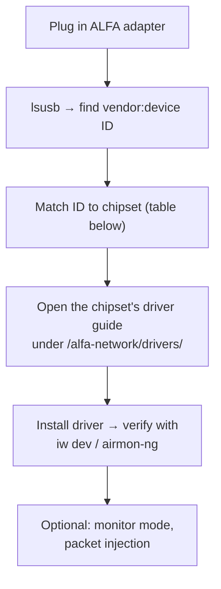

# Linux 上的 ALFA 适配器——驱动程序指引

> **学习目标**：用两条命令识别任何 ALFA 适配器内部的芯片组，然后直达你需要的驱动指南——不用猜，不绕弯路。
> **适用读者**：任何要把 ALFA Wi-Fi 适配器与 Ubuntu 或 Kali Linux 搭配使用的人（包括同时做无线协议分析的 SDR 设备）。

## 为什么会有这个页面

ALFA Network 生产很多适配器，它们并不都使用相同的无线电芯片。**芯片组决定驱动**——光看型号名是不够的。本页是共享的"前门"：教你两条命令的识别流程，然后把你指向 [ALFA Network 专区](/alfa-network/) 中芯片组专属的指南。它适用于任何 Debian 系发行版上的**任何** ALFA 适配器。



## 第 1 步——识别芯片组

```bash
lsusb
```

找到 ALFA 适配器那一行。示例输出：

```
Bus 003 Device 002: ID 0cf3:9271 Qualcomm Atheros Communications AR9271 802.11n
```

`ID xxxx:xxxx` 就是 vendor:device 对。对照下表——*device* 部分能把它缩小到某一族芯片。

### 芯片组查找表

| 芯片组 | 典型 `lsusb` 设备 ID | 典型 ALFA 型号 | 驱动指南 |
|---|---|---|---|
| MediaTek MT7921AUN | `0e8d:7961` | AWUS036AXML、AWUS036AXM | [MT7921AUN 指南](/alfa-network/drivers/mt7921aun/) |
| Realtek RTL8812AU | `0bda:8812` | AWUS036ACH、AWUS036ACHM | [RTL8812AU 指南](/alfa-network/drivers/rtl8812au/) |
| Realtek RTL8811AU | `0bda:8811` | AWUS036ACS | [RTL8811AU 指南](/alfa-network/drivers/rtl8811au/) |
| Realtek RTL8821CU | `0bda:c811` / `0bda:1a2b` | AWUS036ACM | [RTL8821CU 指南](/alfa-network/drivers/rtl8821cu/) |
| Realtek RTL8832BU | `0bda:b832` | AWUS036AXER | [RTL8832BU 指南](/alfa-network/drivers/rtl8832bu/) |
| MediaTek MT7612U | `0e8d:7612` | AWUS036AC | [MT7612U 指南](/alfa-network/drivers/mt7612u/) |
| MediaTek MT7610U | `0e8d:7610` | AWUS036NHA（变体）、AWUS051NH | [MT7610U 指南](/alfa-network/drivers/mt7610u/) |

> 这张表是一张*起点地图*——ALFA 会随时间推出新的 SKU。拿不准时，从适配器 IC 上的印刷标签读取芯片型号，或到 [ALFA Network 产品页面](/alfa-network/) 查你的确切型号。

## 第 2 步——安装匹配的驱动

每个芯片组都有自己的怪癖：

- **MediaTek（MT79xx / MT76xx）**：某些内核已内置树内 `mt76` 支持——芯片组指南会告诉你什么时候够用、什么时候需要编译厂商驱动。
- **Realtek（RTL88xx）**：几乎总是需要树外驱动（`rtl88x2bu` 风格的 DKMS 构建）。预期流程是 `make` + `sudo make install` + 重启。
- **Atheros**：`ath9k_htc` 已在内核中——通常即插即用。

按芯片组专属指南执行确切命令；它们都以一个**验证步骤**收尾：

```bash
iw dev          # shows your wlan interface and connected state
sudo airmon-ng  # confirms monitor-mode capability
```

`iw dev` 的预期输出片段：

```
Interface wlan0
    ifindex 3
    wdev 0x1
    addr 00:c0:ca:xx:xx:xx
    type managed
```

## 第 3 步——常见的 Linux 驱动坑

| 症状 | 可能原因 | 快速修复 |
|---|---|---|
| `iw dev` 什么都不显示 | 驱动未加载或编译失败 | 检查 `dmesg | grep -i rtl\|mt76`；按芯片组指南重新编译 |
| 适配器能用但重启后失效 | 内核模块冲突 | 按芯片组指南中的屏蔽步骤操作 |
| 监听模式失败（`airmon-ng` 报错） | 驱动尚不支持 | 用芯片组指南中的 DKMS 版本，而不是发行版软件包 |
| Ubuntu 上正常，Kali 上不行 | Kali 内核头文件版本不匹配 | 重新构建 DKMS：`sudo dkms autoinstall` |

## 为什么 SDR 用户关心这个

ALFA 适配器不是 SDR——但它是 SDR 天然的*搭档*。常见的组合用法：

- **Wi-Fi 协议分析**，同时用你的 [RTL-SDR V4](/sdrlab/hardware/rtl-sdr-v4/) 观察 ISM 频段频谱。
- **基于 Kali 的实验室工作站**做无线渗透测试课程，用 SDR 验证 Wi-Fi 适配器在频谱中的行为。
- **现场勘测**，把 [H4M](/sdrlab/hardware/h4m/) 的频谱视图与 ALFA 适配器的 deauth/数据包工具搭配使用。

[SDR 软件指南](/sdrlab/sdr-software/) 覆盖 SDR 侧；无线电侧出问题时，[故障排查中心](/sdrlab/troubleshooting/) 能帮上忙。

## 相关

- [ALFA Network 专区](/alfa-network/) — 产品、天线、Jetson/Raspberry Pi/Unitree 集成。
- 芯片组驱动指南：[MT7610U](/alfa-network/drivers/mt7610u/) ・ [MT7612U](/alfa-network/drivers/mt7612u/) ・ [MT7921AUN](/alfa-network/drivers/mt7921aun/) ・ [RTL8811AU](/alfa-network/drivers/rtl8811au/) ・ [RTL8812AU](/alfa-network/drivers/rtl8812au/) ・ [RTL8821CU](/alfa-network/drivers/rtl8821cu/) ・ [RTL8832BU](/alfa-network/drivers/rtl8832bu/)。