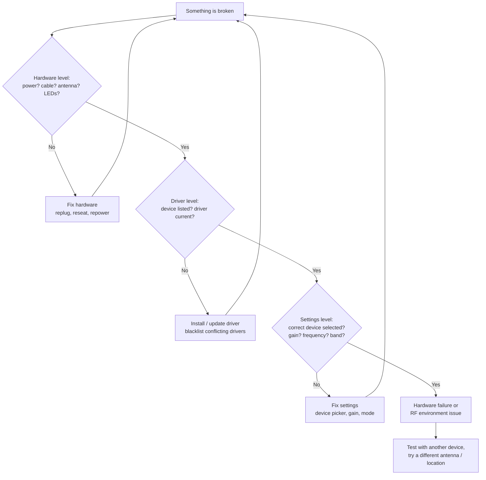

# SDRLAB 故障排查中心

> **黄金法则**：始终按这个顺序排查——**先硬件，再驱动，后设置**。百分之九十的 SDR 问题，要么是天线没插、驱动太旧，要么是一个就摆在眼前的错误设置。



## 问题索引

| 类别 | 此处覆盖的问题 |
|---|---|
| RTL-SDR V4 | [未被检测到](#rtl-sdr-not-detected) ・ [异常信号 / 混叠](#rtl-sdr-picks-up-images-of-other-signals) ・ [偏置三通不工作](#bias-tee-wont-turn-on) |
| TRX-duo | [Web 界面无法访问](#trx-duo-web-ui-unreachable) ・ [启动循环 / 无 DHCP](#trx-duo-boots-but-never-appears-on-the-network) ・ [收不到信号](#trx-duo-rx-shows-noise-only) |
| H4M | [固件升级后应用丢失](#h4m-apps-missing-after-firmware-update) ・ [无法开机](#h4m-wont-power-on) ・ [没有声音](#h4m-no-audio-from-speaker-or-jack) |
| Flipper 模块 | [模块应用提示"no module"](#flipper-app-says-no-module) ・ [NRF24 什么都看不到](#nrf24-sees-nothing-on-channel-scan) ・ [WiFi 板无法连接](#wifi-board-web-interface-unreachable) ・ [以太网模块无链路](#ethernet-module-no-link-light) |

---

## RTL-SDR 未被检测到 {#rtl-sdr-not-detected}

### 症状
`rtl_test` 打印 `No devices found.`，或 GQRX 列不出任何设备。

### 诊断
```bash
lsusb
```
预期输出应显示接收棒：

```
Bus 001 Device 004: ID 0bda:2838 Realtek Semiconductor Corp. RTL2838 DVB-T
```

如果 `lsusb` 什么都没显示，那就是 USB 连接本身的问题（线缆、端口、集线器）。如果*确实*显示了设备，请继续。

### 根本原因
内核的 DVB-T 驱动（`dvb_usb_rtl28xxu`）在 SDR 驱动之前抢占了接收棒——这是 RTL-SDR 的经典故障模式。

### 修复
1. 屏蔽 DVB 驱动：
```bash
echo 'blacklist dvb_usb_rtl28xxu' | sudo tee /etc/modprobe.d/blacklist-dvb_usb_rtl28xxu.conf
```
2. 重启，或如果模块已加载则执行 `sudo modprobe -r dvb_usb_rtl28xxu`。
3. 重新运行 `rtl_test`——预期看到 `Found 1 device(s)`。
4. 还是不行？从源码安装最新驱动——见 [RTL-SDR V4 → Linux 安装](/sdrlab/hardware/rtl-sdr-v4/#linux-install)。

---

## RTL-SDR 收到其他信号的镜像 {#rtl-sdr-picks-up-images-of-other-signals}

### 症状
你调谐到一个频率，却听到混入了*其他*频率的电台，尤其是在 HF 上。

### 根本原因
强广播电台造成的过载，或调谐到约 24 MHz 以下时老式接收棒会发生信号折叠（混叠）。RTL-SDR Blog V4 的处理方式与老式接收棒不同——它内置了用于 HF 的 28.8 MHz 上变频器，以及用于强 FM/DAB 干扰的三工器和陷波滤波器。

### 修复
- 在 HF 上，确保你的驱动支持 V4（R828D）。驱动过旧时上变频器不会被激活，HF 就会变成一团混叠。
- 把增益**调低**（从 20–30 dB 开始）——大多数"幽灵信号"都是过载。
- 加衰减，或改用频段专用天线而不是宽带天线。

---

## 偏置三通无法开启 {#bias-tee-wont-turn-on}

### 症状
需要直流供电的有源天线得不到供电。

### 根本原因
V4 的偏置三通由软件控制（4.5 V，180 mA）。在 SDR# / SDR++ 中它映射到 **"Offset tuning"** 选项；每次会话都需要手动启用。

### 修复
在设备配置中启用 "Offset tuning"（这就是 V4 上的偏置三通开关）。在 GQRX 中，点击设备图标 → 启用 **Bias-T**。注意偏置三通无法驱动重负载——最大 180 mA。

---

## TRX-duo Web 界面无法访问 {#trx-duo-web-ui-unreachable}

### 症状
浏览器无法加载 TRX-duo 仪表盘；`ping` 失败。

### 诊断
```bash
ip neigh show
arp -a
```
查找类似 `192.168.1.100` 的地址或 `trx-duo-alpine` 主机名。

### 根本原因
网络配置错误：设备期望 DHCP，或者你所在的子网与它的默认静态地址不匹配。

### 修复
1. 把 TRX-duo 连接到与你的电脑**相同的交换机/路由器**上。
2. 优先使用有 DHCP 的网络——设备会自动请求地址。
3. 如果没有 DHCP 服务器，Red Pitaya 兼容默认地址是 `http://192.168.1.100`——把你的电脑设为静态 `192.168.1.x` 地址再试。
4. 完整官方流程见 [TRX-duo → 首次启动与网络](/sdrlab/hardware/trx-duo/#first-boot-and-network)。

---

## TRX-duo 能启动但从不出现在网络上 {#trx-duo-boots-but-never-appears-on-the-network}

### 症状
电源 LED 亮，但以太网口没有链路指示灯，或链路灯亮但没有地址。

### 诊断
- 检查 RJ45 口上的以太网链路 LED——如果灯不亮，问题出在线缆/端口。
- 检查 SD 卡：损坏或错误的镜像意味着操作系统根本没启动到能配置网络的阶段。

### 根本原因
通常是以下之一：线缆不良、卡片未完全插好，或镜像写错了板卡型号。

### 修复
1. 换一根线缆/换一个端口。
2. 重新插好并用官方镜像重写 microSD 卡（见 [固件与 SD 镜像](/sdrlab/hardware/trx-duo/#firmware-and-sd-image)）。
3. 如果还是不出现，把卡拿到电脑上测试——`fsck` 失败或读出来几乎为空的卡很可疑。

---

## TRX-duo 接收端只有噪声 {#trx-duo-rx-shows-noise-only}

### 症状
瀑布图是活的，但你什么都听不到，即使面对强 HF 广播电台也一样。

### 诊断
检查输入：天线接在 **RX1/RX2 SMA 端口**上了吗？频段对吗（10 kHz – 60 MHz）？

### 根本原因
没有天线 / 接错端口、输入衰减器已启用，或接收应用把增益设到了最低。

### 修复
1. 接上合适的 HF 天线（长线或调谐环——2.4 GHz WiFi 天线在这里几乎没用）。
2. 在应用中调高 RX 增益 / 关闭衰减器。
3. 确认你启动的是 *SDR 接收机*应用，而不是 VNA。

---

## H4M 固件升级后应用丢失

### 症状
PortaPack 能启动，菜单看起来正常，但很多应用不见了。

### 根本原因
自 Mayhem 1.8.0 起，大多数应用存放在 **microSD 卡**上，而不是闪存里。SD 卡缺失或过期就意味着应用丢失。

### 修复
1. 准备一张 microSD 卡（16 GB 很充裕），格式化为 **FAT32**。
2. 从 [Mayhem 发布页](https://github.com/portapack-mayhem/mayhem-firmware/releases) 下载该版本的 `COPY_TO_SDCARD` 压缩包——见 [H4M → Mayhem 固件](/sdrlab/hardware/h4m/#mayhem-firmware)。
3. 把压缩包解压到卡根目录。
4. 插入并重启。应用就会出现。

---

## H4M 无法开机 {#h4m-wont-power-on}

### 症状
没有显示，没有 LED。

### 诊断
- 用 USB-C 充电 10 分钟以上，然后尝试**电源开关**（H4M 有真正的开/关按钮）。
- 尝试把 USB-C 线缆连接到电脑后启动。

### 根本原因
电池没电是常见嫌疑；偶尔是卡在 DFU/刷写模式。

### 修复
1. 充电直到充电指示灯显示进度。
2. 按住电源按钮约 3 秒。
3. 如果还是无法启动，连接 USB-C 并检查电脑是否能看到 HackRF 设备——如果能，按 [H4M → Mayhem 固件](/sdrlab/hardware/h4m/#mayhem-firmware) 重新刷写 Mayhem。

---

## H4M 扬声器或耳机孔没有声音 {#h4m-no-audio-from-speaker-or-jack}

### 症状
瀑布图里有信号，耳朵里却一片寂静。

### 根本原因
模式/增益设置，或音频被路由到了错误的输出（插入耳机时 H4M 会在内置扬声器和 3.5 mm 耳机孔之间自动切换）。

### 修复
1. 调高 RX 增益并重新检查解调模式（广播 FM 用 WFM）。
2. 拔掉耳机让音频重新路由到扬声器，或反过来。
3. 检查音频菜单中的音量设置。

---

## Flipper 应用提示"no module" {#flipper-app-says-no-module}

### 症状
扩展应用（NRF24、Marauder、GPS）报告模块不存在，尽管它明明插着。

### 根本原因
GPIO 引脚没有为模块设置，或 Flipper 固件没有捆绑该应用。大多数模块需要自定义固件（Momentum / Unleashed / Xtreme）和明确的引脚分配。

### 修复
1. 在 **Momentum** 上：`Protocol Settings → GPIO Pin Settings`——设置模块的引脚（确切引脚见各产品页面）。
2. 在 **Unleashed/Xtreme** 上：等效的 GPIO 配置位于应用自身的设置或固件设置中。
3. 重启 Flipper 再试。

参见具体模块页面：[5G 扩展板](/sdrlab/expansion/5g-board/)、[NRF24](/sdrlab/expansion/nrf24/)、[WiFi 多功能板](/sdrlab/expansion/wifi-multiboard/)、[以太网](/sdrlab/expansion/ethernet-test-module/)。

---

## NRF24 信道扫描什么都看不到 {#nrf24-sees-nothing-on-channel-scan}

### 症状
即使附近有无线鼠标/键盘，嗅探器也显示零活动。

### 诊断
确认模块的 SMA 天线已接上，且鼠标在持续移动（闲置的鼠标几乎不发射）。

### 根本原因
没有天线、SPI 引脚错误，或者干脆没有流量：许多 2.4 GHz 设备使用跳频，闲置时很安静。

### 修复
1. 接上天线。
2. 按 [NRF24 页面](/sdrlab/expansion/nrf24/) 核对引脚。
3. 扫描时移动/晃动鼠标或键盘——你应该能看到信道突发。
4. 依次尝试 2 Mbps、1 Mbps 和 250 kbps 的信道范围 1–126（不同设备使用不同速率）。

---

## WiFi 板 Web 界面无法访问 {#wifi-board-web-interface-unreachable}

### 症状
刷完 deauther 后，你无法访问 `192.168.4.1`。

### 根本原因
你的手机/电脑自动加入了另一个网络，或板卡的接入点没有启动。

### 修复
1. 连接到板卡的接入点（默认 SSID `pwned`，密码 `deauther`）。
2. 在客户端上关闭移动数据 / 自动加入。
3. 浏览到 `http://192.168.4.1`。
4. 还是不行？按 [WiFi 多功能板页面](/sdrlab/expansion/wifi-multiboard/) 重新刷写固件。

---

## 以太网模块无链路指示灯

### 症状
插入线缆后 RJ45 端口的 LED 保持熄灭。

### 诊断
- 换一根线缆、换一个交换机端口（模块是 10/100——有些只支持千兆的"智能"端口很挑剔）。
- 按 [以太网模块页面](/sdrlab/expansion/ethernet-test-module/#wiring-to-the-flipper) 确认与 Flipper 的接线。

### 根本原因
线缆/端口不良，或 SPI 接线（CS/RESET）错误导致 W5500 从未初始化。

### 修复
1. 先用任何已知良好的设备测试线缆。
2. 逐一核对每根 SPI 线——一根线接反就会杀死链路。
3. 启动应用；连接成功后标题栏应显示 `LAN [UP 100M FD]`。

---

## 还是卡住了？

把问题反馈给我们（或论坛）时，请包含：

- **设备 + 固件版本**：例如"RTL-SDR V4，osmocom 驱动 2.x"；"H4M，Mayhem nightly 2026-07-26"；"Flipper Zero，Momentum 8.x"。
- **环境**：操作系统及版本、USB 集线器还是直连、网络化设备的网络拓扑。
- **证据**：`lsusb` / `dmesg` 输出、`rtl_test` 报错、`hackrf_info` 输出、应用截图。
- **你已经尝试过的**：这能避免重复建议，也表明排查顺序已被遵循。

相关：[快速入门](/sdrlab/quickstart/) ・ [固件与驱动程序](/sdrlab/firmware/) ・ [SDR 软件](/sdrlab/sdr-software/)。