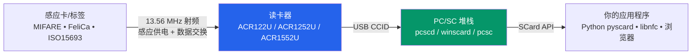

# ACS — 智能卡与 NFC 读卡器

> **一句话定位**：ACS (Advanced Card Systems) 的 PC/SC 智能卡与 NFC 读卡器，把现实世界的感应卡（门禁卡、交通卡、MIFARE、FeliCa、电子护照、ISO 15693 资产标签）变成电脑上一个标准的 `SCard*` 接口，让任何 PC/SC 应用程序与你写的程序都能读写它们。

如果你是第一次接触「读卡器」，可以先看下面的概念图，再用底下的产品链接跳到自己那一款。

## 概念：读卡器到底在做什么？

把感应卡放到读卡器上的那一刻，发生的事可以拆成三层。理解这三层，比记住任何单一指令都重要：

- **感应卡** 是靠射频（RF）从读卡器「无线供电」的。卡片自己没有电池，放上读卡器的瞬间由 13.56 MHz 天线启动。
- **读卡器**（如 ACR122U）负责把射频通讯「翻译」成标准的 USB 协议，让系统识别它是一台「智能卡读卡器」。
- **PC/SC 堆栈** 是操作系统层的标准。Linux 上叫 `pcscd`，macOS/Windows 内置。只要读卡器符合 PC/SC，任何「懂 PC/SC」的软件不用改一行就能用。

:::tip 为什么 PC/SC 重要？
因为 PC/SC 是「读卡器世界的 USB」——一个统一的 API。同一套代码，换一台品牌的读卡器也能运行，前提是那台读卡器符合 PC/SC。
:::

## 三款产品的定位

| 产品 | 一句话定位 | 最佳用途 |
|------|-----------|---------|
| [ACR122U](/acs/products/acr122u/) | 最经典、最便宜、社区支持最广的入门 NFC 读卡器 | 学生项目、MIFARE 研究、libnfc/多卡测试 |
| [ACR1252U](/acs/products/acr1252u/) | NFC Forum 认证、带 SAM 安全插槽的 NFC Reader III | 需要元件的 NFC 应用、卡片模拟/点对点、正式部署 |
| [ACR1552U](/acs/products/acr1552u/) | 第 4 代、多协议、支持 ISO 15693 的旗舰 | 政府/医保/交通/资产盘点等专业多卡应用 |

## 怎么选？3 个问句

1. **你要做什么？** 只要读 MIFARE 门禁卡或学校项目 → **ACR122U**。要正式产品、要 SAM 安全 → **ACR1252U**。要连 ISO 15693（资产标签）都支持、要最快 → **ACR1552U**。
2. **你想用什么开发？** 想用 libnfc 直连 + 大量开源工具 → **ACR122U**（唯一有 libnfc 直连 driver 的一款）。要走标准 PC/SC、跨平台 → 三者皆可。
3. **预算与未来？** 入门省预算选 ACR122U；要 NFC Forum 认证与安全性的商业开发选 ACR1252U；要最大兼容性的长期投资选 ACR1552U。

## 快速规格比较

| 项目 | ACR122U | ACR1252U | ACR1552U |
|------|---------|----------|----------|
| 读写速度（ISO 14443） | 106/212/**424** kbps | 106/212/424 kbps | 106/212/424/**848** kbps |
| 读距 | 最远 50 mm | 最远 50 mm | 最远 70 mm |
| ISO 15693 | ❌ | ❌ | ✅ |
| SAM 安全插槽 | ❌ | ✅ | ✅ |
| NFC Forum 认证 | ❌ | ✅ | ❌ |
| 键盘模拟模式 | ❌ | ❌ | ✅ |
| libnfc 直连 driver | ✅ `acr122_usb` | ⚠️ 只能走 PC/SC | ⚠️ 只能走 PC/SC |
| 网页/浏览器 NFC | 需 PC/SC bridge | 需 PC/SC bridge（详见 [ACR1252U 的 Web NFC 章节](/acs/products/acr1252u/#web-nfc-macos-browser)） | 需 PC/SC bridge |

## 进入方式

- **拿到的是 ACR122U？** → 打开 [ACR122U 完整说明](/acs/products/acr122u/)
- **拿到的是 ACR1252U？** → 打开 [ACR1252U 完整说明](/acs/products/acr1252u/)
- **拿到的是 ACR1552U？** → 打开 [ACR1552U 完整说明](/acs/products/acr1552u/)
- **想知道整台设备怎么装上 Linux？** 三款的设置页都有完整的 `pcscd` / `pcsc_scan` / `libnfc` step-by-step。

## 未涵盖？

- 如果你要找的是其他品牌（ALFA 网卡、Hak5 渗透工具、Flipper Zero、SDR）请回到 [Yupitek Wiki 总览](/getting-started/)。
- ACS 全系列完整的英文官方文档（datasheet、SDK、API reference）可在 [acs.com.hk](https://www.acs.com.hk) 获取，每款产品页的「规格总览」都有对应链接。