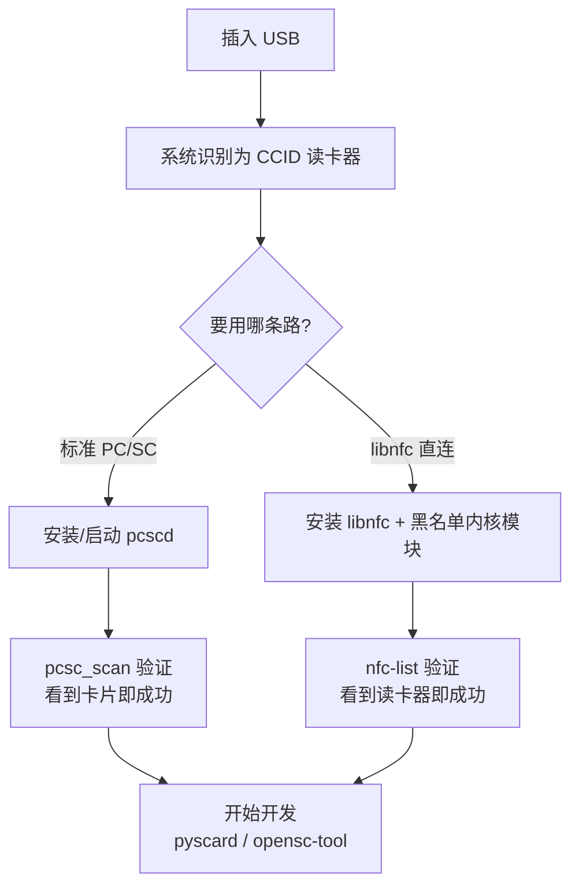

# ACR122U — USB NFC Reader 完整说明

> **一句话定位**：ACR122U 是 ACS 最经典、最广为人知的 PC/SC 感应读卡器。它把 ISO 14443 Type A/B、MIFARE、FeliCa 与 NFC (ISO 18092) 卡片/标签变成标准 USB 读卡器，开源社区（libnfc、pyscard、mfoc...）支持最完整，是大学生项目与 MIFARE 研究的最佳起点。

它是「读卡器界的 Arduino」——便宜、到处买得到、任何 PC/SC 程序都能用、且是这三款里**唯一**有 libnfc 直连 driver 的型号（这在开发上有巨大优势，后面「进阶应用」会讲）。

## 开箱与外观

- **主体**：98.0 × 65.0 × 12.8 mm，珍珠白塑料外壳，70 g。
- **天线**：主体下方内置 50 × 40 mm 天线，卡片直接放上顶面即可（读距最远 50 mm）。
- **LED**：1 颗双色 LED（红/绿），可由软件控制。
- **蜂鸣器**：单音，可由软件控制。
- **连接线**：固定式 USB Type-A 线，长 1 m，不可拆。

读卡成功时 LED 通常会闪绿、并发出一声哔——这是「读到了」最直接的信号。

## 规格总览

| 项目 | 规格 |
|------|------|
| 芯片/核心 | NXP PN532（13.56 MHz） |
| 支持标准/卡片 | ISO/IEC 18092 NFC、ISO 14443 Type A & B、MIFARE Classic®、MIFARE Ultralight®、FeliCa |
| 工作频率 | 13.56 MHz |
| 读写速度 | 106 / 212 / **424** kbps（NFC 标签） |
| USB 接口 | USB 2.0 Full Speed（12 Mbps）、CCID compliant |
| 读距 | 最远 50 mm（依卡片类型而定） |
| 防碰撞 | 内置（同一时间只存取一张卡） |
| 供电 | 由 USB 供电，典型 100 mA / 最大 200 mA，5 V |
| 尺寸/重量 | 98.0 × 65.0 × 12.8 mm / 70 g |
| API | PC/SC、CT-API（透过 PC/SC wrapper） |
| 认证 | ISO 14443、PC/SC、CCID、CE、FCC、KC、VCCI、RoHS、Microsoft WHQL |
| USB Vendor/Product ID | `072F:2200` |
| 系统支持 | Windows、Linux、macOS、Solaris、Android 3.1+ |
| 官方文档 | [ACR122U 产品页](https://www.acs.com.hk/en/products/3/acr122u-usb-nfc-reader/)、[API 手册 (PDF)](https://downloads.acs.com.hk/drivers/en/API-ACR122U-2.02.pdf) |

## 这款能做什么、不能做什么

| 能力 | 说明 |
|------|------|
| ✅ 读/写 MIFARE Classic、Ultralight | 可搭配 `libfreefare` / `nfc-mfclassic` 使用 |
| ✅ 读/写 ISO 14443-4 卡片 | 走标准 PC/SC APDU |
| ✅ 读/写 FeliCa、ISO 18092 NFC 标签 | 走 pseudo-APDU |
| ✅ 卡号（UID）读取 | 最常用的操作，几行代码 |
| ❌ 卡片模拟（Card Emulation） | 本款为 Reader/Writer 用途，非模拟 |
| ❌ ISO 15693 | 这款不支持（需 ACR1552U） |
| ❌ SAM 安全插槽 | 这款没有（ACR1252U/1552U 才有） |

## 安装与驱动

先把安装流程看成一个管道，跟着做即可：



:::caution 最重要的第一步：内核模块冲突
Linux 内核的 `pn533` / `pn533_usb` 模块会自动认领 ACR122U（因为它内置 PN532 芯片），导致 libnfc 或 pcsc 拿不到设备。**大多 Linux 上的 ACR122U 问题都源自这里**。先黑名单这几个模块再继续。
:::

### 方法 A（建议先试）：标准 PC/SC — pcscd + pcsc_scan

这是最「标准」的路，也是 macOS/Windows 原生走的路，程序兼容性最好。

**Step 1：安装 PC/SC 套件（Debian/Ubuntu）**

```bash
sudo apt update
sudo apt install -y pcscd pcsc-tools libpcsclite-dev
```

**Step 2：确认 pcscd 有在跑**

```bash
ps aux | grep pcscd
```

预期你会看到一个 `pcscd` 进程（`/usr/sbin/pcscd`）。若没有，启动它：

```bash
sudo systemctl enable --now pcscd
sudo systemctl status pcscd
```

**Step 3：插入读卡器并列出来**

```bash
pcsc_scan
```

按住不放执行，插入读卡器（或已插入就重新插一次），预期输出：

```text
Scanning present readers...
0: ACS ACR122U PICC Interface 00 00
...
```

现在把一张感应卡放到读卡器上，`pcsc_scan` 会实时印出卡片信息：

```text
Friday, August 21, 2026  10:00:00
Reader 0: ACS ACR122U PICC Interface 00 00
  Card state: Card inserted,
  ATR: 3B 8F 80 01 80 4F 0C A0 00 00 03 06 03 00 01 00 00 00 00 6A
```

看到 **"Card inserted" + ATR** 就代表整条 PC/SC 管道通了。按 `Ctrl+C` 离开。

:::note ATR 是什么？
ATR（Answer To Reset）是卡片接上后第一个回传的字节串，像卡片的「自我介绍」。不同卡片会有不同 ATR，可拿来初判卡片类型。
:::

**Step 4（可选）：用 opensc-tool 发一道 APDU**

```bash
sudo apt install -y opensc
opensc-tool -l
```

预期列出一台读卡器 `ACS ACR122U PICC Interface`。放上卡片后抓 UID：

```bash
opensc-tool --atr        # 印 ATR
opensc-tool --reader 0 -s 00:A4:04:00:07:D2:76:00:00:85:01:00  # 选 AID（MIFARE 常用）
```

### 方法 B：libnfc 直连（进阶、推荐给开发者）

ACR122U 有专属的 libnfc 直连 driver `acr122_usb`，不需 pcscd，速度更直接，且能用大量开源工具（`mfoc`、`mfcuk`、`nfc-mfclassic`）。

**Step 1：黑名单内核模块（关键！）**

```bash
echo -e 'blacklist pn533\nblacklist pn533_usb\nblacklist nfc' | sudo tee /etc/modprobe.d/blacklist-libnfc.conf
sudo rmmod pn533_usb pn533 nfc 2>/dev/null   # 若已加载，卸载
```

:::warning
`rmmod` 只有在模块已加载时才有意义，卸载失败的错误信息可忽略。重插一次读卡器让黑名单生效。若已拔插仍被认领，重启即可。
:::

**Step 2：安装 libnfc 与工具**

```bash
sudo apt install -y libnfc-dev libnfc-bin libmfoc libfreefare-bin
```

**Step 3：验证读卡器被 libnfc 认得**

```bash
nfc-list
```

预期输出：

```text
nfc-list uses libnfc 1.8.0
NFC device: ACS / ACR122U PICC Interface opened
1 NFC device(s) found:
- ACS / ACR122U PICC Interface:
    acr122_usb:001:008
```

放一张卡上去再跑一次，预期多了卡片信息（`NFC-A`、`UID` 等）。看到 `NFC device: ... opened` 就是成功。

**Step 4（可选）：确认无 pcsc 占用**

若同时有 pcscd 在跑，两者会抢设备。不想用 pcsc 时可停掉：

```bash
sudo systemctl stop pcscd
```

### 两条路怎么选？

| 情境 | 用哪条 |
|------|--------|
| 只要标准 PC/SC、跨平台、跟现有软件兼容 | 方法 A（pcscd） |
| 要研究 MIFARE、用 mfoc/mfcuk、开发自己固件层逻辑 | 方法 B（libnfc） |
| 我想两者并存 | 可以，但**同时只能一个占用设备**——跑 libnfc 前先停 pcscd |

## 快速开始：3 行 Python 读卡号

安装 pyscard（PC/SC 的 Python 绑定）：

```bash
pip install pyscard
```

放上卡片，执行：

```python
import smartcard
from smartcard.System import readers

r = readers()
print("Readers:", r)

connection = r[0].createConnection()
connection.connect()
# GET UID (0xFF 0xCA 0x00 0x00 0x04)
try:
    data, sw1, sw2 = connection.transmit([0xFF, 0xCA, 0x00, 0x00, 0x04])
    print("UID:", data)
    print(f"Status words: {sw1:02X} {sw2:02X}")
except Exception as e:
    print("Error:", e)
```

预期输出（UID 依卡片不同）：

```text
Readers: ['ACS ACR122U PICC Interface 00 00']
UID: [4, 165, 60, 138, 185, 79, 128]
Status words: 90 00
```

- `90 00` = **成功**（无错误）。
- UID 是卡片的唯一识别码——这是最常被拿来做「卡号当身份」的基础。

## 兼容性

| 平台 | 支持 | 备注 |
|------|------|------|
| Windows 10/11 | ✅ | 内置 Microsoft CCID/PC/SC 驱动，免装 ACS 驱动即插即用 |
| Linux (Kali/Ubuntu) | ✅ | 建议黑名单 `pn533` 模块；pcscd 或 libnfc 皆可 |
| macOS | ✅ | 内置 PC/SC，`pcsc_scan` 可直接用；可搭配 pyscard |
| Android 3.1+ | ⚠️ | 需 ACS Android Library，非免驱动 |
| 浏览器 | ⚠️ | Web NFC API **只支持 Chrome on Android**；桌面浏览器需 PC/SC bridge（见 ACR1252U 的 [Web NFC](/acs/products/acr1252u/#web-nfc-macos-browser) 章节） |

## 故障排查

### 1. `nfc-list` 说「No NFC device found」但有接
- **原因**：多半是 `pn533_usb` 内核模块抢走了设备。
- **解法**：执行方法 B 的 Step 1（黑名单 + `rmmod`），重插或重启，再用 `nfc-list` 检查。

### 2. `pcsc_scan` 列不到读卡器
- **原因**：`pcscd` 没跑，或设备权限不足（少数桌面环境）。
- **解法**：`sudo systemctl start pcscd`；若权限问题，确认用户身处能被 udev 允许的群组（通常 default 即可）。

### 3. libnfc 报 `Device or resource busy`
- **原因**：pcscd（或 pn533 模块）正占用读卡器。
- **解法**：`sudo systemctl stop pcscd`（并确认模块已卸载），再跑 `nfc-list`。

### 4. LED 一直红、读卡不哔
- **原因**：卡片放歪、超过读距，或该卡与读卡器不兼容（例如 ISO 15693 卡，ACR122U 不支持）。
- **解法**：确认卡片平放于天线正上方、距离 ≤ 50 mm；换一张支持的卡测。

### 5. `pcsc_scan` 出现大量重复 ATR / 瞬间插拔
- **原因**：USB 供电不稳或 udev 权限抖动。
- **解法**：换一条原厂线、插主板后方的 USB 端口（避免 HUB）。

## 相关资源

- [ACS — 读卡器系列总览](/acs/)
- [ACR1252U — NFC Forum 认证、带 SAM](/acs/products/acr1252u/)（要 SAM 安全插槽、元件级 NFC 时选它）
- [ACR1552U — 第 4 代、支持 ISO 15693](/acs/products/acr1552u/)（要 ISO 15693、848 kbps 时选它）
- [Yupitek Wiki 总览](/getting-started/)