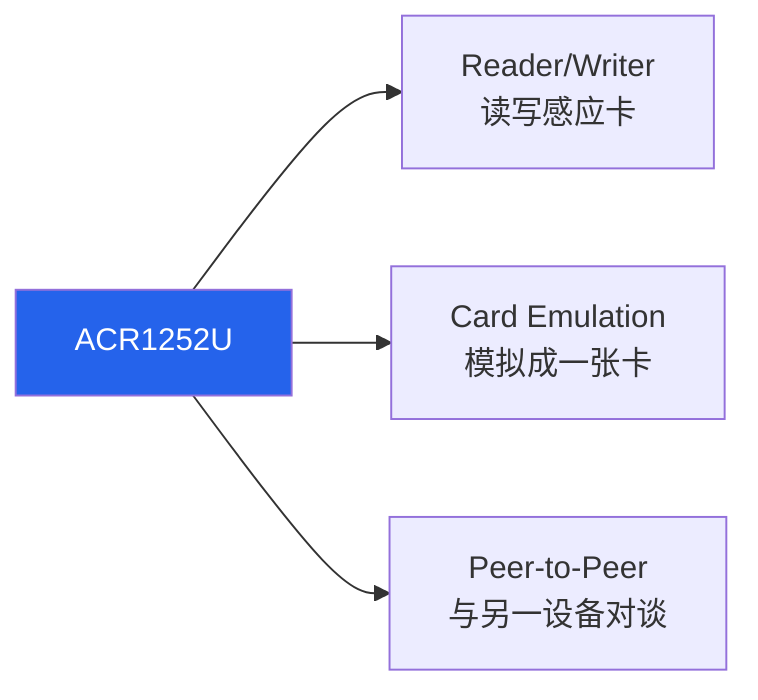
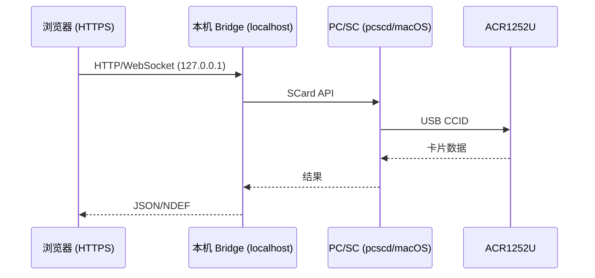

# ACR1252U — USB NFC Reader III（NFC Forum Certified）完整说明

> **一句话定位**：ACR1252U 是 ACS 第二代 NFC 读卡器家族中最受欢迎的成员，主打 **NFC Forum 认证** + **内置 SAM（Secure Access Module）安全插槽**。它能做 NFC 的 Reader/Writer、Card Emulation、Peer-to-Peer 三种模式，适合要上正式产品、需要密钥分散与双向认证的开发者。

如果你在 ACR122U 与 ACR1252U 之间犹豫：ACR122U 是「便宜好玩的入门」，ACR1252U 是「要上线、要安全、要 NFC Forum 兼容标章」的专业选择。

## 开箱与外观

- **主体**：98.0 × 65.0 × 12.8 mm，雾黑（Matte Black）塑料外壳，81 g。
- **天线**：内置 50 × 40 mm 天线，读距最远 50 mm。
- **两个 USB 版本**：USB Type-A（`ACR1252U-M1`）与 USB Type-C（`ACR1252U-MF`）——买之前确认你电脑的连接端口。
- **SAM 插槽**：主体一个标准 SIM 尺寸插槽，用来插 SAM 卡。
- **可编程 LED + 蜂鸣器**：LED（红/绿）与蜂鸣器都可由软件控制。
- **选配底座**：可选购立架，让读卡器站立成最佳感应角度。

## 规格总览

| 项目 | 规格 |
|------|------|
| 认证 | **NFC Forum Certified**、IEC/EN 62368、CE、UKCA、FCC、VCCI、TELEC、KC、BIS、RoHS、REACH、WEEE、Microsoft WHQL |
| 支持标准/卡片 | ISO/IEC 18092 NFC、ISO 14443 Type A & B（T=CL）、MIFARE®、FeliCa |
| 工作频率 | 13.56 MHz |
| 读写速度 | 106 / 212 / **424** kbps（可编程） |
| NFC 模式 | Reader/Writer、Peer-to-Peer、Card Emulation（三种全支持） |
| SAM 插槽 | 1 × ISO 7816 Class A（5 V）/ SIM 尺寸／T=0、T=1，9.6–215 kbps |
| 防碰撞 | 内置 |
| 扩展 APDU | ✅（最大 64 KB） |
| USB 接口 | USB CCID，USB 2.0 Full Speed（12 Mbps），兼容 USB 3.0 |
| 供电 | 5 VDC，最大 200 mA |
| Firmware 升级 | ✅（透过 USB） |
| 尺寸/重量 | 98.0 × 65.0 × 12.8 mm / 81 g |
| USB Vendor/Product ID | `072F:223B` |
| 系统支持 | Windows、Linux、macOS、Android |
| 官方文档 | [ACR1252U 产品页](https://www.acs.com.hk/en/products/178/acr1252u-usb-nfc-reader-iii/)、[技术规格 (PDF)](https://www.smartcardfocus.com/files/ACR1252U-DOT/TechnicalSpecification_TSP-ACR1252U-2.02_Mar2024.pdf) |

## 重点特色深入

### SAM 安全插槽（这款的杀手级功能）

SAM = Secure Access Module。把一张 SAM 卡插进 slot 后，读卡器可以把**密钥分散（Key Diversification）**与**双向认证（Mutual Authentication）**这些敏感运算「外包」给实体 SAM 卡执行，密钥永远不离开硬件。这对金融、门禁、交通等需要高安全等级的应用至关重要——就算主机被入侵，读卡器也拿不到真正的密钥。

### 三种 NFC 模式



- **Reader/Writer**：最常用，读写 NFC 标签与卡片。
- **Card Emulation**：让读卡器「扮演」一张感应卡，供其他读卡器/手机读取（例如会员卡模拟、数字门禁）。
- **Peer-to-Peer**：与另一台支持 P2P 的 NFC 设备交换数据（例如与手机 Android Beam 对谈）。

## 安装与驱动（Linux）

:::caution libnfc 兼容性：这款很关键
与 ACR122U 不同，**ACR1252U 没有 libnfc 的直连 driver**。libnfc 社区明确表示 `acr122_usb` 只认 `072F:2200`（ACR122U）、`072F:90CC`（Touchatag）、`072F:2214`（ACR1222），**不包括 `072F:223B`（ACR1252U）**。
因此要用 libnfc 的话，只能透过 libnfc 的 **PC/SC driver**（`pcsc` wrapper），也就是**一定要先启动 `pcscd`**，libnfc 再去「经过 PC/SC」存取。这代表 mfoc/mfcuk 这类依赖 libnfc 直连的工具对 ACR1252U 支持不佳。
**务实建议**：这款就用标准 PC/SC（`pcsc_scan` + `pyscard`），这才是它的主场。
:::

**Step 1：安装并启动 PC/SC（Debian/Ubuntu）**

```bash
sudo apt update
sudo apt install -y pcscd pcsc-tools libpcsclite-dev
sudo systemctl enable --now pcscd
```

**Step 2：插入读卡器并扫描**

```bash
pcsc_scan
```

预期输出：

```text
Scanning present readers...
0: ACS ACR1252U 0
```

放上卡片，预期看到：

```text
Reader 0: ACS ACR1252U 0
  Card state: Card inserted,
  ATR: 3B 8F 80 01 80 4F 0C A0 00 00 03 06 03 00 01 00 00 00 00 6A
```

**Step 3：确认 USB 设备名（可选）**

```bash
lsusb
```

预期：

```text
Bus 001 Device 008: ID 072f:223b Advanced Card Systems, Ltd
```

确认 `072f:223b` 就是它。

## macOS 安装

macOS **内置 PC/SC**（`pcscd` 以 launchd 服务存在），ACR1252U 是 CCID 读卡器，插上就能被系统识别，不需额外驱动。

**Step 1：列读卡器**

```bash
pcsc_scan
```

在 macOS 上会透过内置 PC/SC 列出 `ACS ACR1252U 0`。

**Step 2（可选）：用 Python 测试**

macOS 对 Python 的 PC/SC 绑定较常见的是 `pyscard`（它底层走系统 PC/SC）：

```bash
python3 -m pip install pyscard
python3 - <<'EOF'
from smartcard.System import readers
print(readers())
EOF
```

预期印出 `['ACS ACR1252U 0']`（版本不同名称可能略异）。放上卡片再跑，就能开始读 UID / 发 APDU。

## Web NFC、macOS 与浏览器：真相与解法 {#web-nfc-macos-browser}

很多人误以为「买一台支持 Web NFC 的读卡器，浏览器就能直接读卡」。这里必须把真相讲清楚：

1. **Web NFC API（`NDEFReader`）只在 Chrome 的 Android 版可用**。macOS 桌面 Chrome/Safari/Firefox **都不支持**——这是 Web NFC 目前最主要、也最常被误解的限制。
2. **WebUSB 也行不通**：ACR1252U 的 USB 接口是 **Smart Card class（0x0B）**，而浏览器的 WebUSB 明确**禁止**存取受保护的 class（含 Smart Card）。所以 `navigator.usb.requestDevice()` 会回报 blocked。
3. **正解 = PC/SC bridge**：在 macOS/Windows/Linux 上，正确做法是让电脑上的 PC/SC 堆栈接管读卡器，再用一支本机桥接程序暴露 HTTP/WebSocket 给浏览器。这正是开源项目如 [web-nfc-bridge](https://github.com/YuDefine/web-nfc-bridge)（以 ACR1252U-M1 实测）采用的架构：



:::tip 结论
在 macOS 上要「浏览器 + ACR1252U」，别找 Web NFC——架一支本机 PC/SC bridge 就对了。若你只想在手机浏览器读卡，手机本身的 NFC 天线 + Web NFC（Android Chrome）即可，与读卡器无关。
:::

## 快速开始：pyscard 读 UID（跨平台）

```bash
pip install pyscard
```

```python
from smartcard.System import readers

r = readers()
print("Readers:", r)
conn = r[0].createConnection()
conn.connect()
# GET UID
data, sw1, sw2 = conn.transmit([0xFF, 0xCA, 0x00, 0x00, 0x04])
print("UID:", data)
print(f"SW: {sw1:02X} {sw2:02X}")
```

预期 `SW: 90 00`（成功）。

## 兼容性

| 平台 | 支持 | 备注 |
|------|------|------|
| Windows 10/11 | ✅ | 内置 Microsoft CCID/PC/SC 驱动，即插即用 |
| Linux (Kali/Ubuntu) | ✅ | 走 PC/SC（pcscd）；**无 libnfc 直连** |
| macOS | ✅ | 内置 PC/SC，免驱动 |
| Android | ✅ | 可透过 OTG + PC/SC 应用使用 |
| 浏览器 | ⚠️ | Web NFC 只在 Android；桌面需 PC/SC bridge |

## 故障排查

### 1. `nfc-list` 找不到 ACR1252U
- **原因**：libnfc 没有这款的直连 driver（`072F:223B` 不在表内）。
- **解法**：这款请改用 `pcsc_scan` / `pyscard` / `opensc-tool`，走标准 PC/SC。若真要 libnfc，确保 pcscd 有跑，且 libnfc 以 `--with-drivers=pcsc` 建置。

### 2. `pcsc_scan` 没东西
- **原因**：`pcscd` 没启动。
- **解法**：`sudo systemctl start pcscd`（Linux）；macOS 检查 `ps aux | grep pcscd` 或 `sudo launchctl load -w /System/Library/LaunchDaemons/com.apple.securityd...`（通常内置已启用）。

### 3. 读 FeliCa/特定卡一直失败
- **原因**：卡片超出了该款的收发协议支持，或读距/角度问题。
- **解法**：确认卡片属 ISO 14443 A/B、MIFARE、FeliCa、ISO 18092；把卡平放于天线正中央；若要多协议（含 ISO 15693）请考虑 [ACR1552U](/acs/products/acr1552u/)。

### 4. SAM 插槽读不到
- **原因**：SAM 卡方向/尺寸（SIM 尺寸）、或 SAM 卡 Class 不符（需 Class A / 5 V）。
- **解法**：确认使用 ISO 7816 Class A SIM 尺寸 SAM 卡，插入方向正确。SAM 与主读卡器是两套独立通道，APDU 走不同节点。

## 相关资源

- [ACS — 读卡器系列总览](/acs/)
- [ACR122U — 经典入门 NFC 读卡器](/acs/products/acr122u/)（libnfc 直连、便宜、学项目首选）
- [ACR1552U — 第 4 代、多协议](/acs/products/acr1552u/)（要 ISO 15693、更高 848 kbps 时选它）
- [Yupitek Wiki 总览](/getting-started/)