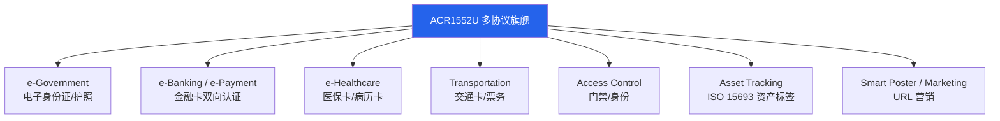

# ACR1552U — USB NFC Reader IV（第 4 代）完整说明

> **一句话定位**：ACR1552U 是 ACS 第 4 代旗舰 USB 读卡器，特色是**多协议**——它多了 **ISO 15693** 支持与高达 **848 kbps** 的读写速度，并首度加入**键盘模拟（Keyboard Emulation）模式**，加上 SAM 安全插槽，是政府、医保、交通、资产盘点等「需要读很多种卡」的应用首选。

如果 ACR122U 是「入门玩具」、ACR1252U 是「NFC 专业版」，那 ACR1552U 就是「什么都能插、更快、更广」的旗舰。

## 开箱与外观

- **主体**：98.0 × 65.0 × 12.8 mm，白色塑料外壳，约 79–89 g（依 USB 版本）。
- **天线**：内置 50 × 40 mm 天线，**读距最远 70 mm**（本家族最远）。
- **两个 USB 版本**：USB Type-A（`ACR1552U-M1`）与 USB Type-C（`ACR1552U-MF`）。
- **SAM 插槽**：1 × ISO 7816 Class A（5 V）/ SIM 尺寸插槽。
- **可编程 LED + 蜂鸣器**：蓝/绿双色 LED，蜂鸣器可编程。
- **连接线**：固定式 USB 线，长 1 m。

## 规格总览

| 项目 | 规格 |
|------|------|
| 世代 | 第 4 代（USB NFC Reader IV） |
| 支持标准/卡片 | **ISO 14443 Type A & B（Part 1–4）、ISO 15693、ISO 18092 NFC**、MIFARE®、FeliCa、SRI/SRIX、CTS、Innovatron、Picopass、Topaz |
| 工作频率 | 13.56 MHz |
| 读写速度 | **106 / 212 / 424 / 848 kbps**（ISO 14443）；26 / 53 kbps（ISO 15693） |
| 读距 | 最远 **70 mm**（依卡片类型） |
| NFC 模式 | Reader/Writer、**Keyboard Emulation**、Card Emulation |
| SAM 插槽 | 1 × ISO 7816 Class A（5 V）/ SIM 尺寸／T=0、T=1，13.4 kbps–1,250 kbps，时钟 5 MHz（可 10 MHz） |
| 防碰撞 | 内置 |
| 扩展 APDU | ✅（最大 64 KB） |
| USB 接口 | USB CCID，USB 2.0 Full Speed（12 Mbps），兼容 USB 3.0 |
| 供电 | 5 VDC，最大 300 mA |
| Firmware 升级 | ✅（透过 USB） |
| 尺寸/重量 | 98.0 × 65.0 × 12.8 mm / 约 79–89 g |
| 系统支持 | Windows、Linux、macOS、Android、iOS/iPadOS 16+ |
| 官方文档 | [ACR1552U 产品页](https://www.acs.com.hk/en/products/575/acr1552u-usb-nfc-reader-iv/)、[技术规格 (PDF)](https://www.smartcardfocus.com/files/ACR1552U-M1SAM/TechnicalSpecification_TSP-ACR1552U-1.05_Jan2024.pdf) |

## 这款与前两款差在哪（重点）

| 能力 | ACR122U | ACR1252U | **ACR1552U** |
|------|---------|----------|--------------|
| ISO 15693 | ❌ | ❌ | ✅ |
| ISO 14443 最高速度 | 424 kbps | 424 kbps | **848 kbps** |
| 最大读距 | 50 mm | 50 mm | **70 mm** |
| 卡片类型数 | MIFARE/FeliCa/NFC | MIFARE/FeliCa/NFC | **+SRI/SRIX、CTS、Innovatron、Picopass、Topaz** |
| 键盘模拟 | ❌ | ❌ | ✅ |
| SAM 插槽 | ❌ | ✅ | ✅ |
| libnfc 直连 | ✅ | ❌（走 PC/SC） | ❌（走 PC/SC） |

:::note 哪些卡只有 ACR1552U 能读？
**ISO 15693** 主要用于资产追踪标签（图书馆、仓储、衣物吊牌）与部分智能标签；**Picopass / Topaz / SRIX** 等则出现在特定门禁与电子标签生态。若你的项目会碰到这些，只有 ACR1552U 能通吃。
:::

## 应用场景



**键盘模拟（Keyboard Emulation）**值得特别介绍：启用后，刷一张卡系统会自动「打字」输出卡号，**就像你从键盘输入一样**。这对「不想写程序、只想让任何字段自动填入卡号」的场景（如网页登录框、Excel 打卡表）非常实用——不需要任何 SDK 或 PC/SC 程序。

## 安装与驱动（Linux + macOS）

与 ACR1252U 相同，**ACR1552U 没有 libnfc 直连 driver**（USB ID 不属于 `acr122_usb`）。请一律走**标准 PC/SC**。

**Step 1：Linux — 安装并启动 PC/SC**

```bash
sudo apt update
sudo apt install -y pcscd pcsc-tools libpcsclite-dev
sudo systemctl enable --now pcscd
```

**Step 2：确认 USB 设备**

```bash
lsusb
```

预期（依型号版本略有不同，皆为 Advanced Card Systems, Ltd）：

- `ACR1552U-M1`（USB Type-A）→ `ID 072f:2303`
- `ACR1552U-M2` / `-MF` → `ID 072f:2308`
- Firmware 升级模式 → `ID 072f:2302`

```text
Bus 001 Device 005: ID 072f:2303 Advanced Card Systems, Ltd
```

**Step 3：扫描读卡器**

```bash
pcsc_scan
```

预期输出：

```text
Scanning present readers...
0: ACS ACR1552U 0
```

放上卡片，预期看到 `Card state: Card inserted, ATR: ...`。

**Step 4：macOS**

macOS 内置 PC/SC，还特别新增了 **iOS/iPadOS 16+** 支持。直接：

```bash
pcsc_scan
```

即可列出 `ACS ACR1552U 0`。读 ISO 15693 标签时，`pcsc_scan` 会显示对应的卡片状态。

## 快速开始：用 pyscard 读卡片（跨平台）

```bash
pip install pyscard
```

```python
from smartcard.System import readers

r = readers()
print("Readers:", r)
conn = r[0].createConnection()
conn.connect()

# 读 ISO 14443 UID
data, sw1, sw2 = conn.transmit([0xFF, 0xCA, 0x00, 0x00, 0x04])
print("ISO 14443 UID:", data, f"SW: {sw1:02X} {sw2:02X}")
```

预期 `SW: 90 00`。**若你放的是 ISO 15693 标签**，这道 APDU 可能不适用——ISO 15693 有自己的一套指令（透过扩展 APDU 命令），建议从 ACS 的 Reference Manual 取得正确命令。

:::tip 第一次用 ISO 15693？
ISO 15693 标签的读法与 ISO 14443 不同，且各家标签（NXP ICODE、ST）指令集略有差异。最直接的验证方式是 `pcsc_scan` 看到卡片被识别为 ISO 15693 类型，之后再依参考手册发对应命令。
:::

## 兼容性

| 平台 | 支持 | 备注 |
|------|------|------|
| Windows 10/11 | ✅ | 内置 Microsoft CCID/PC/SC 驱动 |
| Linux (Kali/Ubuntu) | ✅ | 走 PC/SC（pcscd）；无 libnfc 直连 |
| macOS | ✅ | 内置 PC/SC，免驱动 |
| Android | ✅ | OTG + PC/SC 应用 |
| iOS/iPadOS 16+ | ✅ | 透过支持的 PC/SC 应用使用 |
| 浏览器 | ⚠️ | Web NFC 只在 Android；桌面需 PC/SC bridge（见 ACR1252U 的 [Web NFC 章节](/acs/products/acr1252u/#web-nfc-macos-browser)） |

## 故障排查

### 1. ISO 15693 标签读不到
- **原因**：可能用了 ISO 14443 那组 APDU，或标签超出 70 mm 读距。
- **解法**：用 `pcsc_scan` 先确认标签被识别为 ISO 15693；再查 ACS Reference Manual 的 ISO 15693 命令；确认标签平放且距离 ≤ 70 mm。

### 2. 键盘模拟没输出
- **原因**：键盘模拟模式需在控制项/固件设置中启用；或操作系统输入焦点不在预期字段。
- **解法**：依 ACS 工具启用 Keyboard Emulation 模式；确保目标字段取得输入焦点；检查键盘 layout（数字码可能因 layout 不同而异）。

### 3. libnfc 找不到这款
- **原因**：无直连 driver。
- **解法**：与 ACR1252U 相同，走 PC/SC（pcscd + pyscard/opensc-tool）。依赖 mfoc/mfcuk 的 MIFARE 破解工作流建议改用 [ACR122U](/acs/products/acr122u/)。

### 4. SAM 卡读不到
- **原因**：需 ISO 7816 Class A（5 V）SIM 尺寸 SAM 卡；方向或型号不符。
- **解法**：确认 SAM Class A / SIM 尺寸；正确插入；SAM 与主通道是独立的两套 APDU 节点。

## 相关资源

- [ACS — 读卡器系列总览](/acs/)
- [ACR122U — 经典入门 NFC 读卡器](/acs/products/acr122u/)（libnfc 直连、MIFARE 研究）
- [ACR1252U — NFC Forum 认证、带 SAM](/acs/products/acr1252u/)（NFC 三模式、正式产品）
- [Yupitek Wiki 总览](/getting-started/)