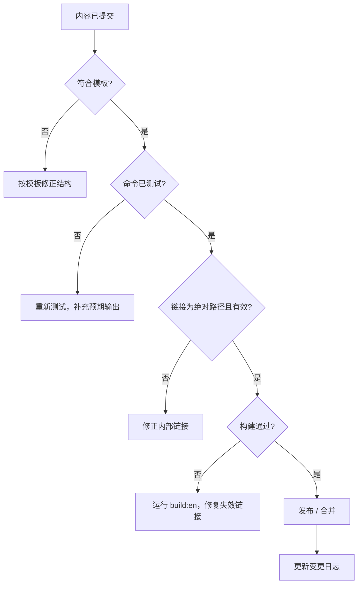

# 审核队列

审核队列是对任何新增、编辑或翻译的 wiki 内容在视为完成之前进行分类的工作流。它与 `support-policy` 的决策流程相对应。

## 工作流



## 检查清单

页面获批之前：

- [ ] Frontmatter `id` 在整个 wiki 中唯一。
- [ ] 结构与 `模板` 中对应的模板一致。
- [ ] 设置/指南/故障排查页面至少包含一个图表。
- [ ] 每条 ```bash 命令均已测试并展示预期输出。
- [ ] 无 `TODO` / `TBD` 占位符。
- [ ] 所有内部链接使用绝对路由路径。
- [ ] `npm run build:en` 通过且零失效链接。
- [ ] 翻译的语言版本在同一次更改中更新（参见 `翻译术语表`）。

## 获批之后

在 [`变更日志`](/admin/change-log/) 中记录该更改。

如果更改新增或重命名了产品，请在同一次提交中更新 `产品注册表` 与 `驱动注册表`。