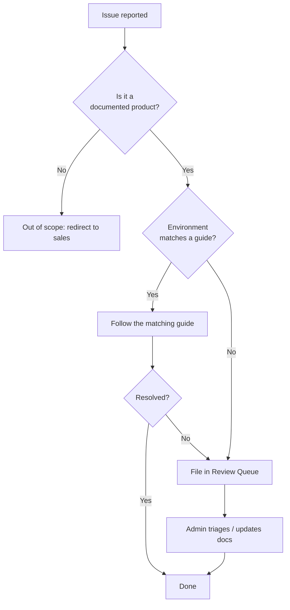

# 支援政策

本頁說明 Yupitek Wiki 涵蓋的範圍、哪些不在範圍內，以及請求如何被分流處理。

## 本 Wiki 支援的內容

本 Wiki 是我們所販售五個產品系列的**技術參考**：

- **ALFA Network** — Linux/Wi-Fi 驅動程式設定、監聽模式、硬體整合。
- **Hak5** — 滲透測試工具的設定、韌體與使用方式。
- **Flipper Zero** — 韌體、行動應用程式與配件。
- **SDRLAB** — 軟體定義無線電設定與 Flipper 擴充模組。
- **ACS** — 智慧卡讀卡機驅動程式與 NFC 使用。

內容是為**學生與初學者**撰寫的：清楚、逐步說明，並附上可運作的指令與預期輸出。

## 支援等級

| 等級 | 涵蓋內容 | 範例 |
|-------|----------------|---------|
| **Documented（有文件）** | 本 Wiki 中有指南涵蓋 | 安裝 `rtl8812au` DKMS 驅動程式 |
| **Best-effort（盡力而為）** | 合理預期可運作，但取決於環境 | 在特殊硬體上使用 Linux |
| **Out of scope（超出範圍）** | 不在 Yupitek 支援範圍內 | 第三方韌體分支、不受支援的核心 |

## 超出範圍

以下項目**不在**本 Wiki 的支援範圍內：

- 由非製造商發佈的第三方韌體分支所導致的問題（例如非官方的 Flipper 版本）。
- 比各晶片組指南所列更舊的核心上的驅動程式。
- 硬體故障 — 如需 RMA，請聯絡 [Yupitek 銷售](https://www.yupitek.com)。
- 我們已不再販售的產品（目前庫存請參閱 [產品登錄](/admin/product-registry/)）。

## 請求如何被分流處理

## 回報本 Wiki 的問題

如果指南有誤、缺少某個步驟，或某個指令不再運作，請告訴我們。問題會記錄在 [審查佇列](/admin/review-queue/) 中，修正內容則記錄在 [變更紀錄](/admin/change-log/) 中。

請記住黃金法則：在正式環境或評估目標上執行指令前，務必先在測試環境中驗證。