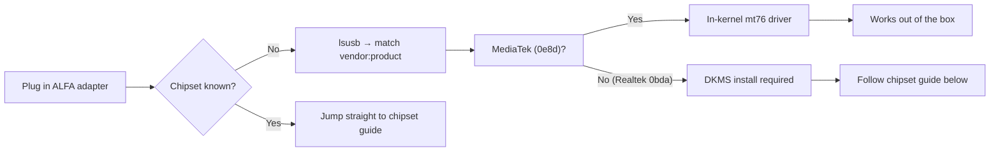

# ALFA 驅動程式指南——總覽

> **一句話定位（One-liner）**：Linux 上的每支 ALFA 無線網絡卡都由**七顆晶片**之一驅動——三顆 MediaTek 晶片使用**內建於核心**的驅動程式、開箱即用，四顆 Realtek 晶片需要**樹外 DKMS** 建置。在下方找到你的晶片並跳到它的指南。

## 晶片對照表

| 晶片 | 無線網絡卡 | 驅動程式繫結 | 內建於核心？ | 指南 |
|---------|----------|----------------|------------|-------|
| MT7612U | AWUS036ACM | `mt76x2u` | ✅ 內建於核心 | [MT7612U 指南](/alfa-network/drivers/mt7612u/) |
| MT7610U | AWUS036ACHM | `mt76x0u` | ✅ 內建於核心 | [MT7610U 指南](/alfa-network/drivers/mt7610u/) |
| MT7921AUN | AWUS036AXM、AWUS036AXML | `mt7921u` | ✅ 內建於核心 | [MT7921AUN 指南](/alfa-network/drivers/mt7921aun/) |
| RTL8812AU | AWUS036ACH | 樹外 / DKMS | ❌ 不在核心內 | [RTL8812AU 指南](/alfa-network/drivers/rtl8812au/) |
| RTL8811AU | AWUS036ACS | 樹外 / DKMS | ❌ 不在核心內 | [RTL8811AU 指南](/alfa-network/drivers/rtl8811au/) |
| RTL8832BU | AWUS036AX、AWUS036AXER | 樹外 / DKMS | ❌ 不在核心內 | [RTL8832BU 指南](/alfa-network/drivers/rtl8832bu/) |
| RTL8821CU | AWUS036EACS | 樹外 / DKMS | ❌ 不在核心內 | [RTL8821CU 指南](/alfa-network/drivers/rtl8821cu/) |

## 如何挑選

1. **確認晶片**——執行 `lsusb` 並把 `vendor:product` 配對到你的無線網絡卡規格表。
2. **MediaTek 晶片？** 你完成了——驅動程式在核心內。直接前往指南，用 `dmesg` / `iw dev` 確認並啟用監聽模式（monitor mode）。
3. **Realtek 晶片？** 依照對應指南建置 DKMS 模組。記得：核心更新後需要 `sudo dkms autoinstall`。

完整的系統教學在 [Linux 設定指南](/alfa-network/linux-setup-ubuntu/) 與[相容性矩陣](/alfa-network/linux-compatibility-matrix/) 中。