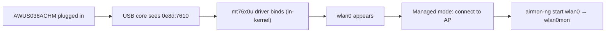

# MT7610U 驅動程式指南（AWUS036ACHM）

> **一句話定位（One-liner）**：**MediaTek MT7610U** 是 **AWUS036ACHM** 內部的 1T1R（單串流）雙頻晶片——一款平價 AC433 無線網絡卡，其 `mt76x0u` 驅動程式**自 4.19 起內建於 Linux 核心**。就像它的老大哥 MT7612U 一樣，在任何現代 Linux 上都是隨插即用。

## 概念：「小老弟」晶片

MT7612U 是 2×2 無線電，而 MT7610U 是 **1×1**——單一空間串流，所以 5 GHz 上限是 433 Mbps 而不是 867。這正是 AWUS036ACHM 的 AC433 規格。你在速度上失去的，在簡潔與價格上贏回來：它是最便宜的 ALFA 無線網絡卡，同時仍給你**內建於核心的驅動程式 + 雙頻 + 可用的監聽模式（monitor mode）**。

驅動程式位於同一個主線 `mt76` 家族（`drivers/net/wireless/mediatek/mt76/mt76x0/`），所以體驗與 MT7612U 完全相同：

- 插上 → 介面出現。不需要安裝。
- 沒有 DKMS → 核心更新後沒有需要維護的東西。
- 透過標準 `mac80211` 工具支援監聽模式 + 注入。



## 前置需求

- [ ] 核心 **4.19 或更新**的 Linux
- [ ] `sudo` 許可權
- [ ] AWUS036ACHM（或任何 MT7610U dongle）

## 步驟 1：驗證驅動程式

```bash
lsusb | grep -i mediatek
lsmod | grep mt76x0
```

**預期輸出**：

```text
Bus 001 Device 005: ID 0e8d:7610 MediaTek Inc. MT7610U
mt76x0u                20480  0
mt76x02_common         49152  2 mt76x0u
mt76                   94208  2 mt76x0u,mt76x02_common
```

如果 `lsmod` 是空的但 `lsusb` 看得到裝置：`sudo modprobe mt76x0u`。

## 步驟 2：確認介面

```bash
iw dev
```

**預期輸出**：

```text
phy#0
	Interface wlan0
		ifindex 3
		addr 00:c0:ca:xx:xx:xx
		type managed
```

## 步驟 3：連線

```bash
nmcli device wifi connect "MySSID" password "my-passphrase"
```

**預期輸出**：`Device 'wlan0' successfully activated with 'MySSID'.`

> 在相同距離下，預期吞吐量大約是 AWUS036ACM 的**一半**——這就是 1×1 無線電。對課堂練習、做筆記與輕量擷取來說完全沒問題。

## 步驟 4：監聽模式

```bash
sudo ip link set wlan0 down
sudo iw wlan0 set monitor none
sudo ip link set wlan0 up
iw dev
```

**預期輸出**：`type monitor`。或使用 Aircrack-ng 的輔助工具：

```bash
sudo airmon-ng start wlan0
```

注入檢查：

```bash
sudo aireplay-ng --test wlan0mon
```

**預期輸出**：`30/30: 100%` 與 `Injection is working!`

## 步驟 5：恢復正常

```bash
sudo airmon-ng stop wlan0mon
sudo systemctl restart NetworkManager
```

## 疑難排解

| 症狀 | 原因 | 修復 |
|---|---|---|
| 不在 `lsusb` 中 | 電源 / 傳輸線 | 不同的連線埠、供電 hub——[疑難排解索引](/alfa-network/troubleshooting/) |
| 沒有介面 | 驅動程式未載入 | `sudo modprobe mt76x0u`；檢查 `dmesg \| grep mt76` |
| 5 GHz 吞吐量卡在 ~150 Mbps | 這就是 1×1 硬體限制 | 不是 bug——AC433 等級代表連結 ~300–400 Mbps，實際 ~150–250 |
| 監聽模式被拒絕 | 核心 < 4.19 | 升級核心 / 作業系統 |
| 注入測試失敗 | 頻道無訊號 / RF 區域 | `sudo iw wlan0mon set channel 6`，在 AP 附近測試 |

## 參考資料

- [AWUS036ACHM 產品頁面](/alfa-network/products/awus036achm/)
- [Ubuntu 設定指南](/alfa-network/linux-setup-ubuntu/) 與 [Kali 設定指南](/alfa-network/linux-setup-kali/)
- [相容性矩陣](/alfa-network/linux-compatibility-matrix/)
- 主線驅動程式原始碼：Linux 核心樹中的 `drivers/net/wireless/mediatek/mt76/mt76x0/`