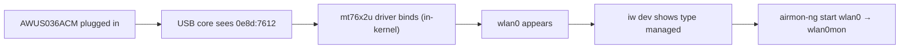

# MT7612U 驅動程式指南（AWUS036ACM）

> **一句話定位（One-liner）**：**MediaTek MT7612U** 是 **AWUS036ACM** 內部的晶片——它的 `mt76x2u` 驅動程式**自版本 4.19 起內建於 Linux 核心**。光是這個事實就讓 ACM 成為 Linux 上摩擦最小的 ALFA 無線網絡卡：不需要安裝、不需要 DKMS、不需要維護。

## 概念：「內建於核心」對 MT7612U 意味著什麼

MT7612U 是一顆 **2T2R**（2 傳 / 2 收）雙頻 802.11ac 無線電——就是 AC1200 規格中的「300 + 867 Mbps」。因為 MediaTek 把驅動程式上游到主線核心（`drivers/net/wireless/mediatek/mt76/`），每個 Linux 發行版都隨附預先編譯。

對學生來說，實際影響非常大：

- **Ubuntu / Kali / Debian / Fedora**：插上 → `wlan0` 就存在。零指令。
- **沒有 DKMS**：核心更新時沒有需要重建的東西。無線網絡卡不會像 Realtek DKMS 模組那樣「升級後壞掉」。
- **監聽模式（monitor mode）+ 封包注入（packet injection）**透過標準 `mac80211` 介面運作——不需要特殊工具。



## 前置需求

- [ ] 核心 **4.19 或更新**的 Linux（`uname -r`——Ubuntu 20.04+ / 任何近期 Kali 都可以）
- [ ] `sudo` 許可權
- [ ] AWUS036ACM（或任何 MT7612U dongle）

## 步驟 1：驗證驅動程式已載入

插上無線網絡卡並檢查：

```bash
lsusb | grep -i mediatek
lsmod | grep mt76x2u
```

**預期輸出**：

```text
Bus 001 Device 004: ID 0e8d:7612 MediaTek Inc. MT7612U 802.11a/b/g/n/ac 2T2R Wireless Adapter
mt76x2u                24576  0
mt76x2_common          36864  1 mt76x2u
mt76                   94208  2 mt76x2u,mt76x2_common
```

`mt76x2u` 那一行帶有非零的 refcount 代表驅動程式認領了你的無線網絡卡。（如果 `lsmod` 什麼都沒顯示但 `lsusb` 看得到裝置，驅動程式是隨需載入的核心模組——執行 `sudo modprobe mt76x2u`。）

## 步驟 2：確認介面

```bash
iw dev
```

**預期輸出**：

```text
phy#0
	Interface wlan0
		ifindex 3
		addr 00:c0:ca:xx:xx:xx
		type managed
```

> **你可能會想問**——*「為什麼我的 MAC 是 00:c0:ca:...？」* 因為 `00:c0:ca` 是 **ALFA MAC OUI**——每支 ALFA 無線網絡卡都以這三個位元組開頭。在塞滿 dongle 的實驗室裡識別無線網絡卡時很方便。

## 步驟 3：連線（managed 模式）

```bash
nmcli device wifi connect "MySSID" password "my-passphrase"
```

**預期輸出**：`Device 'wlan0' successfully activated with 'MySSID'.`

## 步驟 4：監聽模式（有趣的部分）

```bash
sudo ip link set wlan0 down
sudo iw wlan0 set monitor none
sudo ip link set wlan0 up
iw dev
```

**預期輸出**：介面那一行現在顯示 `type monitor`。或者使用 Aircrack-ng 輔助工具：

```bash
sudo airmon-ng start wlan0
```

**預期輸出**：

```text
PHY	Interface	Driver		Chipset
phy0	wlan0		mt76x2u		MediaTek Inc. MT7612U
		(mac80211 monitor mode vif enabled for [phy0]wlan0 on [phy0]wlan0mon)
```

注入自我測試（廣播——在任何頻道上都安全）：

```bash
sudo aireplay-ng --test wlan0mon
```

**預期輸出**：`30/30: 100%` 與 `Injection is working!`

## 步驟 5：把它關掉

```bash
sudo airmon-ng stop wlan0mon
sudo systemctl restart NetworkManager
```

## 疑難排解

| 症狀 | 原因 | 修復 |
|---|---|---|
| `lsusb` 什麼都沒顯示 | 電源 / 傳輸線問題 | 試另一個連線埠、供電 hub、另一條傳輸線——請見[疑難排解索引](/alfa-network/troubleshooting/) |
| `lsusb` 正常，沒有 `wlan0` | 驅動程式未載入（非常罕見） | `sudo modprobe mt76x2u`；檢查 `dmesg \| grep mt76` |
| `airmon-ng` 回報「monitor mode not supported」 | 核心比 4.19 舊 | 升級你的核心 / 作業系統 |
| 監聽模式可用但注入失敗 | 頻道錯誤 / 無 RF 區域 | `sudo iw wlan0mon set channel 6`；在 AP 附近測試 |
| 暫停/恢復後 WLAN 消失 | 某些筆電上已知的 USB 怪癖 | 恢復後拔下/重新插上無線網絡卡 |

## 參考資料

- [AWUS036ACM 產品頁面](/alfa-network/products/awus036acm/)
- [Ubuntu 設定指南](/alfa-network/linux-setup-ubuntu/) 與 [Kali 設定指南](/alfa-network/linux-setup-kali/)
- [相容性矩陣](/alfa-network/linux-compatibility-matrix/)
- 主線驅動程式原始碼：Linux 核心樹中的 `drivers/net/wireless/mediatek/mt76/mt76x2/`