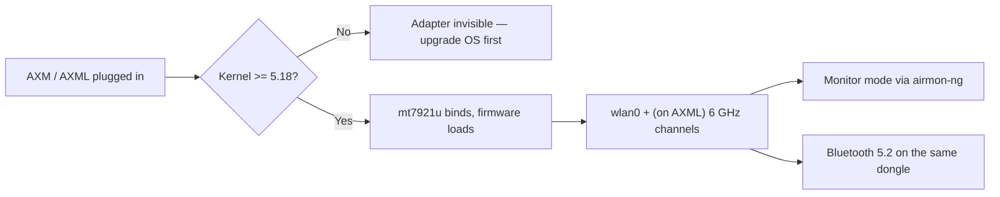

# MT7921AUN 驅動程式指南（AWUS036AXM / AWUS036AXML）

> **一句話定位（One-liner）**：**MediaTek MT7921AUN** 驅動 **AWUS036AXM**（Wi-Fi 6、AX3000）與 **AWUS036AXML**（Wi-Fi 6E、含 6 GHz 頻段的 AXE3000）。它的 `mt7921u` 驅動程式**自核心 5.18 起進入主線**——備受喜愛的 MT7612U 的現代繼任者，也是這個產品線在 Linux 上通往 6 GHz 的唯一路徑。

## 概念：MT7921AUN 給你什麼

這是 ALFA 產品線中 MediaTek 最新的無線電，一個 **2×2:2 802.11ax** 設計，同一個 dongle 上還包含**藍牙 5.2**。對 Linux 使用者有三件事很重要：

1. **內建於核心的驅動程式**（`drivers/net/wireless/mediatek/mt76/mt7921/`）自 **Linux 5.18** 起——沒有 DKMS、沒有編譯。
2. **Wi-Fi 6E**：AXML 版本開啟 **6 GHz 頻段**（5 GHz 以上的頻道 1–233），這是目前可用頻譜中壅塞度最低的。
3. **需要韌體 blob**——驅動程式從 `linux-firmware` 載入 `mt7921` 韌體，所以請保持該套件更新。

主要警告：因為驅動程式需要 **5.18+ 核心**，較舊的作業系統版本看不到這支無線網卡。Ubuntu 22.04+ 與近期 Kali 沒問題；Ubuntu 20.04 不行。



## 前置需求

- [ ] 核心 **5.18 或更新**的 Linux（`uname -r`）
- [ ] 已安裝且夠新的 `linux-firmware` 套件
- [ ] `sudo` 權限
- [ ] AWUS036AXM 或 AWUS036AXML

## 步驟 1：核心檢查

```bash
uname -r
```

**預期輸出**（範例）：

```text
6.8.0-51-generic        # Ubuntu 24.04 — OK
6.1.0-kali9-amd64       # Kali — OK
5.15.0-91-generic       # Ubuntu 22.04 base — TOO OLD for mt7921u
```

在 5.15 或更舊：`sudo apt update && sudo apt upgrade`（或在 Ubuntu 22.04 上安裝 HWE 核心）。驅動程式在舊核心上不存在——這是硬性需求，不是設定細節。

## 步驟 2：驗證驅動程式與韌體

插上無線網卡：

```bash
lsusb | grep -i mediatek
lsmod | grep mt7921u
dmesg | grep -i mt7921
```

**預期輸出**：

```text
Bus 001 Device 006: ID 0e8d:7961 MediaTek Corp. MT7921U
mt7921u                65536  0
[   12.345] mt7921u: probe with 0e8d:7961
[   12.456] mt7921e: HW/SW Version: 0x22010000, Build Time: 20231120163911a
```

沒有 `dmesg` 那一行但 `lsusb` 顯示裝置？更新韌體：

```bash
sudo apt install linux-firmware
```

然後重新插上無線網卡。

## 步驟 3：確認介面與頻段

```bash
iw dev
iwlist wlan0 freq | grep -E "^          Channel" | sort -u | tail -5
```

**預期輸出**：一個介面那一行，而對 AXML 來說頻率清單應包含 **6 GHz 頻道**（「6 GHz band」下的 `Channel 1 ... Channel 233`）。如果 AXML 上只看到 2.4/5 GHz 項目，你的法規領域可能隱藏了 6 GHz——`sudo iw reg set TW`（使用你的國家代碼）並把介面 down/up。

## 步驟 4：連線

```bash
nmcli device wifi connect "MySSID" password "my-passphrase"
```

**預期輸出**：`Device 'wlan0' successfully activated with 'MySSID'.`

## 步驟 5：監聽模式

與其他內建於核心的晶片相同的標準工作流程：

```bash
sudo airmon-ng start wlan0
sudo aireplay-ng --test wlan0mon
```

**預期輸出**：建立 `wlan0mon`；注入測試回報 `30/30: 100%`。

> **你可能會想問**——*「監聽模式在 6 GHz 上可用嗎？」* 在 AXML 上，搭配現代核心與範圍內的 6 GHz 能力 AP，6 GHz 頻段支援監聽模式。早期核心有怪癖；如果你的擷取在 6 GHz 上什麼都沒有，先在 5 GHz 上測試，把驅動程式與環境隔離開來。

## 步驟 6：藍牙

AXM/AXML 在同一個 USB 裝置上提供 BT 5.2。配對方式：

```bash
bluetoothctl
power on
scan on
pair <MAC>
```

**預期輸出**：你的裝置顯示 `Pairing successful`。如果 `bluetoothctl` 什麼都沒看到，載入藍牙堆疊模組：`sudo modprobe btusb` 並重試。

## 疑難排解

| 症狀 | 原因 | 修復 |
|---|---|---|
| `lsusb` 什麼都沒顯示 | 電源（AXML 耗電較大）/ 傳輸線 | 供電 hub；含資料線的 USB-C 傳輸線 |
| `lsusb` 正常，沒有 `wlan0` | 核心 < 5.18，或韌體缺失 | 升級核心；`sudo apt install linux-firmware`；重新開機 |
| `dmesg` 顯示韌體載入失敗 | 韌體 blob 過期 | 更新 `linux-firmware`，拔下/重新插上 |
| 6 GHz 頻道消失（AXML） | 法規領域未設定 | `sudo iw reg set <CC>`；重新啟動介面 |
| 找不到 BT 裝置 | `btusb` 未載入 | `sudo modprobe btusb` |
| 監聽模式在 2.4/5 GHz 可用但 6 GHz 不行 | 早期核心怪癖或沒有 6 GHz AP | 在 5 GHz 重測；更新核心；使用 6 GHz AP |

## 參考資料

- [AWUS036AXM 產品頁面](/alfa-network/products/awus036axm/) 與 [AWUS036AXML 產品頁面](/alfa-network/products/awus036axml/)
- [Ubuntu 設定指南](/alfa-network/linux-setup-ubuntu/) 與 [Kali 設定指南](/alfa-network/linux-setup-kali/)
- [相容性矩陣](/alfa-network/linux-compatibility-matrix/)
- 主線驅動程式原始碼：Linux 核心樹中的 `drivers/net/wireless/mediatek/mt76/mt7921/`
- [linux-firmware](https://git.kernel.org/pub/scm/linux/kernel/git/firmware/linux-firmware.git/)——MT7921 的韌體 blob