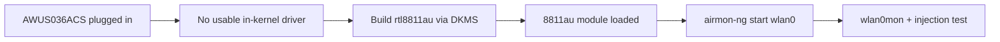

# RTL8811AU 驅動程式指南（AWUS036ACS）

> **一句話定位（One-liner）**：**Realtek RTL8811AU** 是 55 mm **AWUS036ACS** 內部的 1×1 AC433 晶片——口袋大小的監聽模式（monitor mode）夥伴。就像它的老大哥 RTL8812AU 一樣，它需要透過 DKMS 安裝社群 `rtl8811au` 驅動程式，但建置方式完全相同。

## 概念：同一個家族，單一串流

RTL8811AU 基本上是 RTL8812AU 家族的 1×1 變體：單一空間串流、5 GHz 上限 433 Mbps、耗電較低、板子較小。ALFA 把它包進小巧的 ACS 機身，配上兩支 5 dBi 外接天線——你得到經典的 ALFA 滲透測試行為，卻裝在一個能藏進鉛筆盒的包裝裡。

驅動程式方面，與 RTL8812AU 的故事沒有不同：**沒有支援監聽模式的內建於核心驅動程式**，所以我們使用社群 `rtl8811au` DKMS 驅動程式。請注意這個驅動程式也涵蓋 RTL8821AU 變體，所以如果你的 `dkms status` 在類似的 dongle 上顯示相同的模組名稱，別慌。



## 前置需求

- [ ] Linux（Ubuntu 20.04+ / Kali / Debian）
- [ ] `sudo apt install -y build-essential dkms git`
- [ ] `sudo` 權限
- [ ] AWUS036ACS

## 步驟 1：複製並建置

```bash
cd /opt
sudo git clone https://github.com/aircrack-ng/rtl8811au.git
cd rtl8811au
sudo make dkms_install
```

**預期輸出**：

```text
DKMS: install completed.
```

## 步驟 2：載入並驗證

```bash
sudo modprobe 8811au
iw dev
```

**預期輸出**：一行 `Interface wlan0`（或 `wlan1`）。如果無線網卡重新插上後才出現，把模組加入自動載入：

```bash
echo 8811au | sudo tee /etc/modules-load.d/alfa.conf
```

## 步驟 3：監聽模式 + 注入

```bash
sudo airmon-ng check kill
sudo airmon-ng start wlan0
sudo aireplay-ng --test wlan0mon
```

**預期輸出**：

```text
PHY	Interface	Driver		Chipset
phy0	wlan0		8811au		Realtek Semiconductor Corp. RTL8811AU
...
12:34:56  Injection is working!
12:34:56  30/30:  100%
```

## 步驟 4：恢復正常

```bash
sudo airmon-ng stop wlan0mon
sudo systemctl restart NetworkManager
```

## 疑難排解

| 症狀 | 原因 | 修復 |
|---|---|---|
| DKMS 建置失敗 | 缺少標頭檔 / 核心太新 | `sudo apt install linux-headers-$(uname -r)`；`sudo git pull && sudo make dkms_install` |
| 介面只在 managed 模式 | 核心 stub `rtl8811au` 搶走了它 | `echo "blacklist rtl8811au" \| sudo tee /etc/modprobe.d/alfa-8811au.conf`；重新開機 |
| 注入 0/30 | 空頻道 | `sudo iw wlan0mon set channel 6`；在 AP 附近測試 |
| 吞吐量低於預期 | 1×1 無線電（AC433）——硬體限制 | 不是 bug；5 GHz 上實際預期 ~150–250 Mbps |
| 重新開機後偵測不到 | 模組未自動載入 | 把 `8811au` 加入 `/etc/modules-load.d/alfa.conf` |

## 參考資料

- [AWUS036ACS 產品頁面](/alfa-network/products/awus036acs/)
- [Kali 設定指南](/alfa-network/linux-setup-kali/)
- [Ubuntu 設定指南](/alfa-network/linux-setup-ubuntu/)
- [疑難排解索引](/alfa-network/troubleshooting/)
- 驅動程式 repo：[aircrack-ng/rtl8811au](https://github.com/aircrack-ng/rtl8811au)