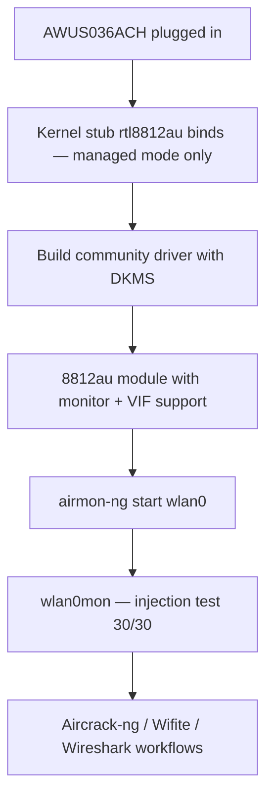

# RTL8812AU 驅動程式指南（AWUS036ACH）

> **一句話定位（One-liner）**：**Realtek RTL8812AU** 是 **AWUS036ACH** 內部傳奇的 2×2 雙頻晶片——你曾看過的每個 Kali 教學影片裡的那支無線網卡。它**不在 Linux 核心內**，所以你用 DKMS 建置一次 `rtl8812au` 驅動程式，它就能撐過每次核心更新。

## 概念：最有名的 Wi-Fi 駭客晶片

RTL8812AU 以高功率（500 mW）無線電與兩支外接天線驅動 AC1200 AWUS036ACH。它的名聲來自 **aircrack-ng 社群**：多年的滲透測試工作把樹外驅動程式打磨成正好符合 Kali 需要的兩件事——**監聽模式（monitor mode）**與**封包注入（packet injection）**。

為什麼它不在核心內？Realtek 從未上游一個乾淨的驅動程式；核心保留一個沒有監聽支援的 stub（`staging/` 中的 `rtl8812au`）。社群驅動程式（`aircrack-ng/rtl8812au`）取代了它。代價是**你必須建置一次**——之後 DKMS 系統會在每次核心更新時自動重新編譯，所以「一次性建置」真的就是一次。



## 前置需求

- [ ] 任何近期 Linux（Ubuntu 20.04+ / Kali / Debian）
- [ ] 建置工具 + 網路：`sudo apt install -y build-essential dkms git`
- [ ] `sudo` 權限
- [ ] AWUS036ACH

## 步驟 1：移除（沒用的）核心 stub

某些發行版附帶一個會搶走無線網卡並拒絕監聽模式的 Realtek stub 驅動程式。先卸載它：

```bash
sudo modprobe -r rtl8812au 2>/dev/null
```

（如果指令報錯「not found」，很好——沒有 stub。`2>/dev/null` 隱藏雜訊。）

## 步驟 2：用 DKMS 建置社群驅動程式

```bash
cd /opt
sudo git clone https://github.com/aircrack-ng/rtl8812au.git
cd rtl8812au
sudo make dkms_install
```

**預期輸出**：

```text
Kernel preparation unnecessary for this kernel.  Skipping...
...
DKMS: install completed.
```

驗證模組已向 DKMS 註冊：

```bash
dkms status
```

**預期輸出**：

```text
rtl8812au/5.6.4.2, 6.8.0-51-generic, aarch64: installed
```

## 步驟 3：載入它

```bash
sudo modprobe 8812au
iw dev
```

**預期輸出**：出現一行 `Interface wlan0`（或 `wlan1`）。如果重新開機後 stub 又載入了，把它加入黑名單：

```bash
echo "blacklist rtl8812au" | sudo tee /etc/modprobe.d/alfa-8812au.conf
```

並把真正的模組加入自動載入：

```bash
echo 8812au | sudo tee /etc/modules-load.d/alfa.conf
```

## 步驟 4：監聽模式 + 注入

```bash
sudo airmon-ng check kill
sudo airmon-ng start wlan0
sudo aireplay-ng --test wlan0mon
```

**預期輸出**：

```text
PHY	Interface	Driver		Chipset
phy0	wlan0		8812au		Realtek Semiconductor Corp. RTL8812AU
...
12:34:56  Injection is working!
12:34:56  30/30:  100%
```

那個 `30/30` 那一行就是 AWUS036ACH 在做它出名的事。

## 步驟 5：回到 managed 模式

```bash
sudo airmon-ng stop wlan0mon
sudo systemctl restart NetworkManager
```

## 疑難排解

| 症狀 | 原因 | 修復 |
|---|---|---|
| `make dkms_install` 失敗並顯示 "No rule to make target" | repo 快照比你的新核心舊 | 再次 `sudo git pull && sudo make dkms_install` |
| 建置失敗：缺少標頭檔 | 標頭檔未安裝 | `sudo apt install linux-headers-$(uname -r)` |
| 無線網卡只在 managed 模式 | 核心 stub 先搶走了它 | 把 `rtl8812au` 加入黑名單（步驟 3）並重新開機 |
| 注入 `0/30` | 沒有 AP 的頻道 / 驅動程式怪癖 | `sudo iw wlan0mon set channel 6`；`git pull` 驅動程式；重測 |
| 重新開機後無線網卡消失 | 模組未自動載入 | `echo 8812au \| sudo tee /etc/modules-load.d/alfa.conf` |
| 升級後 `dkms status` 顯示 Error | 重建靜默失敗 | `sudo dkms autoinstall` |

## 參考資料

- [AWUS036ACH 產品頁面](/alfa-network/products/awus036ach/)
- [Kali 設定指南](/alfa-network/linux-setup-kali/)——完整的監聽/注入工作流程
- [Ubuntu 設定指南](/alfa-network/linux-setup-ubuntu/)
- [疑難排解索引](/alfa-network/troubleshooting/)
- 驅動程式 repo：[aircrack-ng/rtl8812au](https://github.com/aircrack-ng/rtl8812au)