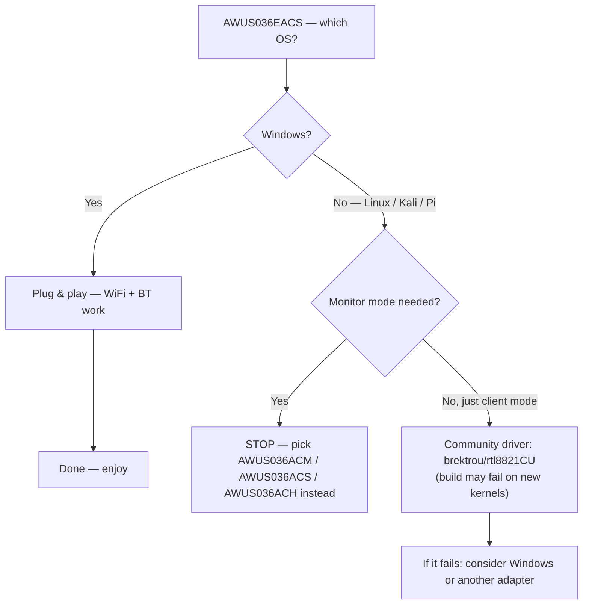

# RTL8821CU 驅動程式指南（AWUS036EACS）

> **一句話定位（One-liner）**：**Realtek RTL8821CU** 是 nano **AWUS036EACS** 內部的 WiFi 5 + 藍牙 4.2 組合晶片。這裡是誠實版本：在 **Windows 上它隨插即用**，在 **Linux 上驅動程式狀況很糟**，而且監聽模式（monitor mode）/ 封包注入（packet injection）**不可靠**。如果你的專案需要 Linux 監聽模式，請改選 [AWUS036ACM](/alfa-network/products/awus036acm/) 或 [AWUS036ACS](/alfa-network/products/awus036acs/)。

## 概念：以 Windows 為優先的晶片

RTL8821CU 是為與 ALFA 產品線其他產品非常不同的買家設計的：想要**一個小巧 dongle 搞定 WiFi + 藍牙**、在 Windows 上零驅動程式麻煩的桌上型/筆電使用者。它是 AC600 等級（150 + 433 Mbps），配整合式 2 dBi 天線，沒有外接 RP-SMA 接頭。

Linux 的故事是尷尬的部分。核心**沒有 RTL8821CU 的上游驅動程式**，而社群驅動程式狀況不穩定：

- 最有名的 repo，[`brektrou/rtl8821CU`](https://github.com/brektrou/rtl8821CU)（涵蓋 RTL8811CU/RTL8821CU），可以針對較舊核心建置，但**在較新核心上常常壞掉**——包括現代發行版上的核心 6.x。
- 回報的問題包括無線網卡不穩定、某些硬體上系統凍結，以及**不可靠的監聽模式 / 沒有注入**。
- 同一顆晶片的藍牙需要另一條驅動程式路徑（`rtl_bt` 韌體），而且同樣落後。

我們不會假裝不是這樣：對 Linux 來說，這是用錯工具。



## 前置需求（給勇於嘗試的 Linux 使用者）

- [ ] 核心 **≤ 5.x** 的 Linux，建置成功率最高（核心 6.x 常常失敗）
- [ ] `sudo apt install -y build-essential dkms git`
- [ ] 耐心——這是實驗性質的領域

## 步驟 1：試試社群驅動程式

```bash
cd /opt
sudo git clone https://github.com/brektrou/rtl8821CU.git
cd rtl8821CU
sudo make dkms_install
```

**可能的結果**：

```text
DKMS: install completed.        # 🎉 it worked (older kernels)
# or
make: *** [Makefile:...] Error 1  # 😓 build failed (new kernels)
```

如果建置成功，載入並檢查：

```bash
sudo modprobe 8821cu
iw dev
```

**預期輸出（成功案例）**：一行 `Interface wlan0`。

## 步驟 2：現實檢查——連線，然後測試監聽模式

```bash
nmcli device wifi connect "MySSID" password "my-passphrase"
sudo airmon-ng start wlan0
sudo aireplay-ng --test wlan0mon
```

**預期輸出**：managed 模式連線通常可用。注入測試是賭注——預期從 `30/30`（罕見）到 `Failed`（常見）都有可能。如果失敗，這不是可修復的設定問題；這是驅動程式已知的限制。

## 建議路徑

| 你的目標 | 建議的無線網卡 |
|---|---|
| Kali / 監聽模式 / 封包注入 | [AWUS036ACM](/alfa-network/products/awus036acm/)（內建於核心、便宜）或 [AWUS036ACH](/alfa-network/products/awus036ach/)（經典高功率） |
| 平價口袋監聽無線網卡 | [AWUS036ACS](/alfa-network/products/awus036acs/) |
| Windows 桌上型 WiFi + BT 組合 | **AWUS036EACS——留在這裡** |

## 疑難排解

| 症狀 | 原因 | 修復 |
|---|---|---|
| `make dkms_install` 在核心 6.x 上失敗 | 驅動程式未針對新核心維護 | 使用較舊的核心 / 發行版，或更換無線網卡 |
| 無線網卡不穩定、隨機斷線 | 已知的 RTL8821CU Linux 怪癖 | Windows 是這顆晶片的支援環境 |
| 監聽模式「可用」但注入失敗 | 驅動程式限制 | 不要依賴它——使用內建於核心晶片的無線網卡 |
| 藍牙缺失 | `rtl_bt` 韌體未載入 | `sudo apt install linux-firmware`；仍然不穩——預期最壞情況 |
| 在 Windows 上一切正常 | — | 這正是設計意圖——在那裡享受它 |

## 參考資料

- [AWUS036EACS 產品頁面](/alfa-network/products/awus036eacs/)
- [無線網卡比較](/alfa-network/wifi-adapter-comparison/)——找一個 Linux 友善的替代品
- [相容性矩陣](/alfa-network/linux-compatibility-matrix/)
- [疑難排解索引](/alfa-network/troubleshooting/)
- 社群驅動程式：[brektrou/rtl8821CU](https://github.com/brektrou/rtl8821CU)