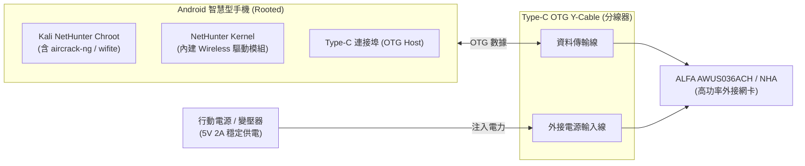

# Android Kali NetHunter × ALFA Network 整合指南

> **技術摘要**：Kali NetHunter 官方文件（[kali.org/docs/nethunter/wireless-cards/](https://www.kali.org/docs/nethunter/wireless-cards/)）將 **ALFA AWUS036ACH**、**AWUS036NEH**、**AWUS036NHA** 與 **AWUS036NH** 列為官方支援的外接 Wi-Fi 網卡。在行動裝置上使用高功率網卡時，**OTG 供電預算（Power Budget）** 是決定系統穩定度的關鍵因素。本文提供完整的硬體接線、核心驅動載入與滲透工具配置。

---

## 1. 供電架構：解決手機 OTG 掉電重開問題

Android 手機的 USB-C / Micro-USB 埠在 OTG Host 模式下，硬體供電上限通常受限在 **500mA (2.5W)**。高功率網卡（如 ALFA AWUS036ACH 具備雙功放 PA）在發射封包時峰值功率可達 **3.6W (720mA @ 5V)**，直接連接會導致手機重開機或網卡反覆斷線。



---

## 2. Kali NetHunter 官方認證 ALFA 型號矩陣

| ALFA 型號 | 核心晶片 | 支援頻段 | 驅動名稱 | NetHunter 整合難度 | 供電建議 |
|---|---|---|---|---|---|
| **AWUS036ACH** | Realtek RTL8812AU | 2.4 GHz + 5 GHz | `8812au.ko` | 需 NetHunter Kernel 包含驅動 | **必備 Y-Cable** 外接供電 |
| **AWUS036NEH** | Ralink RT3070 | 2.4 GHz | `rt2800usb.ko` | Linux Mainline 內建（免編譯） | 手機 OTG 直接供電即可 |
| **AWUS036NHA** | Atheros AR9271 | 2.4 GHz | `ath9k_htc.ko` | Linux Mainline 內建（免編譯） | 手機 OTG 直接供電即可 |
| **AWUS036ACM** | MediaTek MT7612U | 2.4 GHz + 5 GHz | `mt76x2u.ko` | 需 Kernel ≥ 4.19 或手動 backport | 建議外接供電 |

---

## 3. NetHunter 終端實戰操作

### Step 1: 驗證硬體辨識
在 NetHunter Terminal (Root 模式) 輸入：

```bash
# 檢查 USB 裝置
lsusb

# 檢查無線介面
iwconfig
# 或
ip link show
```

### Step 2: 啟動 Monitor Mode 與封包稽核
```bash
# 1. 終止可能干擾的系統服務
airmon-ng check kill

# 2. 開啟監聽模式 (假設網卡為 wlan1)
airmon-ng start wlan1

# 3. 驗證 monitor 介面 (通常為 wlan1mon)
iwconfig wlan1mon

# 4. 啟動自動化無線安全稽核工具
wifite -i wlan1mon
```

---

## 4. 自訂 Kernel 注意事項 (NetHunter Kernel Builder)

若您使用的是非官方預編譯 NetHunter 核心的自訂 ROM，編譯 Kernel 時必須啟用以下設定檔項目：

```ini
CONFIG_NET_RADIO=y
CONFIG_WIRELESS_EXT=y
CONFIG_WEXT_PRIV=y
CONFIG_CFG80211=m
CONFIG_MAC80211=m
CONFIG_CFG80211_WEXT=y
# RTL8812AU 驅動模組
CONFIG_RTL8812AU=m
# Ralink / Atheros 內建驅動
CONFIG_RT2800USB=m
CONFIG_ATH9K_HTC=m
```
