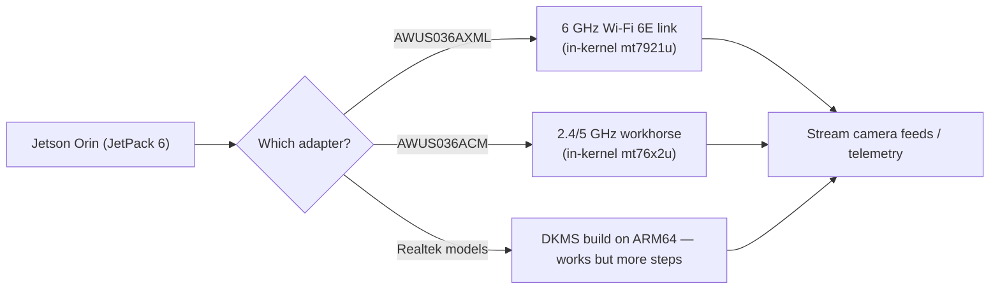

# ALFA 無線網絡卡在 NVIDIA Jetson 上（Orin Nano / NX）

> **一句話定位（One-liner）**：你的 Jetson 是視覺電腦，不是路由器——所以它內建的 Wi-Fi 通常很弱而且是單頻。ALFA 無線網絡卡解決這個問題：**插上 AWUS036AXML 做 6 GHz Wi-Fi 6E 串流**，或任何內建於核心的 ALFA 做可靠的機器人遙測，甚至監聽模式（monitor mode）。

## 概念：為什麼 Jetson 需要外接無線網絡卡

Jetson Orin Nano/NX 主機板（及其載板）隨附一顆普通的整合式 Wi-Fi 無線電，做 `apt update` 可以，其他都不行。機器人與 CV 專案需要更多：

- **6 GHz（Wi-Fi 6E）**：Orin 載板的無線電只有 2.4/5 GHz。6 GHz 頻段是空曠、低延遲的頻譜——非常適合串流攝影機畫面或點雲，不必跟實驗室的 2.4 GHz 雜訊搏鬥。
- **穩定的高吞吐量連結**：AWUS036AXML（MT7921AUN）是 ALFA 產品線中唯一支援 6 GHz 的無線網絡卡，而且它的驅動程式自 5.18 起內建於核心。
- **監聽模式**（無線研究/實驗室工作）：透過正常的 `mac80211` 路徑在內建於核心的晶片上運作。

關鍵在**核心**。Jetson 執行 NVIDIA 的 L4T 核心，不是一般 Ubuntu 核心：

| JetPack | L4T 核心 | `mt7921u`（AXM/AXML） | `mt76x2u`（ACM/ACHM） |
|---|---|---|---|
| JetPack 5.x | 5.10 | ❌ 太舊 | ✅ |
| JetPack 6.x | 6.6 | ✅ | ✅ |

**規則**：MT7921AUN 無線網絡卡需要 **JetPack 6**；經典 AWUS036ACM 兩者都可用。



## 前置需求

- [ ] 已安裝 JetPack 的 Jetson Orin Nano 或 Orin NX
- [ ] 網路（首次設定建議使用乙太網路）
- [ ] ALFA 無線網絡卡——要 6 GHz 請用 [AWUS036AXML](/alfa-network/products/awus036axml/)

## 步驟 1：檢查你的 JetPack / 核心

```bash
uname -r
dpkg -l | grep nvidia-l4t-core | head -1
```

**預期輸出**：

```text
6.6.0-tegra            # JetPack 6 — mt7921u available
# or
5.10.104-tegra          # JetPack 5 — only MT7612U-class chipsets
```

## 步驟 2：內建於核心的路徑（MediaTek——建議）

插上無線網絡卡，然後：

```bash
lsusb | grep -i mediatek
iw dev
```

**預期輸出**：

```text
Bus 001 Device 002: ID 0e8d:7961 MediaTek Corp. MT7921U
phy#0
	Interface wlan0
		ifindex 3
		type managed
```

在 JetPack 6 搭配 AXML 時，驗證 6 GHz 頻道可見：

```bash
iwlist wlan0 freq | grep -E "6 GHz|Channel 1|Channel 233" | head
```

如果什麼都沒出現，設定法規領域：`sudo iw reg set TW`（你的國家），然後 `sudo ip link set wlan0 down && up`。

## 步驟 3：連線並串流

```bash
nmcli device wifi connect "MySSID" password "my-passphrase"
```

**預期輸出**：`Device 'wlan0' successfully activated with 'MySSID'.`

然後透過連結推送攝影機串流（在 6 GHz 頻段上使用 GStreamer 的範例）：

```bash
gst-launch-1.0 v4l2src device=/dev/video0 ! videoconvert ! \
    x264enc tune=zerolatency bitrate=8000 ! rtph264pay ! \
    udpsink host=192.168.1.50 port=5000
```

**預期輸出**：低延遲的連續串流——這正是 6 GHz 頻段的用途。（把接收端 IP 換成你的地面站。）

## 步驟 4：Realtek 機型（ARM64 上的 DKMS）

DKMS 建置在 aarch64 上可用，但 Nano 上的編譯時間較慢。使用與桌面 Linux 相同的 repos：

```bash
sudo apt install -y build-essential dkms git
cd /opt
sudo git clone https://github.com/aircrack-ng/rtl8812au.git
cd rtl8812au && sudo make dkms_install
```

**預期輸出**：`DKMS: install completed.`（在 Nano 上給它幾分鐘）。

## 步驟 5：監聽模式（研究 / 實驗室）

```bash
sudo airmon-ng start wlan0
sudo aireplay-ng --test wlan0mon
```

**預期輸出**：`wlan0mon` 啟動；內建於核心的晶片上注入 `30/30: 100%`。

> ⚠️ 記得 Jetson 特有的電源問題：Orin Nano 的 USB 連線埠可能供電受限。高功率無線網絡卡在高負載下，**供電的 USB hub** 是你的好朋友。也要留意 Jetson 的 `nvpmodel` 電源模式——降頻模式會降低 USB 穩定性。

## 疑難排解

| 症狀 | 原因 | 修復 |
|---|---|---|
| AXML 在 JetPack 5 上看不見 | 核心 5.10 缺少 `mt7921u` | 升級到 JetPack 6（L4T 核心 6.6） |
| 6 GHz 頻道消失 | 法規領域未設定 | `sudo iw reg set <CC>`；重新啟動介面 |
| 攝影機負載下無線網絡卡斷線 | USB 供電限制 | 供電 hub；提高 `nvpmodel` 模式 |
| DKMS 建置慢/失敗 | ARM64 編譯 + 缺少標頭檔 | 安裝 L4T 核心的標頭檔：`sudo apt install linux-headers-$(uname -r)` |
| 監聽模式不可用 | stub 驅動程式衝突（Realtek） | 使用 aircrack-ng repos（步驟 4） |

## 參考資料

- [AWUS036AXML 產品頁面](/alfa-network/products/awus036axml/)——6 GHz 的選擇
- [AWUS036ACM 產品頁面](/alfa-network/products/awus036acm/)——全能款
- [Ubuntu 設定指南](/alfa-network/linux-setup-ubuntu/)——JetPack 骨子裡就是 Ubuntu
- [Kali 設定指南](/alfa-network/linux-setup-kali/)——監聽模式細節
- [Raspberry Pi 指南](/alfa-network/hardware/raspberry-pi/)——更輕量的嵌入式兄弟
- [NVIDIA Jetson 檔案](https://docs.nvidia.com/jetson/)