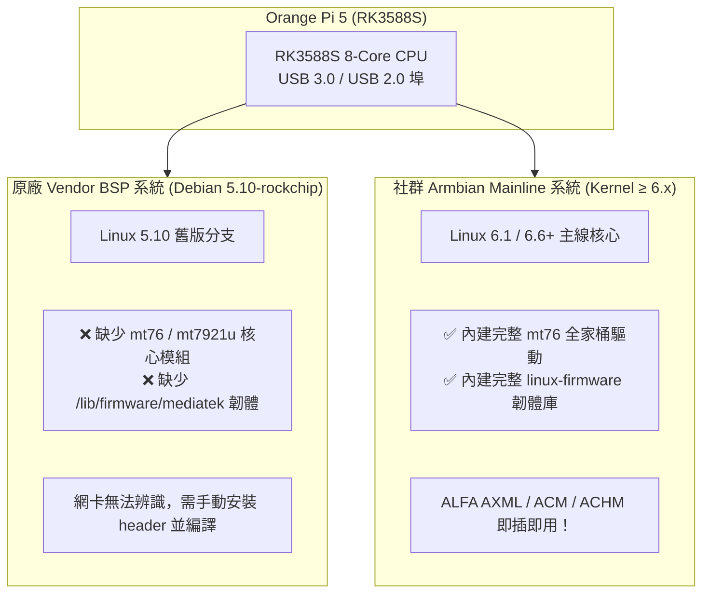

# Orange Pi & Rockchip RK3588 SBC × ALFA Network 整合指南

> **技術摘要**：以 Rockchip RK3588 / RK3588S 晶片為核心的高效能單板電腦（如 Orange Pi 5 / 5B / 5 Plus、Radxa ROCK 5B）具備強大算力，常被作為邊緣運算無線閘道器與遠程安全感測節點。整合 ALFA 網卡時，**系統映像檔的核心版本（Vendor BSP vs Armbian Mainline）** 是決定網卡能否「即插即用」的決定性關鍵。

---

## 1. 核心版本差異：Vendor BSP vs Armbian Mainline

許多開發者在 Orange Pi 原廠 Debian 系統上插入 ALFA 網卡後無法辨識，誤以為硬體不相容。實務根因在於作業系統的核心架構差異：



---

## 2. ALFA 網卡在 RK3588 平台相容性矩陣

| ALFA 型號 | 晶片型號 | Armbian (Kernel ≥6.x) | 原廠 Debian (Kernel 5.10) | 備註說明 |
|---|---|---|---|---|
| **AWUS036AXML** | MT7921AUN (Wi-Fi 6E) | ✅ 即插即用 | ⚠️ 需補載 firmware | 支援 2.4G/5G/6G 高速傳輸 |
| **AWUS036ACM** | MT7612U (802.11ac) | ✅ 即插即用 | ⚠️ 需載入 `mt76x2u` | 滲透監聽與封包注入最佳首選 |
| **AWUS036ACHM** | MT7610U (802.11ac) | ✅ 即插即用 | ⚠️ 需載入 `mt76x0u` | 單天線高靈敏度監聽 |
| **AWUS036ACH** | RTL8812AU | ⚠️ 需 DKMS 編譯 | ⚠️ 需 DKMS 編譯 | 需安裝 `linux-headers` 後編譯 |

---

## 3. Armbian Mainline 快速部署流程 (推薦方案)

1. 下載並刷入適用於 Orange Pi 5 的 **Armbian Linux (Kernel 6.x Mainline)** 映像檔。
2. 開機後將 ALFA AWUS036AXML 插入 **藍色 USB 3.0 Type-A 連接埠**。
3. 執行檢測指令：

```bash
# 檢查核心辨識
dmesg | grep -i "mt7921"

# 預期輸出：
# mt7921u 2-1:1.0: ASIC revision: 79610000
# mt7921u 2-1:1.0: firmware: mediatek/WIFI_MT7961_patch_mcu_1_2_tv.bin loaded
# mt7921u 2-1:1.0: firmware: mediatek/WIFI_RAM_CODE_MT7961_1_2.bin loaded

# 檢查無線射頻狀態
iw dev
```

---

## 4. 供電與散熱最佳化提醒

- **供電預算**：RK3588 全速運作功耗約 10W~15W，外接 ALFA 高功率網卡（2W~4W）時，建議整機使用 **至少 5V/4A (20W) Type-C 電源**，避免因負載瞬間尖峰造成 USB 掉電。
- **連接埠選擇**：優先使用獨立 USB 3.0 控制器通道之連接埠，避免與其他高速外設（如 NVMe USB 外接盒）共用同一 Hub。
