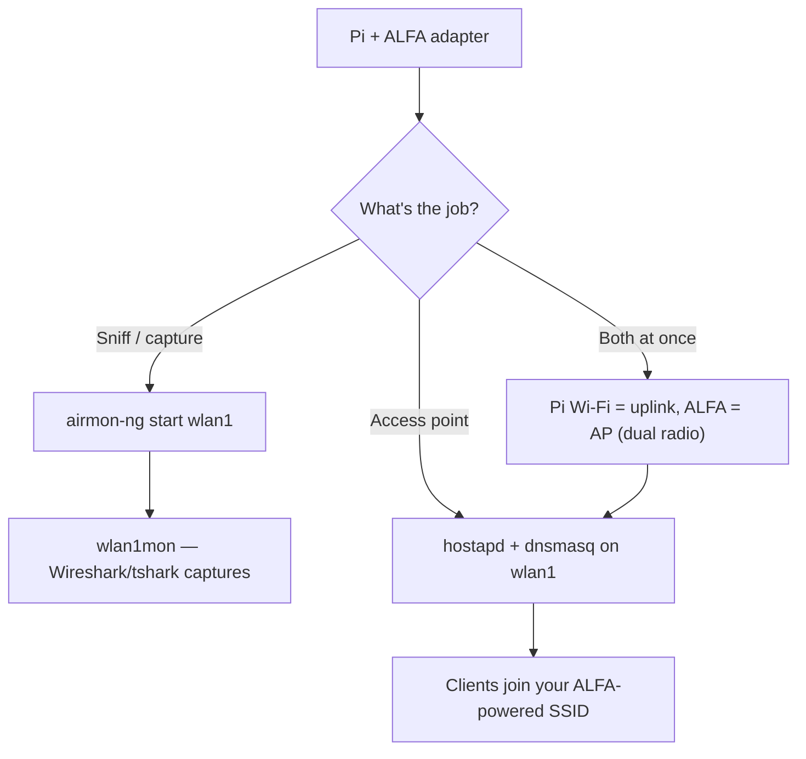

# ALFA 無線網卡在 Raspberry Pi 上（3 / 4 / 5）

> **一句話定位（One-liner）**：Raspberry Pi + ALFA 無線網卡是經典的平價實驗室工作站：用內建於核心晶片的 ALFA **擷取流量**，或把 Pi 變成 **hostapd 存取點（access point）**，範圍是 Pi 內建無線電做夢都想不到的。

## 概念：為什麼 Pi 是完美的 ALFA 主機

Pi 的整合式 Wi-Fi 是單天線而且很弱——做 SSH 可以，嗅探或為整個房間提供 Wi-Fi 就沒用。外接 ALFA 無線網卡改變了這個局面：

- **監聽模式（monitor mode）實驗室工作站**：內建於核心的晶片（MT7612U 等）給你一個無頭擷取設備做 Wireshark 課程作業——插上、`airmon-ng start`、完成。
- **存取點（hostapd）**：AWUS036ACM/ACH 搭配外接天線把 Pi 變成真正的 AP，範圍遠勝內建無線電。
- **雙無線電技巧**：Pi 內建 = 用戶端上行，ALFA = AP 下行。一台 Pi，兩個網路。

各主機板的硬體注意事項：

| 主機板 | USB | 注意事項 |
|---|---|---|
| Pi 3 | USB 2.0 | 支援中最舊；AC433 等級或內建於核心的無線網卡沒問題 |
| Pi 4 | USB 2.0（共享匯流排） | 最受歡迎的選擇——高功率無線網卡請加供電 hub |
| Pi 5 | USB 3.0 + PCIe | 最快的 USB；AC1200/AX1800 吞吐量最佳 |

> ⚠️ **電源是 Pi 的頭號故障模式**。Pi 3/4 共享一條 USB 2.0 匯流排；一支 500 mW ALFA 加上鍵盤再加上其他東西，可能讓匯流排電壓不足。任何高於 AWUS036ACS 的無線網卡都請編列**供電 USB hub** 預算。



## 前置需求

- [ ] 安裝 Raspberry Pi OS 的 Raspberry Pi 3/4/5（建議 64 位元）
- [ ] 已完成 `sudo apt update && sudo apt upgrade`
- [ ] ALFA 無線網卡——監聽模式強烈建議使用[內建於核心的晶片](/alfa-network/linux-compatibility-matrix/)
- [ ] 使用高功率無線網卡時準備供電 USB hub

## 步驟 1：識別無線網卡

插上並列出介面——ALFA 會是*新的*那個：

```bash
lsusb
iw dev
```

**預期輸出**：你的無線網卡在 `lsusb` 中，介面類似 `wlan1`（Pi 的內建無線電通常是 `wlan0`）。如果 ALFA 是 Realtek，先安裝它的 DKMS 驅動程式——請見 [Ubuntu 指南](/alfa-network/linux-setup-ubuntu/)，在 Pi OS 上步驟完全相同。

## 步驟 2：監聽模式實驗室工作站

```bash
sudo airmon-ng start wlan1
iwconfig wlan1mon
```

**預期輸出**：`wlan1mon  IEEE 802.11  Mode:Monitor`。

擷取到檔案供稍後分析：

```bash
sudo tcpdump -i wlan1mon -w lab-capture.pcap
```

**預期輸出**：`listening on wlan1mon`——讓它跑，Ctrl-C 停止，然後在你的筆電上用 Wireshark 開啟 `lab-capture.pcap`。

## 步驟 3：把 Pi 變成存取點（hostapd）

安裝兩套軟體：

```bash
sudo apt install -y hostapd dnsmasq
```

把 ALFA 介面設為靜態位址：

```bash
echo -e "interface wlan1\nstatic ip_address=192.168.4.1/24\nnohook wpa_supplicant" | \
    sudo tee -a /etc/dhcpcd.conf
```

建立 hostapd 設定（2.4 GHz、20 dBm）：

```bash
sudo tee /etc/hostapd/hostapd.conf > /dev/null <<'EOF'
interface=wlan1
driver=nl80211
ssid=alfa-lab
hw_mode=g
channel=6
wmm_enabled=1
auth_algs=1
wpa=2
wpa_passphrase=ChangeMe123
wpa_key_mgmt=WPA-PSK
rsn_pairwise=CCMP
EOF
```

把 hostapd 指向它的設定並啟動一切：

```bash
echo 'DAEMON_CONF="/etc/hostapd/hostapd.conf"' | sudo tee -a /etc/default/hostapd
sudo systemctl restart dhcpcd dnsmasq hostapd
sudo systemctl status hostapd --no-pager | head -10
```

**預期輸出**：`Active: active (running)`，用戶端現在可以加入 **alfa-lab**。

## 步驟 4：雙無線電技巧（選用但很酷）

保留 Pi 自己的 Wi-Fi 作為 SSH/管理上行，把 ALFA 純粹當成 AP：

```bash
sudo systemctl stop wpa_supplicant@wlan1 2>/dev/null   # make sure ALFA is not fighting for a client link
sudo iw dev wlan1 set 4addr off
sudo systemctl restart hostapd
```

現在 `wlan0` 連你到網際網路，`wlan1` 服務實驗室。一台 Pi，兩個網路。

## 疑難排解

| 症狀 | 原因 | 修復 |
|---|---|---|
| 無線網卡在筆電可用、在 Pi 上失效 | USB 供電限制 | 供電 USB hub；使用 Pi 官方 PSU；降低 `txpower` |
| `airmon-ng` 顯示 "No such device" | 介面名稱錯誤 | 先 `iw dev`——Pi 內建通常是 `wlan0`，ALFA 是 `wlan1` |
| hostapd 失敗並顯示 `nl80211: Could not configure driver mode` | 驅動程式缺少 AP 模式，或介面忙碌 | 使用內建於核心的晶片（mt76 = 穩固的 AP 支援）；先 `sudo airmon-ng stop wlan1mon` |
| 用戶端連上但沒有網際網路 | DHCP/NAT 未設定 | 啟用 NAT：`sudo iptables -t nat -A POSTROUTING -o wlan0 -j MASQUERADE` + `sysctl net.ipv4.ip_forward=1` |
| Pi 3/4 上吞吐量受限 | 共享 USB 2.0 匯流排 | 主機板固有限制；Pi 5（USB 3.0）是升級路徑 |

## 參考資料

- [AWUS036ACM 產品頁面](/alfa-network/products/awus036acm/)——Pi 最好的朋友
- [Ubuntu 設定指南](/alfa-network/linux-setup-ubuntu/)——驅動程式安裝（Pi OS 上步驟相同）
- [Kali 設定指南](/alfa-network/linux-setup-kali/)——監聽模式工作流程
- [Jetson 指南](/alfa-network/hardware/jetson/)——更大的嵌入式兄弟
- [hostapd 文件](https://w1.fi/hostapd/)——官方 AP 守護程式文件