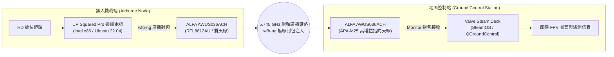

# Steam Deck & UP Squared Pro × ALFA Network 整合指南

> **技術摘要**：在 2026 年無人載具系統（UAS）研究實測中，研究團隊採用 **UP Squared Pro** 作為機載即時邊緣運算平台，並以 **Valve Steam Deck (SteamOS)** 作為掌上型地面控制站（GCS），雙端均外接 **ALFA AWUS036ACH** 網卡，透過 `wfb-ng`（Wi-Fi Broadcast Next Generation）於 5.745GHz 頻段建立長距離單向廣播低延遲視訊與遙測鏈路。本文記錄實測環境配置與 SteamOS 唯讀層處理機制。

---

## 1. UAS 實測無線鏈路拓撲架構



---

## 2. 為什麼實測指名 ALFA AWUS036ACH？

在 `wfb-ng` 長距離 FPV 鏈路中，**Realtek RTL8812AU 驅動** 支援將封包長度設為極限、關閉 ACK 握手回應並強行在非標準/特定 5GHz 頻道（如 5.745 GHz，頻道 149）進行無連線單向廣播。ALFA AWUS036ACH 具備獨立功率放大器（PA/LNA）與雙外接天線接口，是目前學術與社群驗證最扎實的長距離 `wfb-ng` 硬體方案。

> **嚴謹背書聲明**：目前學術論文一手驗證僅針對 **AWUS036ACH (RTL8812AU)**，其他型號（如 AXML / ACM）在 `wfb-ng` 框架下尚未獲得直接數據佐證，本文件不作過度推論。

---

## 3. Steam Deck (SteamOS) 驅動配置步驟

SteamOS 預設採用不可變（Immutable）唯讀檔案系統，建置 DKMS 驅動前必須暫時解除唯讀保護：

```bash
# 1. 切換至 Steam Deck 桌面模式 (Desktop Mode) 並開啟 Konsole 終端機

# 2. 設定管理員密碼（若尚未設定）
passwd

# 3. 暫時關閉 SteamOS 唯讀檔案系統
sudo steamos-readonly disable

# 4. 初始化 Pacman 金鑰環與套件清單
sudo pacman-key --init
sudo pacman-key --populate archlinux holo
sudo pacman -Sy --needed base-devel linux-neptune-headers git dkms

# 5. 自 GitHub 下載 RTL8812AU 支援注入之驅動
git clone -b v5.6.4.2 https://github.com/aircrack-ng/rtl8812au.git
cd rtl8812au
sudo ./dkms-install.sh

# 6. 重新啟用唯讀檔案系統（維護系統安全性）
sudo steamos-readonly enable
```

---

## 4. SteamOS 系統更新防護提醒 (重要踩坑點)

- **A/B 分區覆蓋機制**：SteamOS 每次進行重大系統更新時，會將系統寫入全新 A/B 分區，先前編譯安裝於 `/usr/lib/modules/` 的 DKMS 驅動將會被還原。
- **建議作法**：將建置腳本儲存於 `/home/deck/scripts/rebuild_alfa.sh`，在系統重大更新後只需重新執行一次即可快速恢復外接網卡運作。
