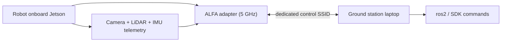

# ALFA 無線網卡在 Unitree 機器人上（Go2 / B2 / A1）

> **一句話定位（One-liner）**：Unitree 的機器狗（Go2、B2、A1）搭載 NVIDIA Jetson，隨附**很弱的內建 Wi-Fi 天線**。一支配外接天線的 ALFA 無線網卡把機器人的無線控制連結從「跟著你在房間裡走」變成「在場地另一端指揮它」。

## 概念：無線控制連結問題

機器狗是長了腿的神經系統：機載 Jetson 把視訊、LiDAR 與 IMU 遙測串流到你的控制器，並接收步態/任務指令回來。那個連結需要**低延遲、高可靠性與範圍**。機器人運算模組上的原廠天線正是你對消費級筆電的預期——30 公尺就很勉強，而且 2.4 GHz 會被實驗室的 Wi-Fi、藍牙與機器人自己的馬達 EMI 吃得乾乾淨淨。

修復方式與 [Jetson](/alfa-network/hardware/jetson/) 相同：用 ALFA 無線網卡取代無線電路徑。實務上有效的配方：

1. **頻段**：優先 **5 GHz**——機器人上的 2.4 GHz 是馬達與其他設備干擾的苦海。
2. **天線**：無線網卡的外接天線勝過機器人機殼上的任何內建天線，而且你可以把它們放在金屬面板上方、不會被遮蔽的位置。
3. **無線網卡**：內建於核心的晶片零麻煩、最可靠（平價選 [AWUS036ACM](/alfa-network/products/awus036acm/)，要 Wi-Fi 6 + 藍牙選 [AWUS036AXM](/alfa-network/products/awus036axm/)，想要 6 GHz 頻段選 [AWUS036AXML](/alfa-network/products/awus036axml/)）。



## 前置需求

- [ ] Unitree 機器人（Go2 / B2 / A1），機載電腦可透過 SSH 存取（開箱通常是 `192.168.123.161`）
- [ ] 執行 Ubuntu 的地面站筆電（請見 [Ubuntu 指南](/alfa-network/linux-setup-ubuntu/)）
- [ ] ALFA 無線網卡 + 機器人 USB 供電不足時準備**供電 USB hub**

## 步驟 1：存取機器人並檢查核心

```bash
ssh unitree@<robot-ip>
uname -r
```

**預期輸出**：L4T/NVIDIA 核心（例如 `5.10.65-tegra` 或 `6.6.0-tegra`）。如同 [Jetson 指南](/alfa-network/hardware/jetson/)，MT7921AUN 無線網卡需要核心 5.18+（JetPack 6）；MT7612U 在任何近期核心上都可用。

## 步驟 2：插上 ALFA 無線網卡

在機器人的機載電腦上：

```bash
lsusb | grep -iE "mediatek|realtek"
iw dev
```

**預期輸出**：你的無線網卡在 `lsusb` 中可見，加上一個新介面（通常是 `wlan1`）。Realtek 晶片請依照 [Ubuntu 指南](/alfa-network/linux-setup-ubuntu/) 安裝 DKMS 驅動程式——或直接選內建於核心的機型，跳過整個步驟。

## 步驟 3：建立專用的 5 GHz 控制 SSID

專用 AP（在地面站或路由器上）讓控制連結與實驗室流量隔離。把機器人連上去：

```bash
sudo nmcli device wifi connect "robot-link" password "your-passphrase"
iw dev wlan1 link
```

**預期輸出**：`Connected to robot-link` 與一行顯示 5 GHz 頻道與速率的連結資訊。驗證頻道是 5 GHz：

```bash
iw dev wlan1 info | grep channel
```

**預期輸出**：`channel 36 (5180 MHz)`（或其他 5 GHz 頻道）——如果顯示 2.4 GHz，把 AP 切到 5 GHz。

## 步驟 4：鎖定頻段並最大化連結

在機器人端強制只使用 5 GHz，讓它永遠不會回落到吵雜的頻段：

```bash
sudo nmcli connection modify robot-link 802-11-wireless.band bg
```

> ⚠️ 等等——那個指令強制的是 **2.4 GHz**。要只使用 5 GHz，請用 `802-11-wireless.band a`：

```bash
sudo nmcli connection modify robot-link 802-11-wireless.band a
sudo nmcli connection up robot-link
```

**預期輸出**：在 5 GHz 頻段重新連線。再用 `iw dev wlan1 info | grep channel` 指令確認。

把 TX 功率提高到你地區的法定上限：

```bash
sudo iw reg set TW   # your country code
sudo iwconfig wlan1 txpower 30
```

**預期輸出**：沒有錯誤——`iwconfig` 顯示 `Tx-Power=30 dBm`（受法規上限約束）。

## 步驟 5：用遙測 ping 測試驗證

透過連結推送資料並在距離上測量來回時間（ICMP 是糟糕的延遲代理；請用 UDP burst）：

```bash
# On the robot:
iperf3 -s &
# On the ground station:
iperf3 -c <robot-ip> -u -b 100M -t 10
```

**預期輸出**：一個吞吐量數字（Mbits/sec）與 0–1% 的遺失率。在你的工作距離上遺失率攀升超過 ~1% 代表天線位置或頻道需要調整——試另一個 5 GHz 頻道（重新設定後 `sudo iw dev wlan1 set channel 149`）或把無線網卡移到機殼上方。

## 疑難排解

| 症狀 | 原因 | 修復 |
|---|---|---|
| 馬達啟動時連結失效 | 馬達 EMI + 弱天線 | 把無線網卡移到金屬上方；切到 5 GHz；檢查頻道壅塞 |
| 無線網卡在機器人上看不見 | 機器人 USB 連接埠供電受限 | 供電 USB hub；試不同的連接埠 |
| MT7921AUN 無線網卡偵測不到 | 較舊 JetPack 上核心 < 5.18 | 升級機器人上的 JetPack，或使用 MT7612U 等級的無線網卡 |
| 距離遠時回落到 2.4 GHz | 頻段導向 / AP 設定 | 在機器人端強制 `802-11-wireless.band a`（步驟 4） |
| 高延遲尖峰 | 頻道壅塞 | 挑一個乾淨的 5 GHz 頻道；如果你的 AP 支援，考慮 6 GHz（AXML） |

## 參考資料

- [Jetson 指南](/alfa-network/hardware/jetson/)——相同的核心考量，更深入
- [AWUS036AXM 產品頁面](/alfa-network/products/awus036axm/)——機器人連結的 Wi-Fi 6 + 藍牙
- [Ubuntu 設定指南](/alfa-network/linux-setup-ubuntu/)——驅動程式安裝
- [Unitree 官方文件](https://support.unitree.com/)——機器人 SDK 與網路參考