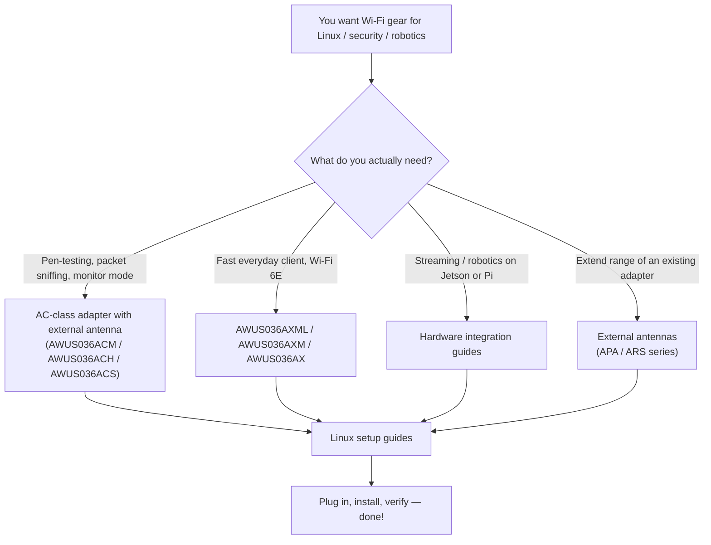

---

id: alfa-index
title: ALFA Network
sidebar_position: 1
description: ALFA Network Wi-Fi 無線網絡卡、天線、Linux 驅動程式、Kali/NetHunter 設定指南、硬體整合與相容性矩陣。
tags: [alfa, wifi, kali, 監聽模式, 無線網絡卡, 天線]
keywords: [ALFA Network, AWUS036ACM, AWUS036AXML, Wi-Fi 無線網絡卡, 監聽模式, Kali Linux]
slug: /alfa-network/
---

# ALFA Network

> **一句話定位（One-liner）**：ALFA Network 生產滲透測試人員、無人機飛手與機器人實驗室會優先選擇的外接 Wi-Fi 無線網絡卡與天線——因為它們結合了**高增益無線電**、**外接天線接頭**，以及（學生們最愛的部分）**扎實的 Linux 支援**。

如果你曾看過某個 Kali Linux 教學影片，片中有人把一支黑色棒子插進 USB 連線埠、把介面切換到監聽模式（monitor mode）然後開始嗅探封包，那支棒子幾乎可以肯定是 ALFA。這個品牌十多年來一直是資安社群中的預設選擇——從傳奇的 **AWUS036ACH** 到全新的 **Wi-Fi 6E AWUS036AXML**。

這本 wiki 是你一步一步的最佳夥伴：我們銷售的每一款無線網絡卡與天線、每一顆晶片的驅動程式、每一個「為什麼我的無線網絡卡沒出現」的解答，以及 Jetson、Raspberry Pi 與 Unitree 機器人的硬體整合指南。

## 本區塊內容

| 頁面 | 內容 |
|---|---|
| [Wi-Fi 無線網絡卡比較](/alfa-network/wifi-adapter-comparison/) | 每款 USB 無線網絡卡並排比較：晶片、速度等級、頻段、監聽模式支援——以及依使用情境的「哪一款適合你」 |
| [Linux 相容性矩陣](/alfa-network/linux-compatibility-matrix/) | 哪些無線網絡卡在 Kali Linux、Ubuntu 與 NetHunter/Android 上可開箱即用 |
| [Ubuntu 設定指南](/alfa-network/linux-setup-ubuntu/) | 逐步教學：內建於核心的晶片（隨插即用）與 Realtek 晶片的 DKMS 建置 |
| [Kali Linux 設定指南](/alfa-network/linux-setup-kali/) | dkms 建置、監聽模式、封包注入——完整的滲透測試工作流程 |
| [NetHunter（Android）設定指南](/alfa-network/linux-setup-nethunter/) | 把手機 + OTG 變成行動稽核裝置 |
| [疑難排解索引](/alfa-network/troubleshooting/) | 每個常見 ALFA 問題的症狀 → 診斷 → 根本原因 → 修復 |
| [驅動程式](/alfa-network/drivers/mt7612u/) | 以晶片為主的指南：MT7612U、MT7610U、MT7921AUN、RTL8812AU、RTL8811AU、RTL8832BU、RTL8821CU |
| [硬體整合](/alfa-network/hardware/jetson/) | NVIDIA Jetson、Raspberry Pi、Unitree 機器人 |
| [產品](/alfa-network/products/awus036acm/) | 每款無線網絡卡與天線的完整規格表與個別產品指南 |

## 如何選擇無線網絡卡（5 分鐘速成）

選擇無線網絡卡其實就是選擇**晶片**，因為晶片決定了：

1. **你需要哪個驅動程式**——以及它是否已內建於 Linux 核心（隨插即用），還是需要 DKMS 建置。
2. **監聽模式與封包注入是否可用**——這是 Kali / Wireshark / Aircrack-ng 工作的核心需求。
3. **無線網絡卡有多快、多遠**。

以下是簡化對照表——詳細內容請見[比較頁面](/alfa-network/wifi-adapter-comparison/)：

| 晶片 | 無線網絡卡 | 內建於核心的驅動程式？ | 監聽模式？ | 最適合 |
|---|---|---|---|---|
| **MT7612U** | AWUS036ACM | ✅（自核心 4.19 起） | ✅ 極佳 | Kali 的經典全能款 |
| **MT7610U** | AWUS036ACHM | ✅（自核心 4.19 起） | ✅ 良好 | 平價雙頻監聽模式 |
| **MT7921AUN** | AWUS036AXM / AWUS036AXML | ✅（自核心 5.18 起） | ✅ 良好 | Wi-Fi 6 / 6E 速度 + 藍芽組合 |
| **RTL8812AU** | AWUS036ACH | ❌ DKMS | ✅ 極佳 | 高功率經典款，社群龐大 |
| **RTL8811AU** | AWUS036ACS | ❌ DKMS | ✅ 良好 | 口袋大小的監聽無線網絡卡 |
| **RTL8832BU** | AWUS036AX / AWUS036AXER | ❌ DKMS | ✅ 良好 | 支援 WPA3 的 Wi-Fi 6 |
| **RTL8821CU** | AWUS036EACS | ❌ 不穩定 | ❌ 不可靠 | **僅限 Windows**——WiFi + 藍芽組合 |

> **你可能會想問**——*「什麼是 DKMS？」* 它是一套系統，會在每次 Linux 核心更新時自動重新建置第三方驅動程式。像 RTL8812AU 這類 Realtek 晶片不在核心內，所以 DKMS 讓它們在每次更新後都能繼續運作。我們在 [Ubuntu 指南](/alfa-network/linux-setup-ubuntu/) 中逐步說明。

## 快速入門

如果這是你的第一支 ALFA 無線網絡卡，建議路徑如下：

1. 閱讀[比較](/alfa-network/wifi-adapter-comparison/)並挑選你的無線網絡卡。
2. 在[相容性矩陣](/alfa-network/linux-compatibility-matrix/)中確認你的作業系統。
3. 依照 [Ubuntu](/alfa-network/linux-setup-ubuntu/) 或 [Kali](/alfa-network/linux-setup-kali/) 指南操作。
4. 遇到怪問題？前往[疑難排解索引](/alfa-network/troubleshooting/)。

祝嗅探愉快——並記得：只能在你自己擁有或已取得書面授權測試的網路上測試。