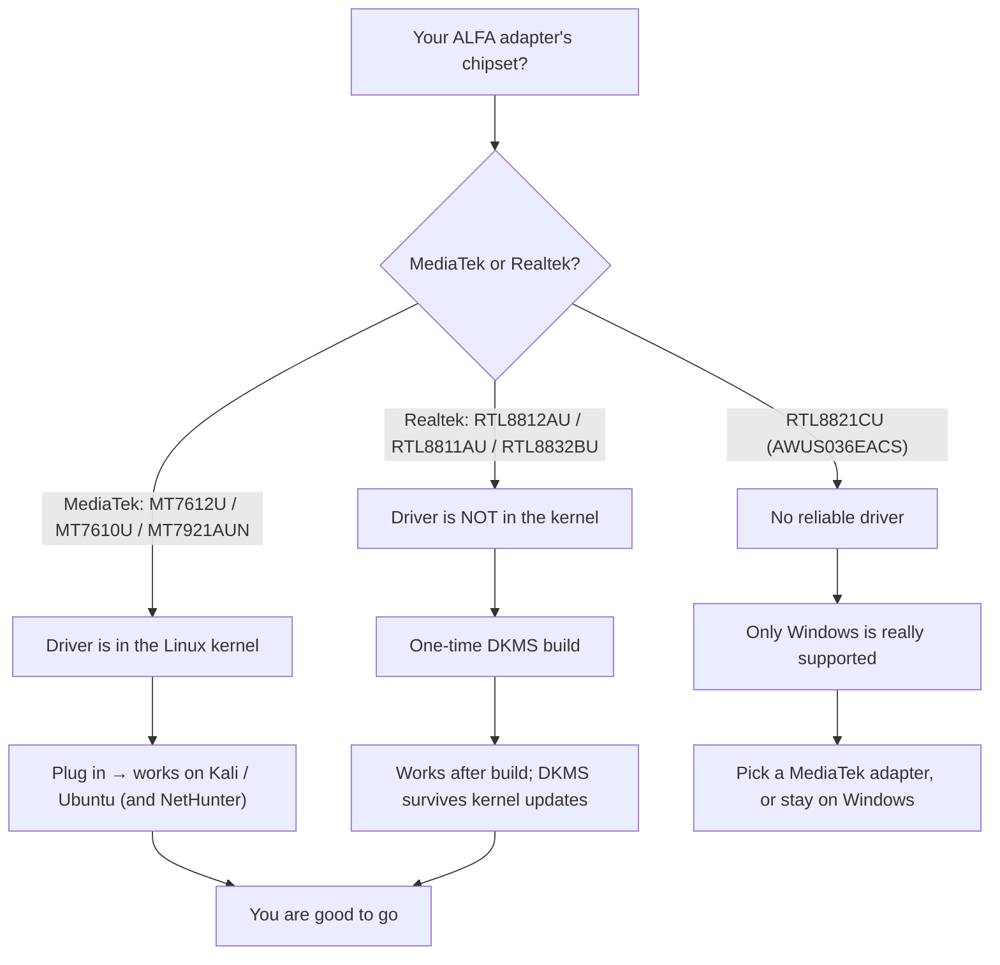

# ALFA Linux 相容性矩陣

> **結論先行（Bottom line）**：在現代 Linux 上，**MediaTek 為基礎的無線網絡卡**（AWUS036ACM、AWUS036ACHM、AWUS036AXM、AWUS036AXML）開箱即用，因為它們的驅動程式內建於核心。**Realtek 為基礎的無線網絡卡**（AWUS036ACH、AWUS036ACS、AWUS036AX、AWUS036AXER）需要 DKMS 驅動程式建置——5 分鐘、一次性工作。**AWUS036EACS 是例外：不要期待它在任何 Linux 上運作良好**。




*💡 點擊上方圖片可開啟高解析度放大燈箱，清晰檢視三條驅動路徑圖解。*
## 矩陣

圖例：✅ 開箱即用 · 🔧 DKMS 安裝後可用 · ⚠️ 部分 / 不穩定 · ❌ 不建議

| 無線網絡卡 | 晶片 | 驅動程式 | 內建於核心？ | Kali Linux | Ubuntu | NetHunter / Android |
|---|---|---|---|---|---|---|
| AWUS036ACM | MT7612U | `mt76x2u` | ✅ 自 4.19 起 | ✅ | ✅ | ✅ |
| AWUS036ACHM | MT7610U | `mt76x0u` | ✅ 自 4.19 起 | ✅ | ✅ | ✅ |
| AWUS036AXM | MT7921AUN | `mt7921u` | ✅ 自 5.18 起 | ✅ | ✅ | ✅ |
| AWUS036AXML | MT7921AUN | `mt7921u` | ✅ 自 5.18 起 | ✅ | ✅ | ✅ |
| AWUS036ACH | RTL8812AU | `rtl8812au-dkms` | ❌ | 🔧 | 🔧 | 🔧 |
| AWUS036ACS | RTL8811AU | `rtl8811au` (DKMS) | ❌ | 🔧 | 🔧 | 🔧 |
| AWUS036AX | RTL8832BU | `rtl88x2bu` (DKMS) | ❌ | 🔧 | 🔧 | ⚠️ |
| AWUS036AXER | RTL8832BU | `rtl88x2bu` (DKMS) | ❌ | 🔧 | 🔧 | ⚠️ |
| AWUS036EACS | RTL8821CU | — (無可靠驅動程式) | ❌ | ❌ | ❌ | ❌ |

## 「內建於核心」對你意味著什麼

當某顆晶片的驅動程式位於 Linux 核心內，你的作業系統會隨附預先安裝。插上無線網絡卡後 `dmesg` 會顯示它被驅動程式認領——不需要編譯、不需要 DKMS、不會因核心更新而壞掉。這是本頁 MediaTek 與 Realtek 無線網絡卡之間最大的可靠性差異。

對 Realtek 機型，[Kali 指南](/alfa-network/linux-setup-kali/) 與 [Ubuntu 指南](/alfa-network/linux-setup-ubuntu/) 會帶你完成 DKMS 建置。DKMS 會在每次核心更新後自動重新建置驅動程式，所以「更新後就不能用了」不應該發生——如果真的發生，請查[疑難排解索引](/alfa-network/troubleshooting/)。

## 各作業系統注意事項

### Kali Linux
除了 EACS 之外一切都能用，但有一個警告：Kali（rolling 發行版）的核心可能比某些 DKMS 驅動程式支援的還新。如果 DKMS 建置在全新的 Kali 上失敗，請使用 **aircrack-ng** 維護的驅動程式 repos（`aircrack-ng/rtl8812au`、`aircrack-ng/rtl88x2bu`），它們會積極追蹤新核心。完整教學：[Kali 設定指南](/alfa-network/linux-setup-kali/)。

### Ubuntu（LTS）
Ubuntu LTS 核心較舊且非常穩定，所以 DKMS 建置基本上不會壞。內建於核心的機型在 20.04+ 上零設定即可運作（MT7921AUN 需要 **22.04+**，因為 `mt7921u` 在核心 5.18 才進入）。完整教學：[Ubuntu 設定指南](/alfa-network/linux-setup-ubuntu/)。

### NetHunter / Android
在已 root 手機上搭配 OTG 的 NetHunter 是最嚴苛的環境：Android 核心因手機而異，所以只有**內建於核心的晶片**可靠（MT7612U、MT7610U、MT7921AUN）。Realtek DKMS 驅動程式需要在 NetHunter chroot 內有相符的工具鏈，而且常常在一般手機核心上失敗——請謹慎行事並參閱 [NetHunter 指南](/alfa-network/linux-setup-nethunter/)。

## 如何檢查你的核心

不確定你用的是哪個核心？執行：

```bash
uname -r
```

**預期輸出**（範例）：

```text
6.8.0-51-generic        # Ubuntu 24.04
6.1.0-kali9-amd64       # Kali rolling
5.15.0-91-generic       # Ubuntu 22.04 — mt7921u NOT present, needs 22.04+ kernel
```

如果你的 MediaTek 機型核心是 **5.18 或更新**，就沒問題。如果更舊，先更新你的作業系統——驅動程式不會憑空出現。

下一步：依照你的作業系統閱讀 [Ubuntu](/alfa-network/linux-setup-ubuntu/) 或 [Kali](/alfa-network/linux-setup-kali/) 指南，或跳到[晶片驅動程式頁面](/alfa-network/drivers/mt7612u/) 深入探討。