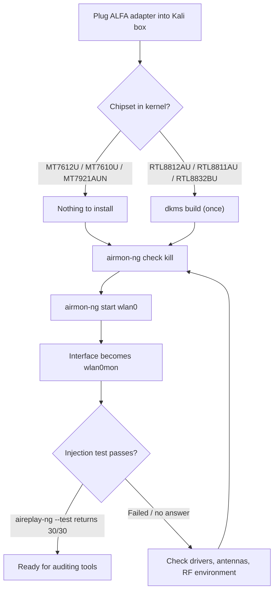

# ALFA 無線網絡卡在 Kali Linux 上——監聽模式與封包注入

> **學習目標（Learning goal）**：完成本指南後，你的 ALFA 無線網絡卡將進入**監聽模式（monitor mode）**並**證明封包注入（packet injection）可用**——這是每個 Wi-Fi 稽核工具（Aircrack-ng、Wifite、Wireshark、Bettercap）都依賴的兩項能力。
> **適用物件**：初學者–中階、Kali 使用者 ｜ **前置需求**：已安裝 Kali Linux（任何近期版本）、網路連線、你的 ALFA 無線網絡卡。

## 概念：為什麼 Kali 不一樣

Ubuntu 把 Wi-Fi 無線網絡卡當成*有禮貌的使用者端*：它們只擷取自己的流量。Kali 的整套工具鏈——Aircrack-ng、Reaver、Wifite——假設無線網絡卡能做兩件額外的事：

1. **監聽模式（monitor mode）**——擷取某個頻道上的*每一*個訊框，而不只是你的連線。
2. **封包注入（packet injection）**——傳送原始的自製訊框（deauth、probe requests、handshake replays）。

不是每顆晶片都能做到這兩件事。好訊息是：除了 **AWUS036EACS** 之外的所有 ALFA 無線網絡卡都可以，而且內建於核心的 MediaTek 晶片完全不需要安裝驅動程式。



## 前置需求

- [ ] 已安裝 Kali Linux（在 Kali rolling、核心 6.x 上測試過）
- [ ] `sudo` 許可權與網路連線
- [ ] 你的 ALFA 無線網絡卡——先查[相容性矩陣](/alfa-network/linux-compatibility-matrix/)
- [ ] （僅 Realtek 機型）建置工具：`sudo apt install -y build-essential dkms git`

## 步驟 1：檢查核心看到了什麼

插上無線網絡卡並確認它被偵測到：

```bash
lsusb | grep -iE "realtek|mediatek"
iw dev
```

**預期輸出**：你的無線網絡卡出現在 `lsusb` 中，且 `iw dev` 至少有一個 `Interface wlan0`（或 `wlan1`）。

## 步驟 2：安裝驅動程式（僅 Realtek 晶片）

如果你的晶片是 RTL8812AU / RTL8811AU / RTL8832BU，用 DKMS 建置 aircrack-ng 維護的驅動程式。如果你的晶片是 MediaTek（MT7612U / MT7610U / MT7921AUN），**跳到步驟 3**——驅動程式已經在你的核心裡。

### RTL8812AU（AWUS036ACH）

```bash
sudo apt update
sudo apt install -y build-essential dkms git
cd /opt
sudo git clone https://github.com/aircrack-ng/rtl8812au.git
cd rtl8812au
sudo make dkms_install
```

**預期輸出**：以 `DKMS: install completed.` 結尾。

> 為什麼用 aircrack-ng 的 fork？Kali 的核心更新很快，而 aircrack-ng 維護者會在每次核心釋出後數天內更新這些驅動程式——在 rolling 發行版上這至關重要。[RTL8812AU 驅動程式頁面](/alfa-network/drivers/rtl8812au/) 有深入探討。

### RTL8811AU（AWUS036ACS）

```bash
cd /opt
sudo git clone https://github.com/aircrack-ng/rtl8811au.git
cd rtl8811au
sudo make dkms_install
```

### RTL8832BU（AWUS036AX / AWUS036AXER）

```bash
cd /opt
sudo git clone https://github.com/aircrack-ng/rtl88x2bu.git
cd rtl88x2bu
sudo make dkms_install
```

重新插上無線網絡卡（或 `sudo modprobe <module>`）並確認介面出現：`iw dev`。

## 步驟 3：終止幹擾的處理程式

Kali 的 NetworkManager 會爭奪 Wi-Fi 介面的控制權。在切換到監聽模式之前先停用它：

```bash
sudo airmon-ng check kill
```

**預期輸出**：

```text
Killing these processes:

    PID Name
   1234 wpa_supplicant
   2345 NetworkManager
```

> ⚠️ 這會中斷你目前的 Wi-Fi 連線（你終止了 NetworkManager！）。如果你是透過 Wi-Fi 工作，會失去連線——請使用乙太網路線或在本地端工作。之後可以用 `sudo systemctl restart NetworkManager` 恢復。

## 步驟 4：啟動監聽模式

```bash
sudo airmon-ng start wlan0
```

（把 `wlan0` 換成步驟 1 中你的介面名稱。）

**預期輸出**：

```text
PHY	Interface	Driver		Chipset
phy0	wlan0		mt76x2u		MediaTek Inc. MT7612U
		(mac80211 monitor mode vif enabled for [phy0]wlan0 on [phy0]wlan0mon)
		(mac80211 station mode vif disabled for [phy0]wlan0)
```

你的介面現在是 **wlan0mon**。驗證：

```bash
iwconfig
```

**預期輸出**：`wlan0mon  IEEE 802.11  Mode:Monitor  ...`

## 步驟 5：證明封包注入可用

注入是每支 Wi-Fi 無線網絡卡的技能檢定。對空執行 Aircrack-ng 自我測試（它會廣播）：

```bash
sudo aireplay-ng --test wlan0mon
```

**預期輸出**：

```text
12:34:56  Trying broadcast probe requests...
12:34:56  Injection is working!
12:34:56  Found 1 AP
12:34:56  30/30:  100%
```

**`30/30: 100%`**——這就是神奇的一行。它代表無線網絡卡注入了 30 個 probe requests 並聽到全部 30 個，證明在監聽模式下 TX 與 RX 都正常運作。如果你看到 `Failed` 或很低的百分比，代表無線網絡卡實際上沒有在注入——請見下方常見錯誤表。

## 步驟 6：把你的工具指向它

快速端對端健全性檢查——擷取並計數 10 秒的訊框：

```bash
sudo timeout 10 tcpdump -i wlan0mon -c 100
```

**預期輸出**：`100 packets captured`（或 10 秒內到達的任何數量——看到*任何* 802.11 訊框就證明擷取可用）。

完成後，把無線網絡卡恢復到一般模式：

```bash
sudo airmon-ng stop wlan0mon
sudo systemctl restart NetworkManager
```

## 常見錯誤（FAQ）

| 錯誤 / 症狀 | 原因 | 修復 |
|---|---|---|
| `airmon-ng start` 顯示 `No such device` | 介面名稱是 `wlan1` 或驅動程式未載入 | 執行 `iw dev` 找出真正的名稱；Realtek 用 `sudo modprobe <module>` |
| `aireplay-ng --test` → `No such device` | 你還在 `wlan0`，不是 `wlan0mon` | 重新檢查 `iwconfig`；從步驟 4 重新啟動監聽模式 |
| `Injection is working!` 但 `0/30` 回覆 | 無線網絡卡 TX 正常但 RX 過濾器壞了（某些 Realtek 驅動程式常見） | 嘗試鎖定頻道：`sudo iw wlan0mon set channel 6`；重測；升級 DKMS 驅動程式 |
| DKMS 建置失敗並顯示 "No rule to make target" | Kali 核心對 repo 快照來說太新 | `cd /opt/rtl8812au && sudo git pull && sudo make dkms_install` |
| 監聽模式幾分鐘後失效 | USB 省電 / 熱節流 | 使用供電 USB hub 或 USB 3.0 連線埠；`sudo iwconfig wlan0mon txpower 20` |
| `airmon-ng check kill` 弄斷了我的網路 | 預期行為——NetworkManager 被停止了 | 工作結束後 `sudo systemctl restart NetworkManager` |
| 無線網絡卡在 managed 模式正常，但 `iw` 中沒有列出 `monitor` | 驅動程式建置時未含監聽支援 | 用 aircrack-ng repos 重建（它們啟用 monitor + VIF） |

> **你可能會想問**——*「擷取這些東西合法嗎？」* 監聽模式與注入是技術能力，不是執照。在大多數司法管轄區，在你不擁有或未獲授權測試的網路上擷取或注入是非法的。每個課程實驗室都假設你在**自己的 AP 或實驗室網路**上測試。請留在那裡。

## 參考資料

- [本指南的 Ubuntu 版本](/alfa-network/linux-setup-ubuntu/)——使用者端模式設定
- [NetHunter 指南](/alfa-network/linux-setup-nethunter/)——在 Android 上的相同工作流程
- [晶片驅動程式頁面](/alfa-network/drivers/rtl8812au/)——各晶片細節與疑難排解
- [疑難排解索引](/alfa-network/troubleshooting/)
- [Aircrack-ng 檔案](https://www.aircrack-ng.org/doku.php)——官方工具檔案