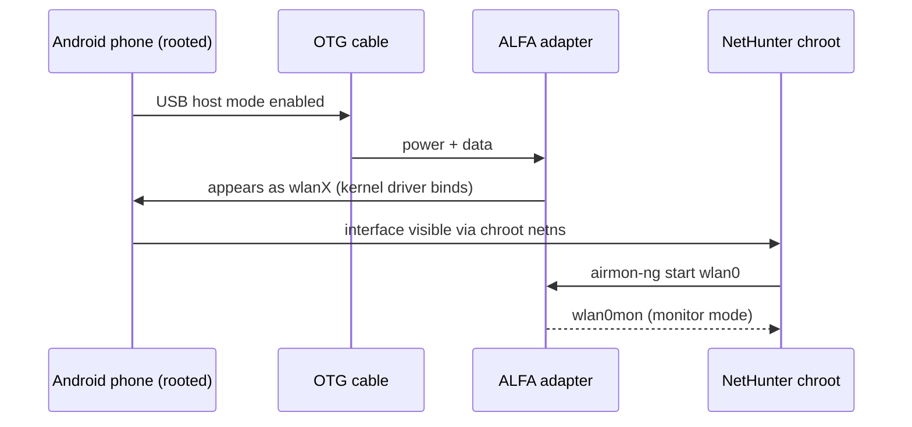

# ALFA 無線網絡卡在 NetHunter（Android）上——OTG 設定指南

> **學習目標（Learning goal）**：完成本指南後，你的 ALFA 無線網絡卡將連線到執行 **Kali NetHunter** 的 Android 手機、在 NetHunter chroot 內可見，並準備好使用監聽模式（monitor mode）工具——全部由一條 USB **OTG** 傳輸線供電。
> **適用物件**：中階（需要 root 知識）｜ **前置需求**：已 root 的 Android 手機、已安裝 NetHunter、OTG 傳輸線、一支使用**內建於核心晶片**的 ALFA 無線網絡卡（見下方）。

## 概念：為什麼 Android 是最困難的環境

NetHunter 是在 Android 裝置上的 **chroot** 內執行的 Kali Linux。手機的核心仍然做真正的工作——而手機核心*不是* Ubuntu 核心：

1. **內建於核心的驅動程式**：主線 Linux 支援的晶片（MT7612U、MT7610U、MT7921AUN）通常可用，因為 NetHunter 的核心映像包含主線 `mt76` 驅動程式家族。
2. **DKMS 驅動程式**：在 Android chroot 內編譯 Realtek DKMS 驅動程式很痛苦——手機核心很少附帶建置所需的標頭檔與工具鏈。RTL8812AU *可能*在某些裝置上可用，但請把它當成一個專案，而不是一個設定步驟。

**經驗法則**：對 NetHunter 而言，優先選擇 **AWUS036ACM（MT7612U）**。它是社群預設的 NetHunter 無線網絡卡，這是有原因的。



## 前置需求

- [ ] 已 root 的 Android 手機並安裝 **Kali NetHunter**（官方 NetHunter 映像，或已 root 裝置上的 **NetHunter Store** 應用程式）
- [ ] OTG 傳輸線（依手機而定為 USB-C 或 micro-USB）——高功率無線網絡卡最好有外接電源
- [ ] 使用內建於核心晶片的 ALFA 無線網絡卡：**AWUS036ACM / AWUS036ACHM / AWUS036AXM / AWUS036AXML**
- [ ] 核心夠新的手機（MT7921AUN 機型需要核心 5.18+）

## 步驟 1：檢查你的核心

某些晶片需要較新的核心。在 NetHunter 應用程式中開啟終端機（或 adb shell）並執行：

```bash
uname -r
```

**預期輸出**：類似 `4.19.157-perf+`（較舊手機）或 `5.15.xx-gki`（較新）。MT7921AUN 無線網絡卡需要 **5.18 或更新**；MT7612U 在 4.19 上運作良好。

> **你可能會想問**——*「我需要特定的 NetHunter 核心嗎？」* 是的——NetHunter 團隊會為特定支援裝置清單建置核心。先查[官方裝置清單](https://www.kali.org/docs/nethunter/)：不支援的手機代表沒有支援監聽模式的核心，無論你做什麼，無線網絡卡都永遠離不開 managed 模式。

## 步驟 2：透過 OTG 連線

把 OTG 傳輸線插進手機，再把無線網絡卡插到 OTG 傳輸線上。多數手機會出現通知（「USB device connected」）。然後確認核心看到無線網絡卡：

```bash
lsusb
```

**預期輸出**（MediaTek 機型）：

```text
Bus 001 Device 002: ID 0e8d:7612 MediaTek Inc. MT7612U 802.11a/b/g/n/ac 2T2R Wireless Adapter
```

如果 `lsusb` 什麼都沒顯示，代表 OTG 傳輸線沒有供電，或手機不在 USB host 模式——試試供電的 OTG hub（對耗電較大的 AWUS036AXM/AXML 很重要）。

## 步驟 3：在 NetHunter 內驗證介面

啟動 **NetHunter** 應用程式 → 開啟 **Kali Chroot** → *Kali terminal*：

```bash
iw dev
```

**預期輸出**：

```text
phy#0
	Interface wlan0
		ifindex 3
		type managed
```

介面在 chroot 內可見——這是大多數 OTG 設定失敗的時刻，所以如果你在這裡看到 `wlan0`，你已經完成 90%。

## 步驟 4：監聽模式

在 Kali 終端機內（你需要 root——NetHunter 預設以 root 執行）：

```bash
airmon-ng check kill
airmon-ng start wlan0
iwconfig
```

**預期輸出**：`wlan0mon` 出現並顯示 `Mode:Monitor`。

## 步驟 5：驗證注入（選用但建議）

```bash
aireplay-ng --test wlan0mon
```

**預期輸出**：`30/30: 100%` 與 `Injection is working!`

## Realtek 晶片怎麼辦？

**RTL8812AU（AWUS036ACH）**值得一段誠實的說明：它*可以*在核心包含預建 `8812au` 模組的 NetHunter 裝置上運作（某些社群核心有），但**不要把你的課程專案規劃在它上面**。在 Android chroot 內進行 DKMS 編譯在多數手機上會失敗，因為手機核心標頭檔不存在。如果你唯一的無線網絡卡是 Realtek，先在筆電上測試——[Kali 指南](/alfa-network/linux-setup-kali/) 在那裡可用——並把手機當成額外紅利。

## 常見錯誤（FAQ）

| 錯誤 / 症狀 | 原因 | 修復 |
|---|---|---|
| `lsusb` 什麼都沒顯示 | OTG 不在 host 模式 / 電源問題 | 使用供電 OTG hub；試另一條 OTG 傳輸線；檢查手機的「USB」通知 |
| chroot 內 `iw dev` 為空 | 介面尚未建立 / 錯誤的 netns | 重新插上無線網絡卡；先檢查 `lsusb`；重新開機手機再重試 |
| `airmon-ng` 顯示 `command not found` | NetHunter chroot 不完整 | 透過 NetHunter 應用程式重新安裝 chroot；`apt update && apt install aircrack-ng` |
| 無線網絡卡偵測到但卡在 `managed` | 手機核心缺少該晶片的監聽支援 | 查 [NetHunter 支援裝置](https://www.kali.org/docs/nethunter/) 清單；改用內建於核心晶片的無線網絡卡 |
| MT7921AUN 無線網絡卡完全偵測不到 | 手機核心比 5.18 舊 | 使用較新的 NetHunter 核心映像，或使用 GKI 5.18+ 核心的手機 |
| 高負載下 WLAN 失效 | 手機的 USB 供電限制 | 供電 OTG hub；停用 NetHunter 的手機電池最佳化 |

## 參考資料

- [Kali Linux 桌面指南](/alfa-network/linux-setup-kali/)——完整的監聽 + 注入工作流程
- [Ubuntu 指南](/alfa-network/linux-setup-ubuntu/)——使用者端模式設定
- [相容性矩陣](/alfa-network/linux-compatibility-matrix/)——晶片 vs 作業系統表
- [Kali NetHunter 檔案](https://www.kali.org/docs/nethunter/)——官方安裝與裝置支援