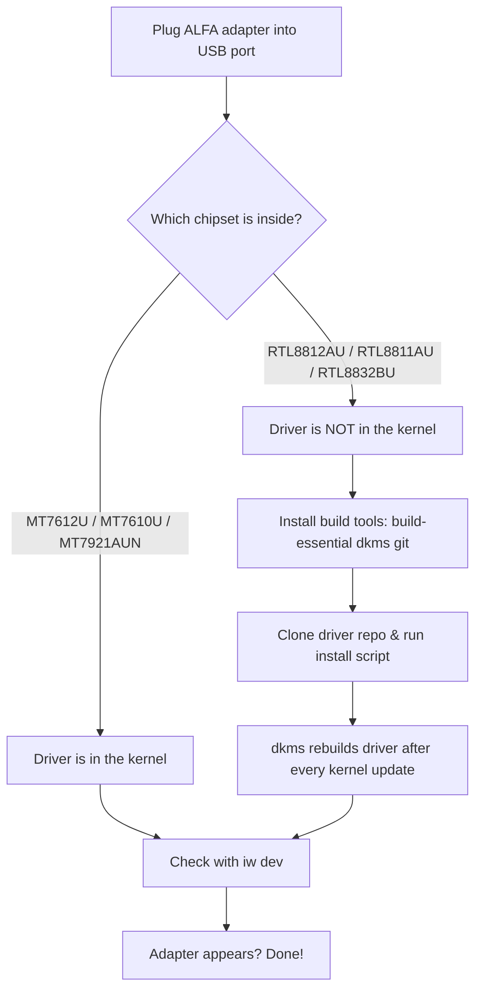

# ALFA 無線網絡卡在 Ubuntu 上的完整設定指南

> **學習目標（Learning goal）**：完成本指南後，你的 ALFA 無線網絡卡將能在 Ubuntu 中顯示（`iw dev`）、連上 Wi-Fi，並且——針對支援的晶片——可以切換到監聽模式（monitor mode）。
> **適用物件**：初學者–中階 ｜ **前置需求**：Ubuntu 20.04+（Wi-Fi 6E 機型需 22.04+）、網路連線（安裝套件需要它！），以及你的 ALFA 無線網絡卡。

## 概念：兩種驅動程式

在碰終端機之前，先了解*為什麼*不同無線網絡卡的設定會不同。這裡有兩個世界：

1. **內建於核心的晶片（MediaTek）**——驅動程式已編譯進 Ubuntu。插上 → 即可使用。這涵蓋 **MT7612U**（AWUS036ACM）、**MT7610U**（AWUS036ACHM）與 **MT7921AUN**（AWUS036AXM / AWUS036AXML，需要 Ubuntu 22.04+ / 核心 5.18+）。
2. **DKMS 晶片（Realtek）**——驅動程式不在核心內，所以你編譯一次，之後 **DKMS** 會在每次核心更新後自動重新建置。這涵蓋 **RTL8812AU**（AWUS036ACH）、**RTL8811AU**（AWUS036ACS）與 **RTL8832BU**（AWUS036AX / AWUS036AXER）。



## 前置需求

- [ ] Ubuntu 20.04 或更新版本（用 `lsb_release -a` 確認）
- [ ] 可用的網路（Wi-Fi 或乙太網路）以下載套件
- [ ] 你的 ALFA 無線網絡卡與一條 USB-A 或 USB-C 傳輸線（AXML 使用 USB-C）
- [ ] `sudo` 許可權

## 步驟 1：確認你的晶片

插上無線網絡卡，然後問 Ubuntu 它看到了什麼：

```bash
lsusb
```

**預期輸出**（尋找 MediaTek / Realtek 那一行）：

```text
Bus 001 Device 004: ID 0e8d:7612 MediaTek Inc. MT7612U 802.11a/b/g/n/ac 2T2R Wireless Adapter
Bus 001 Device 005: ID 0bda:8812 Realtek Semiconductor Corp. RTL8812AU 802.11a/b/g/n/ac 2T2R Wireless Adapter
```

- `0e8d` = MediaTek（內建於核心路徑）
- `0bda` = Realtek（DKMS 路徑）
- 不確定？在[相容性矩陣](/alfa-network/linux-compatibility-matrix/)中交叉比對晶片表。

## 步驟 2：內建於核心的路徑（MediaTek——隨插即用）

如果你的無線網絡卡使用 MediaTek 晶片，什麼都不用安裝。驗證：

```bash
iw dev
```

**預期輸出**：

```text
phy#0
	Interface wlan0
		ifindex 3
		addr 00:c0:ca:xx:xx:xx
		type managed
```

看到 `wlan0` 了嗎？恭喜——驅動程式已生效。透過桌面 Wi-Fi 選單或 NetworkManager 連線：

```bash
nmcli device wifi connect "MySSID" password "my-passphrase"
```

**預期輸出**：`Device 'wlan0' successfully activated with 'MySSID'.`

跳到[步驟 4：驗證一切](#step-4-verify-everything)。

## 步驟 3：DKMS 路徑（Realtek——一次性建置）

針對 RTL8812AU（AWUS036ACH）、RTL8811AU（AWUS036ACS）與 RTL8832BU（AWUS036AX / AXER），建置一次驅動程式。三者都遵循相同模式——安裝工具、複製 repo、執行安裝程式。

### 3.1 安裝建置工具

```bash
sudo apt update
sudo apt install -y build-essential dkms git
```

**預期輸出**：以 `Setting up dkms ...` 結尾且沒有錯誤。DKMS 就是在核心更新後負責重新編譯驅動程式的元件。

### 3.2 RTL8812AU（AWUS036ACH）

最經得起考驗的 repo 由 aircrack-ng 專案維護：

```bash
cd /opt
sudo git clone https://github.com/aircrack-ng/rtl8812au.git
cd rtl8812au
sudo make dkms_install
```

**預期輸出**：

```text
DKMS: install completed.
```

模組現在是 `8812au`，DKMS 會在每次核心更新時重新建置它——你可以當它不存在。

### 3.3 RTL8811AU（AWUS036ACS）

```bash
cd /opt
sudo git clone https://github.com/aircrack-ng/rtl8811au.git
cd rtl8811au
sudo make dkms_install
```

**預期輸出**：`DKMS: install completed.`——模組名稱 `8811au`。

### 3.4 RTL8832BU（AWUS036AX / AWUS036AXER）

```bash
cd /opt
sudo git clone https://github.com/aircrack-ng/rtl88x2bu.git
cd rtl88x2bu
sudo make dkms_install
```

**預期輸出**：`DKMS: install completed.`——模組名稱 `88x2bu`。

### 3.5 重新插上並檢查

拔下再重新插上無線網絡卡（或執行 `sudo modprobe <module>`），然後驗證：

```bash
iw dev
```

**預期輸出**：出現一行 `Interface wlan1`（如果它是你唯一的無線網絡卡則為 `wlan0`）。

> **你可能會想問**——*「哪個模組名稱對應我的無線網絡卡？」* 對照你的晶片：`8812au` → AWUS036ACH、`8811au` → AWUS036ACS、`88x2bu` → AWUS036AX / AXER。[驅動程式頁面](/alfa-network/drivers/rtl8812au/) 有更深入的各晶片細節。

## 步驟 4：驗證一切 {#step-4-verify-everything}

三指令健康檢查：

```bash
ip link show | grep -E "^[0-9]+: wl"        # interface exists?
iw dev                                       # interface + phy info
iw reg get | head -20                        # regulatory domain (affects power/channels)
```

**預期輸出**：

```text
3: wlan1: <BROADCAST,MULTICAST,UP,LOWER_UP> mtu 1500 qdisc mq state UP
phy#1
	Interface wlan1
		ifindex 3
		addr 00:c0:ca:xx:xx:xx
		type managed
```

三個指令都有輸出 = 你的 ALFA 無線網絡卡已完全正常運作。

## 進階：監聽模式（支援的晶片）

監聽模式（monitor mode）讓無線網絡卡擷取某個頻道上的所有封包，而不只是自己的連線。在內建於核心的晶片上，這是兩個指令的工作：

```bash
sudo ip link set wlan1 down
sudo iw wlan1 set monitor none
sudo ip link set wlan1 up
iw dev
```

**預期輸出**：`type monitor` 取代 `type managed`。

> ⚠️ **重要**：`type managed`（預設值）表示驅動程式會過濾掉所有不是傳送給你的流量。`type monitor` 會停用該過濾器——突然之間會有大量流量變得可見。只能在你自己擁有或已明確授權測試的網路上執行。完整的封包注入工作流程請見 [Kali 指南](/alfa-network/linux-setup-kali/)。

## 常見錯誤（FAQ）

| 錯誤 / 症狀 | 原因 | 修復 |
|---|---|---|
| `lsusb` 顯示無線網絡卡但沒有 `wlanX` 介面 | DKMS 模組未載入（Realtek） | `sudo modprobe 8812au`（對應你的晶片），然後檢查 `dmesg \| tail` |
| `make dkms_install` 失敗並顯示 "Kernel preparation unnecessary" | 缺少核心標頭檔 | `sudo apt install linux-headers-$(uname -r)` 後重試 |
| `apt upgrade` 後無線網絡卡消失 | 核心更新，DKMS 重建靜默失敗 | `sudo dkms autoinstall` 然後重新開機 |
| 重新開機後 `iw dev` 什麼都沒有（Realtek） | 模組不在自動載入清單中 | `echo 8812au \| sudo tee /etc/modules-load.d/alfa.conf` |
| Wi-Fi 6E 無線網絡卡（AXML）在 20.04 上偵測不到 | 核心對 `mt7921u` 來說太舊 | 升級到 Ubuntu 22.04+（核心 5.18+） |

## 參考資料

- [本指南的 Kali Linux 版本](/alfa-network/linux-setup-kali/)——監聽模式 + 封包注入
- [晶片驅動程式頁面](/alfa-network/drivers/mt7612u/)——各晶片的深入探討
- [疑難排解索引](/alfa-network/troubleshooting/)——其他任何出錯的情況
- [相容性矩陣](/alfa-network/linux-compatibility-matrix/)——完整的作業系統涵蓋表
- aircrack-ng 驅動程式 repos：[rtl8812au](https://github.com/aircrack-ng/rtl8812au)、[rtl8811au](https://github.com/aircrack-ng/rtl8811au)、[rtl88x2bu](https://github.com/aircrack-ng/rtl88x2bu)