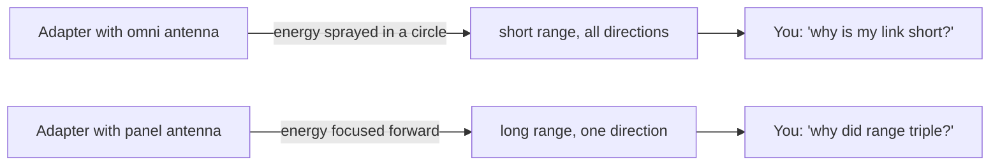
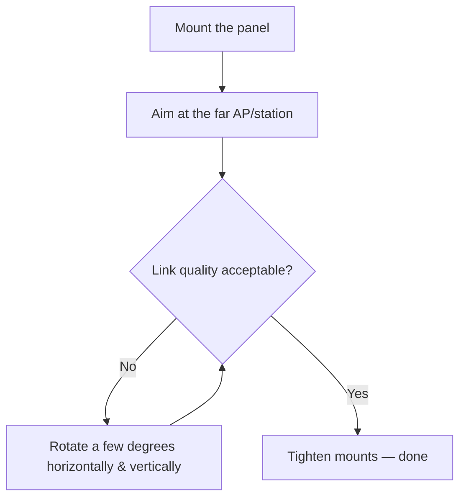

# ALFA APA-M04——2.4 GHz 面板指向性天線

> **一句話定位（One-liner）**：**APA-M04** 是一面扁平的 **2.4 GHz 頻段 7 dBi 指向性面板天線**，以 **PR-SMA** 接頭終接。它把無線電的能量聚焦在一個方向——想想「雷射筆」而不是「燈泡」——用於點對點連結、中繼跳接與長距離使用者端連線。

## 規格總覽 (Spec overview)

| 專案 | 規格 |
|---|---|
| 型別 | 指向性面板天線 |
| 頻段 | 2.4 GHz（802.11b/g/n） |
| 增益 | 7 dBi |
| 接頭 | PR-SMA（母） |
| 極化 | 線性、垂直 |
| 波束寬度 | 窄（指向性——見概念章節） |
| 安裝 | 壁掛 / 桅杆安裝，面板外型 |
| 相容性 | 所有配 RP-SMA 天線的 ALFA 無線網絡卡（透過 PR-SMA/RP-SMA 配對） |

## 總覽

面板天線是固定戶外 Wi-Fi 連結的主力。APA-M04 小巧、扁平、耐天候，而且它的 **7 dBi 增益很誠實**：足以有意義地延伸 2.4 GHz 連結，又不會把天線變成需要三腳架的碟子。

它擅長的地方：

- **兩棟建築之間的點對點連結**（另一端配一面相符的面板）。
- **把實驗室 AP 的涵蓋聚焦**到走廊或庭院。
- **僅 2.4 GHz 的裝置**——IoT 節點、較舊的存取點、僅 2.4 GHz 的無線網絡卡，例如復古中繼設定。

它不擅長的地方：不要期待它能修好 5 GHz 無線網絡卡的範圍——它只支援 2.4 GHz，要 5 GHz 請用 [APA-M25](/alfa-network/products/apa-m25/) 或三頻 [APA-M25-6E](/alfa-network/products/apa-m25-6e/)。

## 天線如何在 30 秒內運作



**全向**天線沿著軸心均勻輻射（一個甜甜圈）。**面板**天線把那個甜甜圈擠成一個錐體——總能量相同，但更集中。dBi 越高 = 錐體越窄 = 範圍越長，代價是需要精確瞄準。APA-M04 的 7 dBi 是短距離固定連結的甜蜜點，你仍然想要一些瞄準容錯。

## 安裝與連線

### 步驟 1：檢查你的接頭

APA-M04 是 **PR-SMA（母）**。無線網絡卡的天線是 **RP-SMA（公）**。PR-SMA 與 RP-SMA 設計上就是配對的——內針極性相符。如果你有一支接頭不同的通用 WiFi 天線（例如 N 型），你需要一條轉接 pigtail——不要硬塞；接頭不符會損壞針腳。

### 步驟 2：鎖上去

- 拆下無線網絡卡的原廠天線。
- 把 APA-M04 的接頭鎖到手指緊，然後用輕壓力**轉四分之一圈**——緊就好，絕不要硬轉。鎖太緊會剝壞脆弱的中心針。

### 步驟 3：指向它



### 步驟 4：驗證

```bash
iw dev wlan0 link
```

**預期輸出**：`signal: -55 dBm`（或更好）——瞄準迴圈是：調整 → 重新檢查 `signal` → 重複直到數值不再改善。每 6 dB 的訊號代表範圍加倍，所以小角度變化很重要。

## 進階使用

- **垂直 vs 水平極化**：保持面板的長軸與遠端天線同方向。90° 錯位可能損失 20+ dB——比天線的增益還多。
- **兩面面板、一條連結**：配對兩面 APA-M04（每端一面），做經典的固定 2.4 GHz 點對點連結。
- **安裝高度**：每高一公尺就清除更多 Fresnel 區障礙。把面板放到屋頂線以上，而不只是桌面以上。

## 相容性

| 搭配 | 結果 |
|---|---|
| 所有 ALFA USB 無線網絡卡（RP-SMA 天線連線埠） | ✅ 直接鎖上 |
| 僅 2.4 GHz 的無線網絡卡 / AP | ✅ 理想 |
| 僅 5 GHz 的連結 | ❌ 頻段錯誤——請用 [APA-M25](/alfa-network/products/apa-m25/) |
| 整合式天線的無線網絡卡（AXER、EACS） | ❌ 沒有可連線的 RP-SMA 連線埠 |

## 疑難排解

| 症狀 | 診斷 | 修復 |
|---|---|---|
| 範圍比原廠天線差 | 接頭未完全就位，或面板指向錯誤方向 | 重新就位接頭；用 `iw dev wlan0 link` 的訊號讀數重新瞄準 |
| 訊號好、速度差 | 2.4 GHz 壅塞，不是天線問題 | 移到乾淨的頻道（`sudo iw dev wlan0 set channel 1/6/11`） |
| 更換天線後什麼都沒有 | 無線網絡卡的 RP-SMA 針被鎖太緊弄斷 | 檢查中心針；用原廠天線當對照組測試 |
| 中午連結正常、晚上失效 | Fresnel 區 / 天氣路徑 | 提高安裝位置；接受長距離連結的大氣變異 |

## 相關資源

- [APA-M25](/alfa-network/products/apa-m25/)——雙頻 2.4/5 GHz 面板，同樣概念 + 5 GHz
- [APA-M25-6E](/alfa-network/products/apa-m25-6e/)——含 6 GHz（Wi-Fi 6E）的三頻面板
- [無線網絡卡比較](/alfa-network/wifi-adapter-comparison/)——挑一支無線電搭配這支天線
- [Ubuntu 設定指南](/alfa-network/linux-setup-ubuntu/)——先讓無線網絡卡能通話