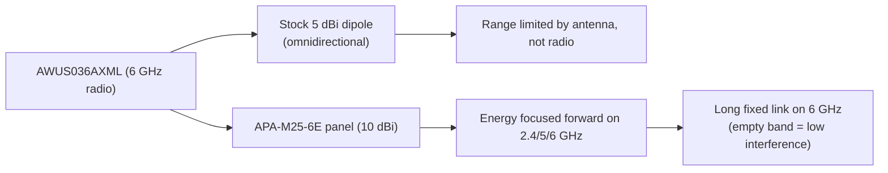

# ALFA APA-M25-6E——三頻面板天線（Wi-Fi 6E 就緒）

> **一句話定位（One-liner）**：**APA-M25-6E** 是一面涵蓋 **2.4、5 與 6 GHz** 的 **10 dBi 指向性面板天線**——經典 APA-M25 的 Wi-Fi 6E 版本。如果你的無線網絡卡有 6 GHz 無線電（[AWUS036AXML](/alfa-network/products/awus036axml/)），這支天線讓它真的能橫跨校園。

## 規格總覽 (Spec overview)

| 專案 | 規格 |
|---|---|
| 型別 | 指向性面板天線 |
| 頻段 | 2.4 GHz / 5 GHz / **6 GHz（Wi-Fi 6E）** |
| 增益 | 10 dBi |
| 接頭 | PR-SMA（母）——與無線網絡卡的 RP-SMA 配對 |
| 極化 | 線性、垂直 |
| 設計 | 緊湊面板，壁掛/桅杆安裝 |
| 使用情境 | 固定點對點連結、6 GHz 回程、長距離使用者端連結 |

## 總覽

APA-M25 是標準的雙頻面板。**6E** 變體加上 **6 GHz 頻段**——相同的 10 dBi 面板設計，重新調校讓頻譜頂端不再是事後才想到。為什麼這很重要？6 GHz 頻段（5 GHz 以上的頻道 1–233）是目前 Wi-Fi 連結能用的壅塞度最低的頻譜，但前提是你的*天線*真的能透過它。舊的「雙頻」面板在 5.8 GHz 以上就急遽衰減；6E 版本就是為它打造的。

它擅長的地方：

- **建築之間的固定 6 GHz 回程連結**（Wi-Fi 6E AP 正在進入每個校園網路）。
- **AWUS036AXML 的長距離使用者端連結**——它的兩支原廠 5 dBi 偶極天線在 500 公尺連結上變成瓶頸；面板移除它。
- **未來就緒**：一面面板無論你的專案最後落在 2.4、5 或 6 GHz 都保持有用。

## 三頻面板如何運作



增益的運作方式與 [APA-M04](/alfa-network/products/apa-m04/) 完全相同：面板用 360° 涵蓋換取聚焦的錐體。10 dBi 在它朝向的方向上比 5 dBi 偶極天線大約提升 3× 線性範圍——並伴隨隨之而來的瞄準紀律。

## 安裝與連線

### 步驟 1：接頭檢查

APA-M25-6E 是 **PR-SMA 母**，與 ALFA 無線網絡卡上的 **RP-SMA 公** 天線連線埠相符。把它配到任何有外接天線的 ALFA 無線網絡卡——[AWUS036AXML](/alfa-network/products/awus036axml/) 是 6 GHz 工作的自然夥伴。

### 步驟 2：安裝與瞄準

1. 把面板裝高——高於屋頂線能為長距離連結清除 Fresnel 區。
2. 用面板取代無線網絡卡的原廠天線。
3. 用無線網絡卡自己的訊號讀數瞄準（見下方）。

### 步驟 3：在每個頻段上驗證

檢查連結在瞄準前後回報的內容：

```bash
iw dev wlan0 link
iw dev wlan0 info | grep channel
```

**預期輸出**：

```text
signal: -48 dBm
channel 37 (6115 MHz)
```

`6115 MHz` 那一行證明你在 **6 GHz 頻段**上——這支天線的全部意義。瞄準面板直到 `signal` 不再改善。

## 進階使用

- **6 GHz 連結配對**：要完整的 6 GHz 點對點連結，兩端都需要支援 6 GHz 的裝置（AP + 使用者端）。面板是使用者端端的元件。
- **極化紀律**：保持兩端極化都垂直（或都水平）。90° 錯位浪費的增益比天線提供的還多。
- **實驗室實驗**：用面板搭配監聽模式（monitor mode）把擷取場聚焦到一個方向——非常適合無線通訊課程作業。

## 相容性

| 搭配 | 結果 |
|---|---|
| AWUS036AXML（6 GHz 無線電、RP-SMA） | ✅ 完美搭配——解鎖 6 GHz 範圍 |
| 任何配 RP-SMA 天線連線埠的 ALFA 無線網絡卡 | ✅ 可用（2.4/5 GHz） |
| 僅 6 GHz 的裝置（Wi-Fi 6E AP） | ✅ 為它設計 |
| 整合式天線的無線網絡卡（AXER、EACS） | ❌ 沒有可連線的接頭 |

## 疑難排解

| 症狀 | 診斷 | 修復 |
|---|---|---|
| `iwlist wlan0 freq` 中沒有 6 GHz 頻道 | 法規領域或驅動程式/頻段不符——不是天線問題 | `sudo iw reg set <CC>`；確認無線網絡卡是 AXML |
| 連結訊號好但慢 | 面板瞄準到錯誤的波瓣 / 極化不符 | 重新瞄準；把面板轉 90° 並比較訊號 |
| 訊號比原廠偶極天線差 | 面板偏離 180° | 邊看 `signal` 邊慢慢掃過 360° |
| 接頭感覺鬆 | 與第三方裝置的 PR-SMA/RP-SMA 不符 | 只把 PR-SMA 配 RP-SMA；否則使用正確的 pigtail |

## 相關資源

- [APA-M25](/alfa-network/products/apa-m25/)——這面面板的雙頻（2.4/5 GHz）版本
- [APA-M04](/alfa-network/products/apa-m04/)——僅 2.4 GHz 的 7 dBi 面板
- [AWUS036AXML 產品頁面](/alfa-network/products/awus036axml/)——這支天線為它打造的無線網絡卡
- [mt7921aun 驅動程式頁面](/alfa-network/drivers/mt7921aun/)——6 GHz 驅動程式細節