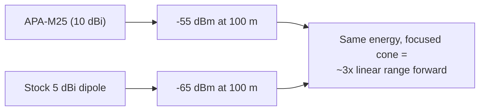

# ALFA APA-M25——雙頻面板天線（2.4/5 GHz）

> **一句話定位（One-liner）**：**APA-M25** 是 ALFA 經典的 **2.4 與 5 GHz 10 dBi 雙頻指向性面板**，以 **RP-SMA** 終接。它是任何配外接天線的 ALFA 無線網絡卡的「指向 AP 就贏」升級——校園中繼專案就是建立在這種面板上。

## 規格總覽 (Spec overview)

| 專案 | 規格 |
|---|---|
| 型別 | 指向性面板天線 |
| 頻段 | 2.4 GHz + 5 GHz |
| 增益 | 10 dBi |
| 接頭 | **RP-SMA（公）**——注意與 PR-SMA 面板的差異 |
| 極化 | 線性、垂直 |
| 設計 | 緊湊扁平面板，壁掛/桅杆安裝 |
| 使用情境 | 固定點對點連結、長距離使用者端連結、涵蓋聚焦 |

## 總覽

APA-M25 是大多數人想到「ALFA 指向性天線」時浮現的面板：一面扁平、耐天候的矩形，把任何配外接天線的 ALFA 無線網絡卡變成長距離連結工具。它在 **2.4 與 5 GHz 上都是 10 dBi**，這是可以用肉眼瞄準的面板的實用上限——再上去，天線會變大、變窄、變得不留情面。

先注意兩件事：

1. **RP-SMA（公）接頭**——它直接插進無線網絡卡的 **RP-SMA（母）** 天線連線埠，不需要轉接頭，因為針極性與無線網絡卡側的插座相符。（[APA-M25-6E](/alfa-network/products/apa-m25-6e/) 與 [APA-M04](/alfa-network/products/apa-m04/) 使用 PR-SMA，*也*能正確與 RP-SMA 連線埠配對——兩個家族都設計成能與 ALFA 無線網絡卡連線埠接合。）
2. **沒有 6 GHz**——這是 2.4/5 GHz 面板。要 Wi-Fi 6E 請買 6E 變體。

它擅長的地方：學生專案、建築對建築連結、實驗室涵蓋塑形——任何需要聚焦範圍又不需要桅杆的地方。

## 如何看待 10 dBi



每 ~6 dB 的天線增益讓有效範圍加倍。比原廠偶極天線多 5 dB 在面板朝向的方向買到大約 **1.7–1.8× 的範圍倍數**——「困在實驗室」與「連結橫跨庭院」之間的差別。

## 安裝與連線

### 步驟 1：鎖上去

1. 旋下無線網絡卡的原廠天線。
2. 把 APA-M25 鎖進無線網絡卡的 RP-SMA 連線埠——手指緊加上輕輕的四分之一圈。
3. 絕不要硬轉：無線網絡卡的中心針很脆弱，而且面板比偶極天線重，所以**盡可能用束線帶做應力釋放**支撐傳輸線。

### 步驟 2：裝高一點

高度就是增益：把面板放到女兒牆、屋頂線與人群之上。每多一公尺的淨空就清除 10 dBi 無法補償的 Fresnel 區障礙。

### 步驟 3：瞄準並驗證

```bash
iw dev wlan0 link
```

**預期輸出**：一個 dBm 單位的 `signal:` 數值。每次把面板水平與垂直掃過幾度；保留最佳讀數。重複直到數值趨於平穩。

## 進階使用

- **雙面板連結**：每端一面 APA-M25 = 一條固定點對點連結，兩個方向都有相同增益。
- **2.4 GHz 上的頻道選擇**：面板聚焦能量但不聚焦乾擾——在 2.4 GHz 上，先挑乾淨的頻道（`1/6/11`），再瞄準。
- **監聽模式瞄準**：用 `airmon-ng start` + `tcpdump -i wlan0mon -c 50` 當瞄準工具：聽到最多 beacon 的面板就是指向正確的。

## 相容性

| 搭配 | 結果 |
|---|---|
| 任何配 RP-SMA 天線連線埠的 ALFA 無線網絡卡（ACM、ACH、ACS、AX、AXM、AXML...） | ✅ 直接鎖上 |
| 5 GHz 連結 | ✅ 完整 5 GHz 支援 |
| 6 GHz（Wi-Fi 6E）連結 | ❌ 請用 [APA-M25-6E](/alfa-network/products/apa-m25-6e/) |
| 整合式天線的無線網絡卡（AXER、EACS） | ❌ 沒有可連線的連線埠 |

## 疑難排解

| 症狀 | 診斷 | 修復 |
|---|---|---|
| 訊號比原廠天線差 | 面板瞄準錯誤或接頭鬆動 | 重新就位；用 `iw dev wlan0 link` 掃描瞄準 |
| 訊號好、連結間歇 | 面板重量造成傳輸線/接頭應力 | 支撐傳輸線；檢查接頭是否緊密 |
| 只看到 2.4 GHz 網路 | 無線網絡卡/法規領域問題，不是天線 | `sudo iw reg set <CC>`；用原廠天線測試以隔離 |
| 面板「可用」但沒有 5 GHz 範圍 | 連結端（AP）在 5 GHz 上可能功率低 | 檢查 AP 端；5 GHz 也需要乾淨的 Fresnel |

## 相關資源

- [APA-M25-6E](/alfa-network/products/apa-m25-6e/)——Wi-Fi 6E 就緒版本
- [APA-M04](/alfa-network/products/apa-m04/)——僅 2.4 GHz 的 7 dBi 面板
- [ARS-25-57A](/alfa-network/products/ars-25-57a/)——緊湊槳形替代方案
- [無線網絡卡比較](/alfa-network/wifi-adapter-comparison/)——搭配正確的無線電
- [疑難排解索引](/alfa-network/troubleshooting/)