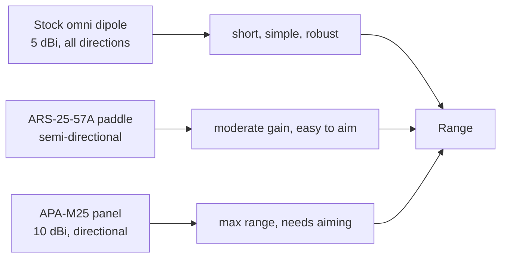

# ALFA ARS-25-57A——雙頻槳形天線（5/7 dBi）

> **一句話定位（One-liner）**：**ARS-25-57A** 是一支緊湊、半指向性的 **2.4 與 5 GHz 槳形**天線——**2.4 GHz 上 5 dBi、5 GHz 上 7 dBi**。它是原廠偶極天線與完整面板之間的旅行友善中間地帶：比棒狀天線更多增益，比壁掛面板更少體積。

## 規格總覽 (Spec overview)

| 專案 | 規格 |
|---|---|
| 型別 | 指向性槳形天線 |
| 頻段 | 2.4 GHz + 5 GHz |
| 增益 | 2.4 GHz：5 dBi ｜ 5 GHz：7 dBi |
| 接頭 | RP-SMA（公） |
| 極化 | 線性 |
| 設計 | 扁平槳形、鉸接、輕量 |
| 使用情境 | 可攜式裝置、旅行、需要多一點範圍的實驗室 |

## 總覽

「槳形」介於全向偶極天線與扁平面板之間：它是一小片扁平的刀片，帶輕微指向性與真實增益——**2.4 GHz 上 5 dBi，5 GHz 上有用的 7 dBi**。這種依頻段而異的增益很合理：5 GHz 比 2.4 GHz 更需要幫助，而 5 GHz 頻段上的 7 dBi 正是 ARS-25-57A 發揮價值的地方。

它擅長的地方：

- **可攜式/滲透測試套件**——平摺、耐得住揹包、鎖上任何 RP-SMA ALFA 無線網絡卡。
- **筆電實驗室工作站**——相同重量下比原廠偶極天線更多範圍。
- **半指向性瞄準**——指向目標 AP 獲得一點聚焦，又不需要面板的完整瞄準紀律。

它不擅長的地方：對*固定*的建築對建築連結，[APA-M25](/alfa-network/products/apa-m25/)（10 dBi 面板）勝過它；要完全的旅行極簡，用原廠天線。

## 概念：為什麼是槳形，為什麼 5/7 dBi



槳形是那條鏈中的折衷節點：它給出真實的增益數字（原廠偶極天線的「5 dBi」全向數字在實務上可說名不副實），同時瞄準起來很寬容。5/7 dBi 的分工代表最吃力的頻段——5 GHz——拿到較大的份額。

## 安裝與連線

### 步驟 1：安裝

把 ARS-25-57A 的 RP-SMA 接頭鎖上任何 ALFA 無線網絡卡的 RP-SMA 天線連線埠。手指緊加上輕輕的八分之一到四分之一圈就夠了。

### 步驟 2：展開

把槳形翻開，讓它的扁平面對著你要連結的 AP/工作站。邊看無線網絡卡的訊號讀數邊傾斜與旋轉。

### 步驟 3：驗證

```bash
iw dev wlan0 link
```

**預期輸出**：一個 dBm 單位的 `signal:`。每次把槳形掃過幾度；保留負值最小的方向。如果你的連結使用 5 GHz 頻段，在 5 GHz 上重複。

## 進階使用

- **監聽模式瞄準**：啟動 `tcpdump -i wlan0mon` 並重新調整槳形方向，直到從你的目標方向收到最高的 beacon 數量。
- **雙天線無線網絡卡**：在 AWUS036ACM/ACH 上你可以一支用槳形、一支留在 5 GHz——但對多頻段連結，兩支天線都應瞄準相同頻段以獲得一致的 MIMO。
- **可攜式野外套件**：旅行時把槳形平摺；如果你在野外弄斷接頭，RP-SMA 是可更換的。

## 相容性

| 搭配 | 結果 |
|---|---|
| 任何配 RP-SMA 天線連線埠的 ALFA 無線網絡卡 | ✅ 直接鎖上 |
| 2.4 與 5 GHz 連結 | ✅ 兩個頻段，分別 5/7 dBi |
| 旅行 / 揹包裝置 | ✅ 理想的尺寸與重量 |
| 固定長距離連結（>200 公尺） | ⚠️ 考慮 [APA-M25](/alfa-network/products/apa-m25/) 面板 |

## 疑難排解

| 症狀 | 診斷 | 修復 |
|---|---|---|
| 對原廠天線沒有增益 | 槳形指向錯誤 / 未完全就位 | 重新瞄準 AP；重新就位接頭 |
| 2.4 GHz 可用、5 GHz 弱 | 5 GHz 需要更精確的瞄準 | 精確傾斜；7 dBi 5 GHz 波瓣很窄 |
| 接頭搖晃 | RP-SMA 鬆動 | 輕輕重新鎖緊；不要鎖太緊 |
| 自己摺回去 | 鉸鏈摩擦磨損 | 輕微問題——靠無線網絡卡自身重量維持方向是正常的 |

## 相關資源

- [APA-M25](/alfa-network/products/apa-m25/)——固定連結的全尺寸面板
- [APA-M04](/alfa-network/products/apa-m04/)——僅 2.4 GHz 的面板
- [ARS-NT5B7](/alfa-network/products/ars-nt5b7/)——工業 WiFi 7 三頻偶極天線
- [無線網絡卡比較](/alfa-network/wifi-adapter-comparison/)
- [疑難排解索引](/alfa-network/troubleshooting/)