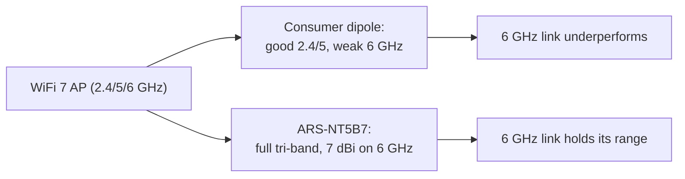

# ALFA ARS-NT5B7——WiFi 7 三頻工業偶極天線

> **一句話定位（One-liner）**：**ARS-NT5B7** 是涵蓋 **2.4、5 與 6 GHz**、最高 **7 dBi** 的 **WiFi 7 就緒三頻偶極天線**，為 **工業 -40 至 +85 °C** 範圍打造。當原廠塑膠偶極天線撐不過工作環境時，它就是你要鎖上嵌入式閘道器或機器人的那支天線。

## 規格總覽 (Spec overview)

| 專案 | 規格 |
|---|---|
| 型別 | 偶極天線（近似全向） |
| 頻段 | 2.4 / 5 / **6 GHz（Wi-Fi 6E/7）** |
| 增益 | 最高 7 dBi（6 GHz 上最佳） |
| 工作溫度 | **-40 °C 至 +85 °C**（工業） |
| 接頭 | 業界標準（依變體為 IPEX / RP-SMA / N——請確認你的 SKU） |
| 設計 | 強化偶極天線，耐天候材料 |
| 使用情境 | 嵌入式閘道器、工業 IoT、機器人、戶外無線電、WiFi 7 |

## 總覽

大多數 ALFA 天線是消費級。ARS-NT5B7 是為**嚴苛環境**打造的例外：它是一支深入 **6 GHz** 頻段的三頻偶極天線（所以 WiFi 6E 與即將到來的 **WiFi 7** 裝置都能用它），額定從 **-40 °C** 冷凍庫到 **+85 °C** 機櫃都能持續運作。如果你的專案涉及機器人、戶外閘道器，或任何活在恆溫實驗室之外的東西，這就是你要選用的天線。

**6 GHz 上的 7 dBi 數字**是重點：如果天線很弱，6 GHz 頻段會抵消它的範圍優勢，而這支偶極天線在頂端並不弱。

它擅長的地方：

- **嵌入式與工業**——消費級偶極天線缺乏的耐熱性。
- **WiFi 7 / 6E 閘道器**——三頻涵蓋，不只是 2.4/5。
- **機器人**——偶極天線能承受野外機器人丟給它的振動與溫度劇變。

它不擅長的地方：它仍然是偶極天線（近似全向），不是指向性面板。要聚焦的長距離連結，請把[面板](/alfa-network/products/apa-m25-6e/)放在心上。

## 概念：三頻與 WiFi 7 的問題



WiFi 7（802.11be）透過 MLO（multi-link operation，多連結運作）同時跑在三個頻段上。一個「WiFi 7」系統的好壞取決於它最弱的一環——如果天線在 6 GHz 上崩潰，整個多連結設定都會退化。ARS-NT5B7 的設計讓最新的頻段成為*最強*的那個。

## 安裝與連線

### 步驟 1：對上接頭

ARS-NT5B7 以接頭變體出貨（板載模組通常是 IPEX/U.FL，外接無線電連線埠是 RP-SMA）。先對上你的無線電——不要硬塞不符的接頭。

### 步驟 2：留淨空安裝

- 把偶極天線**直立安裝並遠離金屬**——碰到金屬牆的偶極天線會變成它原本一半的天線。
- IPEX 變體請以溫和的彎曲佈線（IPEX 在焊點處很脆弱；使用應力釋放）。

### 步驟 3：跨頻段驗證

```bash
iw dev wlan0 link
iw dev wlan0 info | grep channel
```

**預期輸出**：連結啟動並有訊號數值；在 6E/7 裝置上頻道那一行顯示 **6 GHz 頻率**（例如 `channel 37 (6115 MHz)`）。檢查你的閘道器使用的每個頻段上的訊號——三個都應該維持合理數字。

## 進階使用

- **工業閘道器**：搭配支援 6 GHz 的無線電模組，並在機櫃的實際工作溫度下做現場測試。
- **WiFi 7 上的多連結（MLO）設定**：三頻偶極天線讓三條連結共存於一支天線上——不需要每頻段一支天線農場。
- **機器人野外連結**：搭配 [Unitree](/alfa-network/hardware/unitree/) 或 [Jetson](/alfa-network/hardware/jetson/) 整合，並把 IPEX pigtail 佈線到機器人的無線電。

## 相容性

| 搭配 | 結果 |
|---|---|
| 板載 WLAN 模組（IPEX 變體） | ✅ 直接安裝 |
| 配 RP-SMA 連線埠的 ALFA 無線網絡卡（RP-SMA 變體） | ✅ 鎖上 |
| 6 GHz / WiFi 6E / WiFi 7 無線電 | ✅ 完整三頻 |
| 熱/冷/工廠環境 | ✅ 額定 -40 至 +85 °C |
| 聚焦的長距離連結 | ⚠️ 這裡[面板](/alfa-network/products/apa-m25-6e/)勝過偶極天線 |

## 疑難排解

| 症狀 | 診斷 | 修復 |
|---|---|---|
| 6 GHz 弱、2.4/5 正常 | 錯誤 SKU（僅 2.4/5 變體）或障礙物 | 確認 SKU 是三頻；重新定位遠離金屬 |
| IPEX 接頭脫落 | 焊點脆弱 / 沒有應力釋放 | 輕輕重新就位；為傳輸線加應力釋放 |
| 安裝後訊號下降 | 偶極天線碰到機殼金屬 | 留淨空重新安裝（見步驟 2） |
| 實驗室可用、野外不行 | 熱/EMI 環境不同 | 在真實機櫃內驗證；確認 -40/85 °C 額定適用於你的用途 |

## 相關資源

- [APA-M25-6E](/alfa-network/products/apa-m25-6e/)——三頻指向性面板
- [ARS-25-57A](/alfa-network/products/ars-25-57a/)——可攜式雙頻槳形天線
- [AWUS036AXML 產品頁面](/alfa-network/products/awus036axml/)——6 GHz USB 無線網絡卡
- [Unitree 指南](/alfa-network/hardware/unitree/) / [Jetson 指南](/alfa-network/hardware/jetson/)——工業/機器人主機