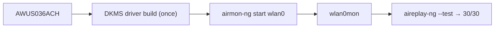

# ALFA AWUS036ACH——高功率 AC1200

> **一句話定位（One-liner）**：**AWUS036ACH** 是 ALFA 最有名的無線網卡——一支**高功率 RTL8812AU AC1200 雙頻** USB 3.0 dongle，配兩支 5 dBi 外接天線。如果你曾在 Kali 教學影片中看過一支黑色 ALFA，大概就是它。監聽模式（monitor mode）與封包注入（packet injection）是它的拿手好戲；DKMS 驅動程式建置是唯一的一次性入場費。

## 規格總覽 (Spec overview)

| 項目 | 規格 |
|---|---|
| 晶片 | Realtek RTL8812AU |
| Wi-Fi 等級 | AC1200（300 + 867 Mbps） |
| 介面 | USB 3.0 |
| 頻段 | 2.4 + 5 GHz |
| 天線 | 2 × 外接 5 dBi，RP-SMA |
| TX 功率 | 高功率（500 mW 等級） |
| Linux 驅動程式 | `rtl8812au-dkms`（社群，不在核心內） |
| 監聽模式 | ✅ 極佳 |
| 封包注入 | ✅ 極佳 |

## 總覽

AWUS036ACH 是為 ALFA 建立「駭客無線網卡」名聲的那支無線網卡。它把耐操的 **RTL8812AU** 無線電配上真正的**高功率（500 mW）前端**與兩支可更換的 5 dBi 天線，包在你一眼就認得的黃/黑 ALFA 外殼裡。對課程作業最重要的區別：與低價仿冒品不同，它的驅動程式背後有多年 aircrack-ng 社群打磨，所以一旦驅動程式就位，**監聽模式與封包注入就是能用**。

它唯一真正的「代價」是 RTL8812AU **不在 Linux 核心內**——一次性 DKMS 建置就是它與隨插即用 [AWUS036ACM](/alfa-network/products/awus036acm/) 之間的差別。

## 安裝與驅動程式

完整教學在 [RTL8812AU 驅動程式頁面](/alfa-network/drivers/rtl8812au/)——這裡是 30 秒版本：

```bash
sudo apt install -y build-essential dkms git
cd /opt && sudo git clone https://github.com/aircrack-ng/rtl8812au.git
cd rtl8812au && sudo make dkms_install
sudo modprobe 8812au
```

**預期輸出**：`DKMS: install completed.` 然後 `iw dev` 後出現 `Interface wlan0`。



## 進階使用

### 監聽模式 + 注入

```bash
sudo airmon-ng check kill
sudo airmon-ng start wlan0
sudo aireplay-ng --test wlan0mon
```

**預期輸出**：`Injection is working!` 與 `30/30: 100%`。

### 更換天線以增加範圍

RP-SMA 連接埠接受任何 [ALFA 天線](/alfa-network/products/apa-m25/)——升級到面板或更高增益的偶極天線能提升 500 mW 無線電能觸及的範圍。

## 相容性

| 平台 | 支援 | 注意事項 |
|---|---|---|
| Kali Linux | ✅ | DKMS 建置；aircrack-ng repo 追蹤新核心 |
| Ubuntu | ✅ | DKMS；在 LTS 上非常穩固 |
| NetHunter / Android | 🔧 | 在某些核心上可用；不保證 |
| Windows | ✅ | 官方驅動程式；隨插即用 |
| macOS | ⚠️ | 需要驅動程式；Apple Silicon 受限 |

## 疑難排解

| 症狀 | 原因 | 修復 |
|---|---|---|
| DKMS 建置失敗 | 新核心 vs 過期 repo | `cd /opt/rtl8812au && sudo git pull && sudo make dkms_install` |
| 無線網卡只在 managed 模式 | 核心 stub 搶走了它 | 把 `rtl8812au` 加入黑名單（見[驅動程式頁面](/alfa-network/drivers/rtl8812au/)） |
| 注入 0/30 | 空頻道 | `sudo iw wlan0mon set channel 6`；在 AP 附近測試 |
| 重新開機後消失 | 模組未自動載入 | 把 `8812au` 加入 `/etc/modules-load.d/alfa.conf` |

## 相關資源

- [RTL8812AU 驅動程式頁面](/alfa-network/drivers/rtl8812au/)——完整設定 + 深入疑難排解
- [Kali 設定指南](/alfa-network/linux-setup-kali/)
- [AWUS036ACM](/alfa-network/products/awus036acm/)——內建於核心的替代方案（初學者建議）
- [無線網卡比較](/alfa-network/wifi-adapter-comparison/)
- [相容性矩陣](/alfa-network/linux-compatibility-matrix/)