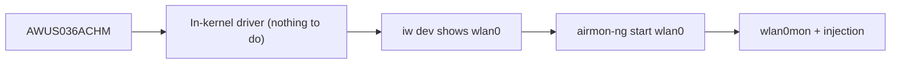

# ALFA AWUS036ACHM——平價雙頻 AC433

> **一句話定位（One-liner）**：**AWUS036ACHM** 是平價雙頻 ALFA——一支 **MT7610U AC433** 無線網卡，配兩支 5 dBi 天線，而且關鍵的是**內建於核心的驅動程式**（自 Linux 4.19 起的 `mt76x0u`）。它是進入 Linux 雙頻監聽模式（monitor mode）最便宜的方式，沒有之一。

## 規格總覽 (Spec overview)

| 項目 | 規格 |
|---|---|
| 晶片 | MediaTek MT7610U |
| Wi-Fi 等級 | AC433（150 + 433 Mbps） |
| 介面 | USB 2.0 |
| 頻段 | 2.4 + 5 GHz |
| 天線 | 2 × 外接 5 dBi，RP-SMA |
| Linux 驅動程式 | `mt76x0u`——**自 4.19 起內建於核心** |
| 監聽模式 | ✅ 良好 |
| 封包注入 | ✅ 良好 |

## 總覽

ACHM 是 [AWUS036ACM](/alfa-network/products/awus036acm/) 的「小老弟」。它使用 **1×1 MT7610U** 無線電，所以 AC433 的速度上限大約是 ACM 的 AC1200 的一半——但對大學生真正需要的兩件事來說，它競爭力十足：

1. **它在核心內。** 沒有 DKMS、沒有編譯、沒有「升級後壞掉」。在 Ubuntu 或 Kali 上插上，`wlan0` 就存在。
2. **監聽模式 + 注入可用**，透過標準 `mac80211` 路徑，感謝 MediaTek 主線驅動程式。

如果你的課程作業是「擷取並分析 Wi-Fi 管理訊框」或「示範封包注入」，ACHM 以 ALFA 產品線最低的價格完成它。只有在你要為重度擷取取得雙倍 5 GHz 吞吐量時，才改買 [ACM](/alfa-network/products/awus036acm/)。

## 安裝與驅動程式

因為驅動程式在核心內，**沒有需要安裝的東西**——請見 [MT7610U 驅動程式頁面](/alfa-network/drivers/mt7610u/)。驗證方式：

```bash
lsusb | grep -i mediatek
iw dev
```

**預期輸出**：

```text
Bus 001 Device 005: ID 0e8d:7610 MediaTek Inc. MT7610U
phy#0
	Interface wlan0
		ifindex 3
		type managed
```



## 進階使用

### 監聽模式（不需要安裝）

```bash
sudo airmon-ng start wlan0
sudo aireplay-ng --test wlan0mon
```

**預期輸出**：建立 `wlan0mon`；注入 `30/30: 100%`。

### 天線升級

如果你覺得原廠偶極天線不夠用，RP-SMA 連接埠接受 [ALFA 天線](/alfa-network/products/apa-m25/)——但要注意 1×1 無線電無法用兩支天線做 MIMO，所以要增加範圍請用單支高增益天線。

## 相容性

| 平台 | 支援 | 注意事項 |
|---|---|---|
| Kali Linux | ✅ | 內建於核心的 `mt76x0u` |
| Ubuntu | ✅ | 20.04+ 隨插即用 |
| NetHunter / Android | ✅ | 內建於核心的晶片 |
| Windows | ✅ | 官方驅動程式 |
| Raspberry Pi / Jetson | ✅ | 內建於核心 |

## 疑難排解

| 症狀 | 原因 | 修復 |
|---|---|---|
| 不在 `lsusb` 中 | 電源 / 傳輸線 | 不同的連接埠 / 供電 hub——[疑難排解](/alfa-network/troubleshooting/) |
| 沒有介面 | 驅動程式未載入（罕見） | `sudo modprobe mt76x0u` |
| 吞吐量約為 ACM 的一半 | 1×1 硬體限制 | 不是 bug——AC433 等級 |
| 注入失敗 | 空頻道 | `sudo iw wlan0mon set channel 6` |

## 相關資源

- [MT7610U 驅動程式頁面](/alfa-network/drivers/mt7610u/)
- [Ubuntu 設定指南](/alfa-network/linux-setup-ubuntu/) 與 [Kali 設定指南](/alfa-network/linux-setup-kali/)
- [AWUS036ACM](/alfa-network/products/awus036acm/)——更快的兄弟
- [無線網卡比較](/alfa-network/wifi-adapter-comparison/)