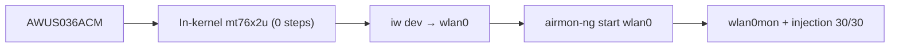

# ALFA AWUS036ACM——經典全能款（MT7612U）

> **一句話定位（One-liner）**：**AWUS036ACM** 是社群的預設推薦：一支**高功率 MT7612U AC1200** 雙頻無線網卡，驅動程式**內建於 Linux 核心**。沒有 DKMS、沒有編譯——在 Kali 或 Ubuntu 上插上，監聽模式（monitor mode）就是能用。它是「我該買哪支 ALFA？」的無聊答案，而無聊代表可靠。

## 規格總覽 (Spec overview)

| 項目 | 規格 |
|---|---|
| 晶片 | MediaTek MT7612U |
| Wi-Fi 等級 | AC1200（300 + 867 Mbps） |
| 介面 | USB 3.0 |
| 頻段 | 2.4 + 5 GHz |
| 天線 | 2 × 外接 5 dBi，RP-SMA |
| TX 功率 | 高功率（500 mW 等級） |
| Linux 驅動程式 | `mt76x2u`——**自 4.19 起內建於核心** |
| 監聽模式 | ✅ 極佳 |
| 封包注入 | ✅ 極佳 |

## 總覽

AWUS036ACM 把 [AWUS036ACH](/alfa-network/products/awus036ach/) 出名的一切——2×2 AC1200、高功率、雙頻、兩支外接天線——拿來，然後移除學生們最討厭的一件事：**DKMS 驅動程式建置**。ACM 的 MT7612U 是 Linux 核心的正式公民，所以：

- 插上 → `wlan0` 出現。零指令。
- 沒有 DKMS → 核心更新時沒有東西會壞。
- 監聽模式 + 注入 → 透過原廠 `mac80211` 工具運作。

這個組合就是為什麼它是「我是學生、我想要一支無線網卡上資安課、我不想跟作業系統搏鬥」的答案——也是為什麼這本 wiki 在 [Ubuntu](/alfa-network/linux-setup-ubuntu/) 與 [Kali](/alfa-network/linux-setup-kali/) 指南中把它當成參考無線網卡。

## 安裝與驅動程式

沒有需要安裝的東西——完整細節請見 [MT7612U 驅動程式頁面](/alfa-network/drivers/mt7612u/)。快速驗證：

```bash
lsusb | grep -i mediatek
iw dev
```

**預期輸出**：

```text
Bus 001 Device 004: ID 0e8d:7612 MediaTek Inc. MT7612U 802.11a/b/g/n/ac 2T2R Wireless Adapter
phy#0
	Interface wlan0
		ifindex 3
		addr 00:c0:ca:xx:xx:xx
		type managed
```

（`00:c0:ca` 前綴是 ALFA 的 MAC OUI——一個方便的實驗室識別技巧。）



## 進階使用

### 監聽模式 + 注入

```bash
sudo airmon-ng start wlan0
sudo aireplay-ng --test wlan0mon
```

**預期輸出**：`Injection is working!` 與 `30/30: 100%`。

### 天線升級

兩個 RP-SMA 連接埠代表你可以用[面板](/alfa-network/products/apa-m25/)做聚焦的長距離連結，或用雙高增益偶極天線做全向涵蓋——而且 2×2 無線電真的會用到兩個串流。

### Wireshark 擷取設備

搭配 [Raspberry Pi 指南](/alfa-network/hardware/raspberry-pi/) 建立無頭、常開的擷取站。

## 相容性

| 平台 | 支援 | 注意事項 |
|---|---|---|
| Kali Linux | ✅ | 內建於核心，零設定 |
| Ubuntu | ✅ | 20.04+ 隨插即用 |
| NetHunter / Android | ✅ | 標準的 NetHunter 無線網卡 |
| Windows | ✅ | 官方驅動程式 |
| Raspberry Pi / Jetson | ✅ | 內建於核心，穩固的 AP + 監聽支援 |

## 疑難排解

| 症狀 | 原因 | 修復 |
|---|---|---|
| 不在 `lsusb` 中 | 電源 / 傳輸線 | 不同的連接埠 / 供電 hub——[疑難排解](/alfa-network/troubleshooting/) |
| 沒有介面 | 驅動程式未載入（罕見） | `sudo modprobe mt76x2u`；檢查 `dmesg \| grep mt76` |
| 注入 0/30 | 空頻道 / 無 RF 區域 | `sudo iw wlan0mon set channel 6`；在 AP 附近測試 |
| 暫停/恢復時 WLAN 失效 | 已知的筆電 USB 怪癖 | 恢復後拔下/重新插上 |

## 相關資源

- [MT7612U 驅動程式頁面](/alfa-network/drivers/mt7612u/)
- [Kali 設定指南](/alfa-network/linux-setup-kali/)
- [Ubuntu 設定指南](/alfa-network/linux-setup-ubuntu/)
- [NetHunter 設定指南](/alfa-network/linux-setup-nethunter/)
- [AWUS036AXM](/alfa-network/products/awus036axm/)——Wi-Fi 6 + 藍牙升級款
- [無線網卡比較](/alfa-network/wifi-adapter-comparison/)