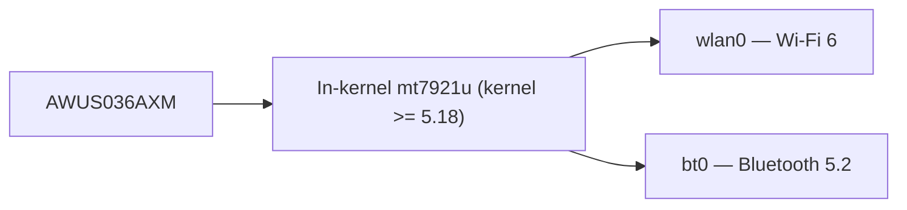

# ALFA AWUS036AXM——Wi-Fi 6 AX3000 + 藍牙 5.2

> **一句話定位（One-liner）**：**AWUS036AXM** 是 ALFA 的旗艦 Wi-Fi 6 dongle——一支 **MT7921AUN AX3000** 雙頻無線網卡，含**藍牙 5.2**、USB 3.2、兩支天線，而且關鍵的是**內建於核心的驅動程式**（自 Linux 5.18 起的 `mt7921u`）。一支棒子取代你的 Wi-Fi 與藍牙。

## 規格總覽 (Spec overview)

| 項目 | 規格 |
|---|---|
| 晶片 | MediaTek MT7921AUN |
| Wi-Fi 等級 | AX3000（574 + 2402 Mbps） |
| 介面 | USB 3.2 |
| 頻段 | 2.4 + 5 GHz |
| 天線 | 2 × 外接 5 dBi，RP-SMA |
| 藍牙 | **BT 5.2**（同一個 dongle） |
| MIMO | 2×2 |
| Linux 驅動程式 | `mt7921u`——**自 5.18 起內建於核心** |
| 監聽模式 | ✅ 良好 |

## 總覽

AXM 是備受喜愛的 [AWUS036ACM](/alfa-network/products/awus036acm/) 的現代繼任者——MediaTek 無線電、內建於核心的驅動程式、沒有 DKMS 的麻煩——但帶上整整一代的升級：**AX3000** 速度（5 GHz 上 2.4 Gbps）、**藍牙 5.2** 搭在同一個 USB 裝置上，以及一顆在擁擠環境中處理得更好的新無線電。

對 Linux 使用者來說，吸引力與 ACM 相同：**它就是能用**。驅動程式在核心內（需要 5.18+，所以 Ubuntu 22.04+ 或近期 Kali）、監聽模式（monitor mode）透過標準 `mac80211` 路徑可用，而且紅利是你的 WiFi 與藍牙共用一個連接埠。

唯一警告：因為 `mt7921u` 需要 5.18+ 核心，較舊的作業系統安裝完全看不到它——請查[相容性矩陣](/alfa-network/linux-compatibility-matrix/)。

## 安裝與驅動程式

自 5.18 起內建於核心——沒有需要編譯的東西。完整細節請見 [MT7921AUN 驅動程式頁面](/alfa-network/drivers/mt7921aun/)。驗證：

```bash
lsusb | grep -i mediatek
iw dev
bluetoothctl list
```

**預期輸出**：`lsusb` 中的 MT7921U 那一行、`iw dev` 中的介面，以及 `bluetoothctl list` 中的藍牙控制器（BT 可能需要 `sudo modprobe btusb`）。



## 進階使用

### 最高速度連線 + BT 配對

```bash
nmcli device wifi connect "MySSID" password "my-passphrase"
bluetoothctl
power on
scan on
pair <MAC>
```

**預期輸出**：Wi-Fi 已啟用；你的 BT 裝置顯示 `Pairing successful`。

### 監聽模式

```bash
sudo airmon-ng start wlan0
sudo aireplay-ng --test wlan0mon
```

**預期輸出**：`wlan0mon` + 注入 `30/30: 100%`。

## 相容性

| 平台 | 支援 | 注意事項 |
|---|---|---|
| Kali Linux | ✅ | 內建於核心（5.18+） |
| Ubuntu | ✅ | 22.04+（核心 5.18+） |
| NetHunter / Android | ✅ | 內建於核心，需要較新核心 |
| Windows | ✅ | 官方驅動程式，WiFi + BT |
| Raspberry Pi / Jetson（JetPack 6） | ✅ | 內建於核心 |

## 疑難排解

| 症狀 | 原因 | 修復 |
|---|---|---|
| Ubuntu 20.04 上偵測不到 | 核心 < 5.18 | 升級作業系統 / 核心 |
| 沒有 `wlan0` 但看得到裝置 | 韌體缺失 | `sudo apt install linux-firmware`；重新插上 |
| 藍牙不存在 | `btusb` 未載入 | `sudo modprobe btusb` |
| 注入 0/30 | 空頻道 | `sudo iw wlan0mon set channel 6` |

## 相關資源

- [MT7921AUN 驅動程式頁面](/alfa-network/drivers/mt7921aun/)
- [AWUS036AXML](/alfa-network/products/awus036axml/)——Wi-Fi 6E、USB-C 兄弟
- [AWUS036AX](/alfa-network/products/awus036ax/)——更便宜的 AX1800 替代方案
- [Ubuntu 設定指南](/alfa-network/linux-setup-ubuntu/) / [Kali 設定指南](/alfa-network/linux-setup-kali/)
- [無線網卡比較](/alfa-network/wifi-adapter-comparison/)