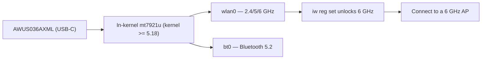

# ALFA AWUS036AXML——Wi-Fi 6E USB-C（6 GHz）

> **一句話定位（One-liner）**：**AWUS036AXML** 是 ALFA 產品線中唯一的 **Wi-Fi 6E** 無線網卡——一支 **MT7921AUN AXE3000 三頻**（2.4/5/**6 GHz**）無線網卡，配 **USB-C**、雙 5 dBi 天線與**藍牙 5.2**，全部建立在**內建於核心的驅動程式**（自 5.18 起的 `mt7921u`）上。這就是學生從現代筆電登上空曠 6 GHz 頻段的方式。

## 規格總覽 (Spec overview)

| 項目 | 規格 |
|---|---|
| 晶片 | MediaTek MT7921AUN |
| Wi-Fi 等級 | AXE3000（574 + 1201 + **2402 Mbps**） |
| 頻段 | 2.4 + 5 + **6 GHz** |
| 介面 | **USB-C** |
| 天線 | 2 × 外接 5 dBi，RP-SMA |
| 藍牙 | BT 5.2 |
| MIMO | 2×2 |
| Linux 驅動程式 | `mt7921u`——**自 5.18 起內建於核心** |
| 監聽模式 | ✅ 良好（現代核心上含 6 GHz） |

## 總覽

AXE3000 **AXML** 是 ALFA 為 6 GHz 世代打造的招牌產品。**6 GHz 頻段**（5 GHz 以上的頻道）是目前可用頻譜中壅塞度最低的——沒有舊裝置、沒有重疊的實驗室 AP——而這支無線網卡就是你在 Linux 上觸及它的方式。兩個細節讓它特別：

1. **它在核心內。** `mt7921u` 驅動程式自 5.18 起進入主線，所以在 Ubuntu 22.04+ 或近期 Kali 上，你把它插進 **USB-C 連接埠**就登上 6 GHz 頻段。沒有 DKMS。
2. **USB-C + 藍牙 5.2。** 現代超輕薄筆電有 USB-C 但 Wi-Fi 常常很弱；一支 AXML 用真正的無線電與真正的天線取代 Wi-Fi 與 BT。

自然的夥伴：遠端一顆 [Wi-Fi 6E 存取點](/alfa-network/products/apa-m25-6e/)，以及[6 GHz 法規設定](/alfa-network/drivers/mt7921aun/) 來解鎖你地區的頻道。

## 安裝與驅動程式

沒有需要編譯的東西——需要核心 5.18+。完整的 6 GHz 設定請見 [MT7921AUN 驅動程式頁面](/alfa-network/drivers/mt7921aun/)。驗證：

```bash
lsusb | grep -i mediatek
iw dev
iwlist wlan0 freq | grep -E "6 GHz|Channel 1|Channel 233" | head
```

**預期輸出**：MT7921U 那一行；一個介面；而在 AXML 上，頻率清單中有 **6 GHz 頻道項目**。沒有 6 GHz 項目？設定法規領域：

```bash
sudo iw reg set TW    # your country code
sudo ip link set wlan0 down && sleep 1 && sudo ip link set wlan0 up
```



## 進階使用

### 加入 6 GHz 網路

```bash
iw dev wlan0 info | grep channel   # confirm you are on 6 GHz
nmcli device wifi connect "My6eSSID" password "my-passphrase"
```

**預期輸出**：已連線，頻道那一行類似 `channel 37 (6115 MHz)`——證明你在 6 GHz 頻段上，那裡的延遲與壅塞遠低於 2.4/5 GHz。

### 監聽模式（含 6 GHz）

```bash
sudo airmon-ng start wlan0
sudo aireplay-ng --test wlan0mon
```

**預期輸出**：`wlan0mon` + 注入 `30/30: 100%`。在 6 GHz 上搭配 6 GHz AP 與現代核心，監聽擷取也能運作——如果你在 6 GHz 上什麼都沒看到，在 5 GHz 上測試以隔離驅動程式與環境。

### 用三頻面板延伸範圍

AXML 的原廠偶極天線夠用，但[三頻面板](/alfa-network/products/apa-m25-6e/)能把空曠的 6 GHz 頻段變成真正的長距離固定連結。

## 相容性

| 平台 | 支援 | 注意事項 |
|---|---|---|
| Kali Linux | ✅ | 內建於核心（5.18+） |
| Ubuntu | ✅ | 22.04+ |
| NetHunter / Android | ✅ | 手機需要 5.18+ 核心 |
| Windows | ✅ | 官方驅動程式，Wi-Fi 6E + BT |
| Jetson（JetPack 6） | ✅ | 6 GHz 串流——請見 [Jetson 指南](/alfa-network/hardware/jetson/) |

## 疑難排解

| 症狀 | 原因 | 修復 |
|---|---|---|
| 完全偵測不到 | 核心 < 5.18，或 USB-C 傳輸線只能充電 | 升級核心；使用資料傳輸線 |
| 6 GHz 頻道消失 | 法規領域未設定 | `sudo iw reg set <CC>`；重新啟動介面 |
| 監聽在 5 GHz 可用、6 GHz 不行 | 早期核心 6 GHz 怪癖 / 沒有 6 GHz AP | 更新核心；確認範圍內有 6 GHz AP |
| 藍牙不存在 | `btusb` 未載入 | `sudo modprobe btusb` |

## 相關資源

- [MT7921AUN 驅動程式頁面](/alfa-network/drivers/mt7921aun/)
- [AWUS036AXM](/alfa-network/products/awus036axm/)——Wi-Fi 6（無 6 GHz）兄弟
- [APA-M25-6E](/alfa-network/products/apa-m25-6e/)——這支無線網卡的三頻面板
- [Jetson 指南](/alfa-network/hardware/jetson/)——6 GHz 串流使用情境
- [無線網卡比較](/alfa-network/wifi-adapter-comparison/)