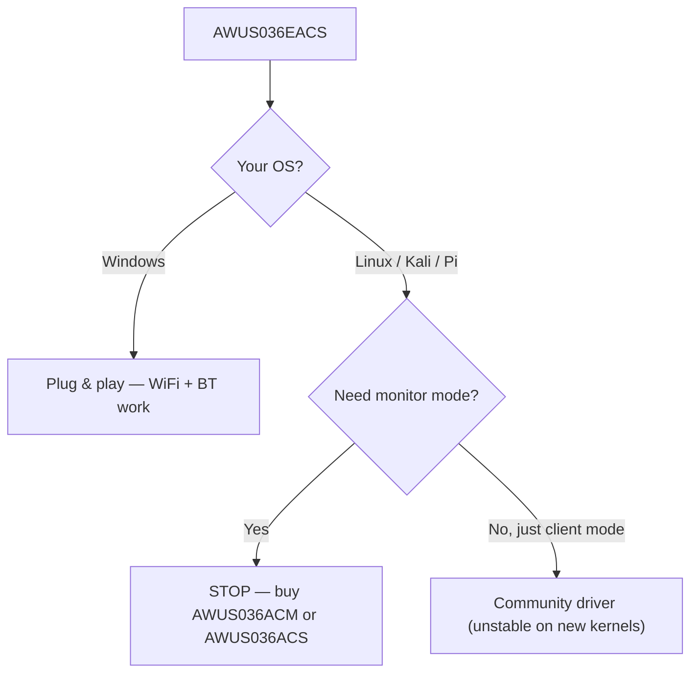

# ALFA AWUS036EACS——Nano WiFi + 藍牙組合

> **一句話定位（One-liner）**：**AWUS036EACS** 是 ALFA 的 **nano WiFi + 藍牙組合**——一支 **RTL8821CU AC600** 雙頻 dongle，整合 **BT 4.2**，在 **Windows 上隨插即用**。先誠實警告：它的 Linux 驅動程式故事很弱，而且它**不是**監聽模式（monitor mode）無線網卡。買它是為了 Windows 桌上型，不是為了 Kali。

## 規格總覽 (Spec overview)

| 項目 | 規格 |
|---|---|
| 晶片 | Realtek RTL8821CU |
| Wi-Fi 等級 | AC600（150 + 433 Mbps） |
| 介面 | USB 2.0 |
| 頻段 | WiFi：2.4 + 5 GHz ｜ BT：2.4 GHz |
| 藍牙 | BT 4.2 |
| 天線 | 整合式 2 dBi（沒有外接 RP-SMA） |
| 安全性 | WEP / WPA / WPA2 |
| Linux 驅動程式 | 沒有可靠的（見 [RTL8821CU 驅動程式頁面](/alfa-network/drivers/rtl8821cu/)） |
| 監聽模式 | ❌ 不可靠 |

## 總覽

EACS 是 ALFA 資安產品線中的異類，而且事先知道這點很重要。它是為**不同的買家**設計的：需要**一個小巧、不顯眼的棒子搞定 WiFi + 藍牙**的 Windows 桌上型或嵌入式工業 PC。AC600 速度與 2 dBi 整合式天線讓它成為「夠用的網路 + BT 鍵盤/滑鼠」升級，而不是訊號分析儀器。

尖銳的邊緣是 **Linux**：RTL8821CU 沒有主線驅動程式，社群驅動程式在現代核心上不穩定——監聽模式與封包注入（packet injection）不可靠。我們保留這款產品給 Windows/組合使用情境，並向任何課程作業會碰到 Kali 的人推薦 [AWUS036ACM](/alfa-network/products/awus036acm/) 或 [AWUS036ACS](/alfa-network/products/awus036acs/)。

## 安裝與驅動程式（Windows）

在 Windows 上沒有需要做的事——驅動程式已隨附：

1. 把無線網卡插進 USB 連接埠。
2. Windows 自動安裝 RTL8821CU 驅動程式。WiFi 與藍牙都會出現在裝置管理員中。

驗證：

```powershell
Get-PnpDevice -PresentOnly | Where-Object { $_.Class -eq "Net" }
```

**預期輸出**：列出一個 `802.11ac NIC` 網路介面卡與一個藍牙無線電。

## Linux？先讀這個

如果你在 Linux 上，[RTL8821CU 驅動程式頁面](/alfa-network/drivers/rtl8821cu/) 是誠實的完整故事。簡短版本：存在一個社群驅動程式（`brektrou/rtl8821CU`），*可能*在較舊核心上建置，但預期不穩定與**沒有可靠的監聽模式**。做 Linux/Kali 工作請選不同的 ALFA。



## 相容性

| 平台 | 支援 | 注意事項 |
|---|---|---|
| Windows | ✅ | 隨插即用，WiFi + BT |
| Kali Linux | ❌ | 監聽模式 / 注入不可靠 |
| Ubuntu | ❌ | 沒有穩定驅動程式 |
| NetHunter / Android | ❌ | 未確認 |
| Raspberry Pi | ❌ | 驅動程式在 ARM64 上失敗 |
| macOS | ⚠️ | 受限；不支援 Apple Silicon |

## 疑難排解

| 症狀 | 原因 | 修復 |
|---|---|---|
| 找不到 BT 裝置（Windows） | 驅動程式 / 服務衝突 | 檢查裝置管理員；從 ALFA 支援重新安裝驅動程式 |
| 在 Linux 上完全不能用 | 沒有可靠驅動程式 | 到此為止——改用 [Linux 友善的 ALFA](/alfa-network/wifi-adapter-comparison/) |
| 監聽模式「可用」但注入失敗 | RTL8821CU 驅動程式限制 | 不要依賴它——擷取工作請更換無線網卡 |
| 範圍短 | 整合式 2 dBi 天線 | 設計使然；在 AP 附近使用，不要離它太遠 |

## 相關資源

- [RTL8821CU 驅動程式頁面](/alfa-network/drivers/rtl8821cu/)——詳細的 Linux 故事
- [AWUS036ACM](/alfa-network/products/awus036acm/)——建議的 Linux/Kali 替代方案
- [AWUS036ACS](/alfa-network/products/awus036acs/)——口袋監聽模式替代方案
- [無線網卡比較](/alfa-network/wifi-adapter-comparison/)
- [相容性矩陣](/alfa-network/linux-compatibility-matrix/)