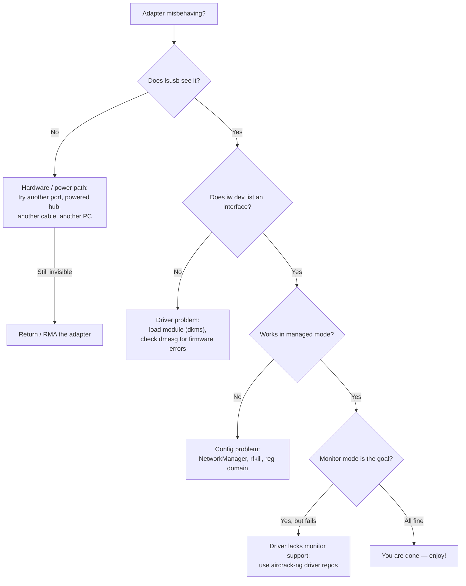

# ALFA 無線網卡——疑難排解索引

> **排查鐵律（Diagnosis iron rule）**：**先硬體 → 再驅動程式 → 最後設定。**超過 80% 的「我的 ALFA 壞了」回報其實是電源問題、缺少 DKMS 重建，或核心更新的副作用——而不是無線網卡壞了。在責怪硬體之前，先依照下方的決策樹。




## 問題分類索引

| 類別 | 典型問題 |
|---|---|
| **偵測** | 無線網卡不在 `lsusb` 中、沒有介面、重新開機後消失 |
| **驅動程式** | DKMS 建置失敗、模組未載入、`dmesg` 中的韌體錯誤 |
| **連線** | 無法關聯、持續斷線、連結緩慢 |
| **監聽模式** | `airmon-ng` 失敗、注入測試失敗、沒有擷取到訊框 |
| **電源** | 高負載下無線網卡失效、在一台電腦可用但另一台不行 |
| **法規** | 頻道設定錯誤、TX 功率被限制、「5 GHz 頻道消失」 |

**每顆晶片都有自己的深入探討頁面**——把屬於你的加入書籤：

| 晶片 | 無線網卡 | 驅動程式頁面 |
|---|---|---|
| MT7612U | AWUS036ACM | [mt7612u](/alfa-network/drivers/mt7612u/) |
| MT7610U | AWUS036ACHM | [mt7610u](/alfa-network/drivers/mt7610u/) |
| MT7921AUN | AWUS036AXM / AWUS036AXML | [mt7921aun](/alfa-network/drivers/mt7921aun/) |
| RTL8812AU | AWUS036ACH | [rtl8812au](/alfa-network/drivers/rtl8812au/) |
| RTL8811AU | AWUS036ACS | [rtl8811au](/alfa-network/drivers/rtl8811au/) |
| RTL8832BU | AWUS036AX / AWUS036AXER | [rtl8832bu](/alfa-network/drivers/rtl8832bu/) |
| RTL8821CU | AWUS036EACS | [rtl8821cu](/alfa-network/drivers/rtl8821cu/) |

---

## 問題 1：無線網卡完全偵測不到（`lsusb` 為空）

### 症狀
已插上，LED 可能亮也可能不亮，`lsusb` 沒有顯示 Realtek/MediaTek 那一行。

### 診斷
```bash
lsusb
dmesg | tail -30
```
在 `dmesg` 中尋找 `device descriptor read/64, error -71` 或 `device not accepting address`——典型的電源握手失敗。

### 根本原因
幾乎都是 **USB 電源或傳輸線**——尤其是高功率機型（AWUS036AXM/AXML、AWUS036AX）接到前面板連接埠或未供電的 hub 時。

### 修復
1. 試**後方 USB 連接埠**（或透過轉接頭使用 USB-C 連接埠）。
2. 試**不同的傳輸線**——某些便宜的 USB-C 傳輸線只能充電。
3. 使用**供電的 USB hub**。
4. 在筆電上，拔掉其他高功率 USB 裝置。
5. 如果在*兩台不同的電腦*上仍然看不見，無線網卡有問題——請聯絡支援。

---

## 問題 2：`lsusb` 看得到，但沒有 `wlanX` 介面

### 症狀
`lsusb` 顯示無線網卡；`iw dev` / `ip link` 什麼都沒顯示。

### 診斷
```bash
dmesg | grep -iE "wlan|firmware|error"
lsmod | grep -iE "mt76|8812|8811|88x2|8821"
```

### 根本原因
兩個常見原因：
- **Realtek 晶片**：DKMS 模組從未載入（或核心更新後建置失敗）。
- **MediaTek Wi-Fi 6E**：核心比 5.18 舊（缺少 `mt7921u`）或韌體 blob 不存在。

### 修復
- Realtek：`sudo modprobe 8812au`（對應你的晶片），並把它加入 `/etc/modules-load.d/alfa.conf` 讓它開機時自動載入。如果 `modprobe` 顯示 `Module not found`，重建：`sudo dkms autoinstall`。
- MediaTek：`sudo apt install linux-firmware` 然後重新開機。核心太舊？升級作業系統——請見[相容性矩陣](/alfa-network/linux-compatibility-matrix/)。

---

## 問題 3：核心更新後 DKMS 建置失敗

### 症狀
`apt upgrade` 後「無線網卡不能用了」；`dmesg` 顯示 `8812au: version magic ... should be ...`。

### 診斷
```bash
dkms status
```
如果你的模組顯示 `Error!` 或損壞的核心版本項目，那就是問題所在。

### 根本原因
驅動程式的 DKMS 配方無法針對新核心重建——通常是缺少標頭檔，或 repo 對全新核心來說太舊。

### 修復
1. 安裝標頭檔：`sudo apt install linux-headers-$(uname -r)`
2. 強制重建：`sudo dkms autoinstall`
3. 仍然失敗？更新驅動程式 repo 並重新安裝：
   ```bash
   cd /opt/rtl8812au && sudo git pull && sudo make dkms_install
   ```
4. 重新開機並再次檢查 `dkms status`——它應該把你的模組列為 `installed`。

---

## 問題 4：監聽模式啟動了但注入測試失敗

### 症狀
`airmon-ng start` 成功、`wlan0mon` 存在，但 `aireplay-ng --test` 回報 `0/30` 或 `Failed`。

### 診斷
```bash
sudo aireplay-ng --test wlan0mon
sudo iw dev wlan0mon info   # confirm it really is type monitor
```

### 根本原因
驅動程式建置時沒有正確的監聽/注入支援，**或**你在一個沒有 AP 使用的頻道上（注入需要 AP beacon 來回覆），**或** RF 環境是空的（隔離的實驗室）。

### 修復
1. 鎖定有活躍 AP 的頻道：`sudo iw dev wlan0mon set channel 6`
2. 重測。還是 0/30？用 aircrack-ng 驅動程式 repos 重建，它們預設啟用 monitor + VIF：
   - [rtl8812au](/alfa-network/drivers/rtl8812au/)、[rtl8811au](/alfa-network/drivers/rtl8811au/)、[rtl88x2bu](/alfa-network/drivers/rtl8832bu/)
3. 在無 RF 的區域，用手機熱點在同一個頻道上建立你自己的 AP。

---

## 問題 5：Wi-Fi 一直斷線或很慢

### 症狀
連結連上後每隔幾分鐘就斷；吞吐量遠低於等級標示。

### 診斷
```bash
iw dev wlan0 link          # signal + tx rate
iw reg get | head -20      # regulatory domain
```

### 根本原因
- **法規領域**：如果 `iw reg get` 顯示 `country 00`（未設定），TX 功率會被限制在預設的 20 dBm 上限。
- **省電**：激進的 USB 電源管理會節流無線電。
- **過熱**：高功率無線網卡持續 TX。

### 修復
1. 設定你的地區：`sudo iw reg set TW`（或你的國家代碼）。
2. 設定 TX 功率：`sudo iwconfig wlan0 txpower 30`（你領域的法定上限）。
3. 停用省電：`sudo iwconfig wlan0 power off`。
4. AC1200+ 無線網卡優先使用 USB 3.0 連接埠——USB 2.0 會限制吞吐量。

---

## 問題 6：5 GHz 頻道消失

### 症狀
只看到 2.4 GHz 網路；`iwlist wlan0 freq` 沒有 5 GHz 項目。

### 根本原因
法規領域未設定或被限制（全新安裝時通常是 `country 00`），所以驅動程式拒絕 5 GHz 頻道。

### 修復
```bash
sudo iw reg set TW    # replace with your country code
sudo ip link set wlan0 down && sudo ip link set wlan0 up
```

---

## 還是沒解決？

在放棄之前，收集這些確切資訊並聯絡我們（或[驅動程式專案](/alfa-network/drivers/mt7612u/)）——這是維護者協助你所需要的：

```bash
uname -r
lsusb
dkms status
dmesg | tail -50
iw dev
```

附上以上所有內容，再加上：你的無線網卡型號、作業系統/核心，以及輸出讓你意外的確切指令。還有一件事值得檢查——如果你在跑 Jetson、Raspberry Pi 或 Unitree 機器人，請看[硬體整合指南](/alfa-network/hardware/jetson/)；嵌入式主機板有自己的電源與驅動程式怪癖。