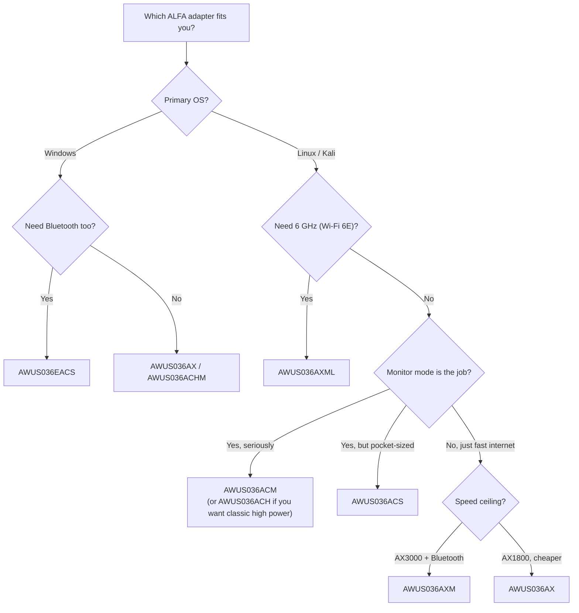

# ALFA Wi-Fi 無線網卡比較

> **結論先行（Bottom line）**：如果你是使用 Kali Linux 做課程作業或實驗室練習的大學生，買 **AWUS036ACM**——它的 MediaTek MT7612U 晶片內建於 Linux 核心，監聽模式（monitor mode）直接可用，而且比旗艦機型便宜。如果你的專案*需要* Wi-Fi 6E 速度，**AWUS036AXML** 是唯一的三頻選項。如果你是主要需要小巧 WiFi + 藍牙組合的 Windows 使用者，**AWUS036EACS** 是你的（唯一）無線網卡。

## 完整規格比較表

九款無線網卡，一張表。「監聽模式」代表把介面切換成 RFMON，這樣你可以擷取某個頻道上的每個封包——這是 Wireshark、Aircrack-ng、Wifite 與類似工具的基本需求。

| 型號 | 晶片 | Wi-Fi 等級 | 介面 | 頻段 | 最高速度 | 監聽模式（Linux） | 天線 |
|---|---|---|---|---|---|---|---|
| [AWUS036ACH](/alfa-network/products/awus036ach/) | RTL8812AU | AC1200 | USB 3.0 | 2.4 + 5 GHz | 300 + 867 Mbps | ✅ 極佳（DKMS） | 2 × 外接 5 dBi，RP-SMA |
| [AWUS036ACHM](/alfa-network/products/awus036achm/) | MT7610U | AC433 | USB 2.0 | 2.4 + 5 GHz | 150 + 433 Mbps | ✅ 良好（內建於核心） | 2 × 外接 5 dBi，RP-SMA |
| [AWUS036ACM](/alfa-network/products/awus036acm/) | MT7612U | AC1200 | USB 3.0 | 2.4 + 5 GHz | 300 + 867 Mbps | ✅ 極佳（內建於核心） | 2 × 外接 5 dBi，RP-SMA |
| [AWUS036ACS](/alfa-network/products/awus036acs/) | RTL8811AU | AC433 | USB 2.0 | 2.4 + 5 GHz | 150 + 433 Mbps | ✅ 良好（DKMS） | 2 × 外接 5 dBi，RP-SMA（55 mm 機身） |
| [AWUS036AX](/alfa-network/products/awus036ax/) | RTL8832BU | AX1800 | USB 3.2 | 2.4 + 5 GHz | 574 + 1201 Mbps | ✅ 良好（DKMS） | 2 × 外接 6 dBi，RP-SMA |
| [AWUS036AXER](/alfa-network/products/awus036axer/) | RTL8832BU | AX1800 | USB 3.2 | 2.4 + 5 GHz | 574 + 1201 Mbps | ✅ 良好（DKMS） | 內建（10.5 g nano 機身） |
| [AWUS036AXM](/alfa-network/products/awus036axm/) | MT7921AUN | AX3000 | USB 3.2 | 2.4 + 5 GHz | 574 + 2402 Mbps | ✅ 良好（內建於核心） | 2 × 外接 5 dBi，RP-SMA + BT 5.2 |
| [AWUS036AXML](/alfa-network/products/awus036axml/) | MT7921AUN | AXE3000 | USB-C | 2.4 + 5 + 6 GHz | 574 + 1201 + 2402 Mbps | ✅ 良好（內建於核心） | 2 × 外接 5 dBi，RP-SMA + BT 5.2 |
| [AWUS036EACS](/alfa-network/products/awus036eacs/) | RTL8821CU | AC600 | USB 2.0 | 2.4 + 5 GHz | 150 + 433 Mbps | ❌ 不可靠 | 整合式 2 dBi + BT 4.2 |

### 解讀速度數字

「+」分隔兩個頻段：**2.4 GHz + 5 GHz**（AXE 機型則為 + 6 GHz）。「300 + 867」的無線網卡是 **AC1200** 等級：300 Mbps 是 2.4 GHz 上限（2 個空間串流 × 150 Mbps），867 Mbps 是 5 GHz 上限（2 × 433 Mbps）。實際吞吐量通常是連結速率的 50–70%——物理、牆壁與 USB 匯流排開銷吃掉了其餘部分。

## 哪一款適合你？

### 如果你要 Kali / 監聽模式 / 封包注入 → AWUS036ACM

MT7612U 晶片**自 Linux 4.19 起內建於核心**，這代表：在任何近期的 Kali 或 Ubuntu 上插上，`ip link` 就已經顯示 `wlan0`。監聽模式透過標準 `iw` 指令運作，封包注入也可靠。它還以兩支 5 dBi 天線推出真正的 500 mW TX 功率——對實驗室練習來說是真正有用的範圍。完整工作流程在 [Kali 設定指南](/alfa-network/linux-setup-kali/)。

### 如果你要 Wi-Fi 6E（6 GHz）→ AWUS036AXML

AXML 是產品線中唯一具備 **6 GHz 頻段**（AXE3000）的無線網卡。它使用 MediaTek **MT7921AUN**，其 `mt7921u` 驅動程式自核心 5.18 起進入主線——所以同樣沒有 DKMS 的麻煩。它也是唯一的 USB-C 機型，這使它成為現代超輕薄筆電或平板電腦的完美夥伴。請見 [Wi-Fi 6E 設定說明](/alfa-network/linux-setup-ubuntu/)。

### 如果你要純用戶端無線網卡（快速、穩定、不做滲透測試）→ AWUS036AXM 或 AWUS036AX

AXM 是兩者中較快的（AX3000，5 GHz 上 2.4 Gbps），並加上**藍牙 5.2**——一個 dongle 搞定 WiFi + BT。AX 提供 Wi-Fi 6 + WPA3，外觀更經典 ALFA，價格略低。兩者在你需要時都能做監聽模式，但都不是專門嗅探的首選。

### 如果你帶筆電旅行 / 想要口袋無線網卡 → AWUS036ACS 或 AWUS036AXER

ACS（55 mm 機身）與 AXER（10.5 g、內建天線）放進背包就消失。ACS 是平價監聽模式夥伴；AXER 是日常使用的 Wi-Fi 6 nano。

### 如果你是需要 WiFi + 藍牙的 Windows 使用者 → AWUS036EACS

誠實說明：EACS **不建議用於 Linux**。它的 RTL8821CU 晶片沒有受維護的開源驅動程式，監聽模式也不可靠。在 Windows 上它隨插即用，一支小棒子搞定 WiFi AC600 + BT 4.2——非常適合兩者都需要的桌上型電腦。

## 如果你無法決定——買 ACM

AWUS036ACM 是社群共識的選擇：內建於核心的驅動程式、經證實的監聽模式 + 注入、雙頻、高功率，而且完全在學生預算內。你會在[疑難排解](/alfa-network/troubleshooting/) 與[驅動程式](/alfa-network/drivers/mt7612u/) 頁面中看到它被當成「無聊但可靠的選項」——而在這個世界裡，無聊代表*它就是能用*。

下一步：在[相容性矩陣](/alfa-network/linux-compatibility-matrix/)中確認你的作業系統，或直接深入 [Ubuntu](/alfa-network/linux-setup-ubuntu/) / [Kali](/alfa-network/linux-setup-kali/) 設定指南。