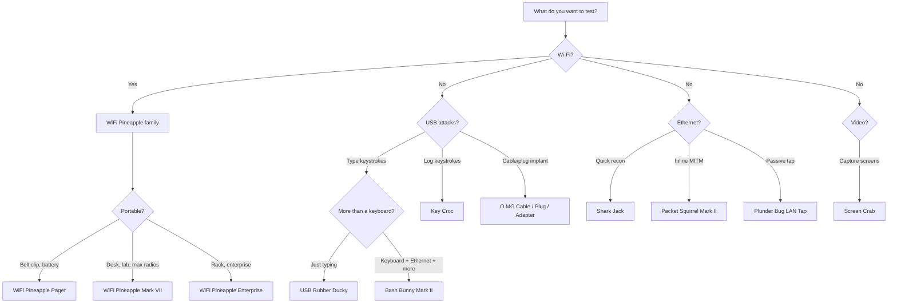

# Hak5 FAQ — 每個初學者都會問的問題

> **結論先行**：沒有「最強」的 Hak5 工具，只有「最適合你目標」的工具。先搞清楚你要測什麼 — Wi-Fi、USB、還是網路 — 再往下選。

---

## 1. 合法性與倫理

### 擁有 Hak5 裝備合法嗎？
**合法。** 這些是一般用途的運算裝置 — 一臺插著 Wi-Fi 網絡卡的 Raspberry Pi 就能做到 WiFi Pineapple 大部分的事。擁有它們幾乎在所有地方都是合法的。

### 那*使用*呢？
只能用於**你擁有、或已取得書面授權測試的系統**。未授權存取在任何司法管轄區都是犯罪（在臺灣，刑法妨害電腦使用罪，第 358–363 條，部分罪行最高可處五年有期徒刑）。Hak5 自家的保固條款也這麼說：這些工具「僅供授權稽核與安全分析用途」。

### 我可以用 Hak5 裝備參加 CTF 或大學實驗室嗎？
可以 — CTF 平臺和大學資安課程經常使用它們。不確定時，**問實驗室主辦人或教授**你被授權測試什麼，並把所有操作留在提供的沙盒內。

---

## 2. 選擇裝置

### USB Rubber Ducky vs Bash Bunny — 差在哪？
[USB Rubber Ducky](/hak5/products/usb-rubber-ducky/) 是*專才*：它打字，而且極快、極可靠。[Bash Bunny](/hak5/products/bash-bunny-mark-ii/) 是*通才*：它能打字，**還能**假裝成乙太網路轉接器、序列埠和隨身碟 — 同時執行完整的 Linux 工具 — 全部從一個 USB 插頭搞定。買 Ducky 是為了學按鍵注入；買 Bunny 是為了多向量攻擊和 payload 切換。

### WiFi Pineapple Mark VII vs Pager vs Enterprise？
| | Mark VII | Pager | Enterprise |
|---|---|---|---|
| 外型 | 可攜式 AP（USB-C 供電） | 手持、電池、2.4 吋螢幕 | 1U 機架、AC 電源 |
| 頻段 | 原生 2.4 GHz，透過 MK7AC 支援 5 GHz | 2.4 / 5 / 6 GHz 三頻 | 2.4 / 5 GHz，5 組無線電 |
| Payload | 模組（PineAP Marketplace） | DuckyScript + Bash + Python | 模組、長期部署 |
| 最適合 | 學習與經典 PineAP | 現場作業、自動化、告警 | 嚴肅的多目標空域稽核 |

完整比較在各產品頁： [Mark VII](/hak5/products/wifi-pineapple-mark-vii/)、[Pager](/hak5/products/wifi-pineapple-pager/)、[Enterprise](/hak5/products/wifi-pineapple-enterprise/)。

### Shark Jack vs Shark Jack Cable？
同樣的大腦，不同的電源。經典 [Shark Jack](/hak5/products/shark-jack/) 靠內建電池跑 10–15 分鐘 — 非常適合掛在鑰匙圈上攜帶。[Shark Jack Cable](/hak5/products/shark-jack-cable/) 由 USB-C 供電並多了序列主控臺，所以能跑好幾個小時，而且你能拿到一個即時 shell。

### 什麼是 Cloud C²，我需要它嗎？
Cloud C²（https://cloudc2.io）是 Hak5 免費、可自架的**命令與控制伺服器**。它讓你能從瀏覽器管理裝置 — WiFi Pineapple、Key Croc、Packet Squirrel、Screen Crab：串流按鍵、觀看截圖、遠端部署 payload。你第一個星期不需要它；每臺裝置上的 Web UI 或 SSH 就夠了。當裝置在物理上無法觸及時，它就變得不可或缺。

---

## 3. DuckyScript — payload 語言

### 什麼是 DuckyScript？
Hak5 用於按鍵注入與裝置控制的指令碼語言。你會遇到的版本：

| 版本 | 使用者 | 備註 |
|---|---|---|
| 1.0（2011） | 經典 USB Rubber Ducky | `STRING`、`DELAY`、`ENTER` — 就這樣 |
| 2.0（2020） | Key Croc | 直譯式：直接從 `payload.txt` 執行，用 `QUACK` 取代 `STRING` |
| 3.0（2022） | 新款 USB Rubber Ducky、Bash Bunny、O.MG、Pager | 完整語言：if/else、迴圈、函式、`ATTACKMODE`、按鍵反射 |

### 我在哪裡寫 payload？
[PayloadStudio](https://payloadstudio.hak5.org) — 一個免費的瀏覽器 IDE。它把 DuckyScript 編譯成 `inject.bin`（給 Rubber Ducky），並為 Key Croc 和 O.MG 做直譯式 payload 的語法檢查。它是**唯一官方支援的編碼器**；舊教學文裡那些第三方「編碼器」不受支援，而且結果不一致。

### 為什麼我的 payload 沒有打進目標？
通常是其中之一：(1) 開頭少了 `DELAY`（目標 OS 還沒載入它的 USB 堆疊）、(2) 在 PayloadStudio 選了錯誤的鍵盤配置，或 (3) payload 在目標應用程式取得焦點之前就執行了。[USB Rubber Ducky 指南](/hak5/products/usb-rubber-ducky/)對每一項都有修正方法。

---

## 4. 韌體與更新

### 我應該多常更新韌體？
每當某個版本加入了你需要的新功能時。不像手機，這裡沒有攸關安全的自動更新 — Hak5 韌體出廠時已測試且穩定。[韌體與下載](/hak5/firmware-downloads/)頁面顯示每臺裝置的官方更新路徑。**絕對不要刷第三方韌體**：在某些裝置上（尤其是 USB Rubber Ducky），它會讓裝置永久無法復原，並使保固失效。

### O.MG 裝置需要 O.MG Programmer 嗎？
**需要。** O.MG 裝置出廠時是停用狀態；通用的 [O.MG Programmer](/hak5/products/omg-programmer/) 負責啟用、韌體升級、自我銷毀救援與鑑識備份。一支 Programmer 涵蓋所有 O.MG 裝置（Cable、Plug、Adapter、UnBlocker）。

---

## 5. 實務問題

### WiFi Pineapple 能攻擊 5 GHz / WPA2 / WPA3 網路嗎？
[Mark VII](/hak5/products/wifi-pineapple-mark-vii/) 出廠時是 2.4 GHz — 加上 **MK7AC 轉接器（MT7612U 晶片組）** 就能做 5 GHz 監聽與注入。[Pager](/hak5/products/wifi-pineapple-pager/) 原生支援 5 GHz 和 6 GHz。Pineapple 建立的是 **evil-twin / rogue AP**（Enterprise 型號支援 WPA2-Enterprise）；它不「破解」WPA2 金鑰 — 那是 `aircrack-ng` 這類離線攻擊（你可以在筆電上執行）的工作。

### Key Croc 會被偵測到嗎？
任何下定決心的防禦者都能找到硬體植入裝置。[Key Croc](/hak5/products/key-croc/) 在側錄期間 LED 是關閉的，並複製鍵盤的硬體 ID 讓它看起來像一般轉接頭 — 但一次實體稽核（或 [Malicious Cable Detector](/hak5/products/malicious-cable-detector/)！）就會發現它。

### Malicious Cable Detector 偵測得到 O.MG Cable 嗎？
**可以 — 這就是它的全部用途。** 它使用側通道電力分析（每秒 200,000 次取樣）來偵測植入晶片 — 包括完全休眠的 O.MG 裝置 — 這些晶片在資料線上完全隱形。諷刺的是，它是由製造 O.MG 線材的同一個團隊打造的。

### 哪些裝置跟 ALFA 轉接器搭配得好？
[WiFi Pineapple Mark VII](/hak5/products/wifi-pineapple-mark-vii/) 官方支援基於 MT7612U 的 ALFA 轉接器（例如 AWUS036ACM）做 5 GHz 監聽 — 完整的轉接器陣容與驅動程式指南請見 [ALFA Network 專區](/alfa-network/)。

---

## 還有問題嗎？

操作問題請查[疑難排解索引](/hak5/troubleshooting-index/)，或如果你還沒開過機，先讀[快速入門](/hak5/quickstart/)。[Hak5 總覽](/hak5/)連結到每一頁產品頁。