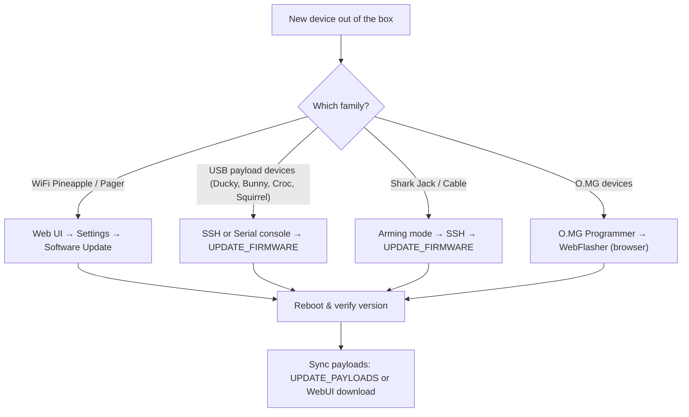

# Hak5 韌體與下載 — 完整索引

> **學習目標**：讀完你將能自己找到並更新任何 Hak5 裝置的韌體、下載 PayloadStudio 編寫 Payload、並從官方 Payload 倉庫同步現成腳本。
> **適用對象**：初學者 ｜ **前置需求**：一台 Hak5 裝置（任一型號）

在我們丟給你一張巨大的連結表格之前，你應該先了解一台 Hak5 裝置跑的兩種「軟體」，因為初學者老是把它們搞混：

- **韌體** — 讓硬體運作的作業系統（底層是 Linux/OpenWrt）。你很少更新它，而且只在某個你需要的新功能或修正推出時才更新。
- **Payload** — 告訴裝置*要做什麼*的腳本（打這些鍵、跑這個掃描、擷取那段流量）。你會一直換這些。它們不是韌體。

**PayloadStudio**（payloadstudio.hak5.org）是官方、瀏覽器為基礎的 IDE，用來撰寫與編譯 payload。它是*唯一*官方支援的 DuckyScript 編碼器 — 舊教學叫你下載 Java 或 JavaScript「編碼器」的內容都過時了。PayloadStudio 完全在你的瀏覽器裡執行，支援 Community（免費）與 Pro 兩種版本。



---

## 官方韌體與工具表格

| 你需要什麼 | 去哪裡拿 | 備註 |
|---|---|---|
| **所有官方文件** | https://docs.hak5.org | 可搜尋；每個產品都有自己的文件樹 |
| **PayloadStudio** | https://payloadstudio.hak5.org | 所有 DuckyScript 裝置的瀏覽器 IDE — 免安裝 |
| **WiFi Pineapple（所有型號）韌體** | Web UI → *Settings → Software Update* | Pineapple 透過網路自我更新；不需要手動下載 |
| **USB Rubber Ducky / Bash Bunny / Key Croc / Shark Jack / Packet Squirrel** | SSH 或序列 → `UPDATE_FIRMWARE` 輔助指令 | 見下方 SSH 章節 |
| **O.MG 裝置韌體** | O.MG Programmer + WebFlasher | https://o.mg.lol/setup/ — Chrome 或 Edge（WebSerial） |
| **Screen Crab / Malicious Cable Detector** | 設定檔驅動，不需刷韌體 | 透過 MicroSD 設定檔截圖/更新 |
| **Cloud C²** | https://cloudc2.io | 免費自架的 Pineapple、Croc、Squirrel、Screen Crab 命令與控制 |

---

## 社群 payload 倉庫

Hak5 維護官方 GitHub 倉庫存放社群 payload。這是你在自己寫之前，看到真實、可運作腳本的最快方式。

| 裝置 | Payload 倉庫 | 裡面有什麼 |
|---|---|---|
| USB Rubber Ducky | https://github.com/hak5/usbrubberducky-payloads | 經典 + DuckyScript 3.0 payload（擴充、範本） |
| Bash Bunny | https://github.com/hak5/bashbunny-payloads | switch1/2/3 payload 資料夾 |
| Key Croc | https://github.com/hak5/keycroc-payloads | 直譯式 DuckyScript（不需編譯）+ 語言檔 |
| Shark Jack | https://github.com/hak5/shark-payloads | 偵察、外洩、存取 payload |
| Packet Squirrel | https://github.com/hak5/packetsquirrel-payloads | 嗅探、代理、DNS payload |
| WiFi Pineapple | https://github.com/hak5/wifi-pineapple-modules | PineAP marketplace 的模組 |
| **PayloadHub** | https://payloads.hak5.org | 可搜尋、社群評分的跨裝置 payload 索引 |

> **不要盲目信任網路上來的 payload。** 任何你在 Hak5 裝置上執行的腳本，都會以 root 權限在一台 Linux 機器上執行 — 或把按鍵打進目標。讀過每一個你下載的 payload。這正是專業人士在部署前會做的事。

---

## 方法 A：透過 SSH 更新韌體（USB payload 裝置）

像 Bash Bunny、Shark Jack 和 Key Croc 這類裝置，出廠時附帶你可以在 shell 執行的輔助指令。先連線（每台裝置的產品頁會顯示確切位址 — 例如 Shark Jack 在 arming 模式下監聽 `172.16.24.1`）：

```bash
# Example — Shark Jack in arming mode, connected via Ethernet
ip addr add 172.16.24.2/24 dev eth0    # your machine joins the Shark's network
ssh root@172.16.24.1                    # password: hak5shark
```

預期輸出：

```text
The authenticity of host '172.16.24.1' can't be established.
...
root@172.16.24.1's password:
Welcome to Shark Jack (kernel 4.x.y)
```

然後，在裝置的 shell 中執行更新輔助指令：

```bash
UPDATE_FIRMWARE     # check for and install firmware updates
UPDATE_PAYLOADS     # synchronise the local payload library with the remote repo
```

預期輸出（韌體檢查）：

```text
[*] Checking for firmware updates...
[+] Firmware is up to date
```

> **為什麼用輔助指令而不是 `apt upgrade`？** Hak5 刻意把更新路徑鎖定在已測試的版本。在某些裝置上（尤其是 USB Rubber Ducky），一次失敗的韌體刷寫可能讓裝置**無法復原** — Hak5 的保固明確排除韌體刷寫造成的損壞。只使用官方更新機制。

## 方法 B：從 Web UI 更新 WiFi Pineapple

1. 連上 Pineapple 的 AP（例如 `PineAP` 網路）並開啟管理介面 — [WiFi Pineapple Mark VII 指南](/hak5/products/wifi-pineapple-mark-vii/)顯示確切位址。
2. 前往 **Settings → Software Update**。
3. 點 **Check for updates**，然後 **Update**。
4. 裝置會重新開機；在 UI 頁尾確認版本。

## 方法 C：O.MG 裝置（WebFlasher）

1. 把 O.MG 裝置插進一台執行 **Chrome 或 Edge** 的電腦（需要 WebSerial）。
2. 開啟 O.MG 設定頁（https://o.mg.lol/setup/）並選擇你的裝置型號。
3. 依照 3 步驟 WebFlasher 精靈操作 — 它會啟用裝置、安裝最新韌體，並（可選）先做一次鑑識備份。
4. 或者，O.MG 韌體倉庫裡的 Python flasher 可以在任何 OS 上執行。

---

## 常見錯誤

| 錯誤訊息 / 症狀 | 原因 | 修正 |
|---|---|---|
| `ssh: Connection refused` | 裝置不在 arming 模式 | 撥開關 / 按 arming 按鈕；確認你的靜態 IP 在裝置的子網路上 |
| `UPDATE_FIRMWARE: command not found` | Shell 輔助指令只在韌體 ≥ 1.2.0 存在 | 從 WebUI 手動更新，或查你確切型號的文件 |
| Pineapple「Check for updates」失敗 | 沒有上游連線（AP 沒有網際網路） | 先接上乙太網路 uplink 或設定 client 模式 |
| WebFlasher 顯示「No device found」 | 瀏覽器缺少 WebSerial / 裝置不在 bootloader 模式 | 使用 Chrome 或 Edge，並在精靈要求前保持 O.MG 裝置未插上 |
| Payload 有執行但沒作用 | 你把編譯過的 `.bin` 複製到預期原始碼的裝置，或反之 | Rubber Ducky 需要編譯過的 `inject.bin`；Key Croc 直接執行直譯式 `payload.txt` |

---

## 更新之後：驗證

```bash
# From the device shell — check the running version
cat /etc/version          # Shark Jack / Packet Squirrel
uname -a                  # any Linux-based Hak5 device
ls /root/payload/library  # payload library after UPDATE_PAYLOADS
```

預期輸出：

```text
4.0.0
Linux sharkjack 4.19.0 ... # your exact kernel/version
payload1  payload2  payload3
```

還是卡住了？看[疑難排解索引](/hak5/troubleshooting-index/)或跳回 [Hak5 總覽](/hak5/)。