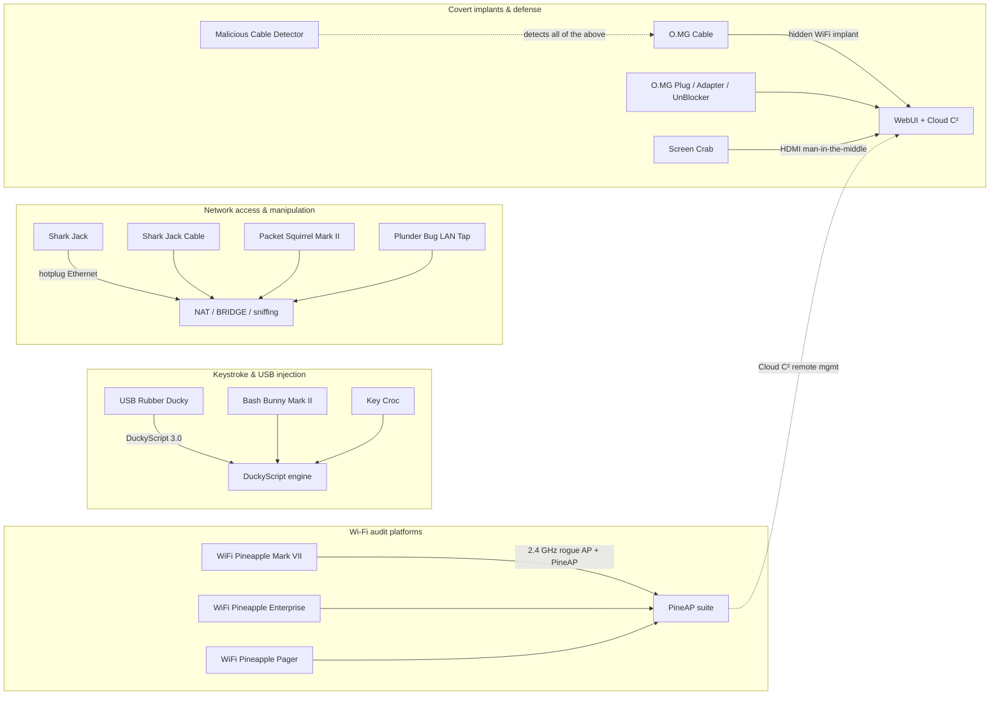

# Hak5 — 攻擊型安全硬體，一次講清楚

> **一句話定位**：Hak5 是全世界最知名的「攻擊型」安全硬體品牌 — 從替別人收發鍵盤敲擊的 USB Rubber Ducky，到假裝成咖啡店 Wi-Fi 的 WiFi Pineapple。本節用大學課程等級的詳細度，帶你一步一步認識每一台裝置、怎麼設定、怎麼寫 Payload（攻擊載荷）、出了問題怎麼修。

Hak5 於 2005 年以一個關於駭客與科技的 Podcast 起家，後來成長為一家實際上*定義*了「plug-and-pwn」這類安全硬體的公司。他們的哲學很簡單：**電腦對 USB 與乙太網路裝置抱持著無條件的信任 — 所以這些信任邊界正是你該測試的地方。** 如果你正在學習資安、參加 CTF，或準備投入紅隊職涯，這些工具會出現在每一間實驗室、每一場研討會演講、每一則徵才廣告裡。

本 wiki 的這一節就是你的完整學習指南：我們販售的每一項產品，附官方規格、適合初學者的快速入門、DuckyScript 範例，以及一份疑難排解索引 — 全部寫到讓大一新生也能跟上，同時詳細到資深滲透測試工程師仍能從中發現新東西。

> **⚠️ 法律聲明 — 只讀一次。** 本節的所有內容僅限於**授權的安全測試**：你自己的實驗室、你自己的裝置，或你已取得書面授權測試的網路。每個國家都有關於未授權存取的法律（在台灣，見刑法第 358–363 條與個資法）。未經許可的駭入是犯罪 — 而且用這些工具，也很容易被本頁所介紹的防禦工具偵測到。請在你的沙盒裡玩。

---

## 這個 wiki 怎麼編排

| 頁面 | 你會找到什麼 |
|---|---|
| [快速入門](/hak5/quickstart/) | 任何一台 Hak5 裝置的前 15 分鐘 — arming 模式、第一個 payload、第一次掃描 |
| [韌體與下載](/hak5/firmware-downloads/) | 官方韌體、PayloadStudio，以及所有 payload 倉庫，一張表格搞定 |
| [FAQ](/hak5/faq/) | 「我該買哪一台？」以及每個初學者都會問的問題 |
| [疑難排解](/hak5/troubleshooting-index/) | LED 顏色意義、SSH 連線失敗、跑不起來的 payload |
| **產品**（下方） | 全部 17 台裝置的深入介紹 |

---

## Hak5 生態系一覽

Hak5 裝置都共享三個設計理念。學會一個，就等於學會全部：

1. **Payload 優先於設定** — 你不是「程式化」硬體；你是把一個腳本檔丟進去。
2. **Arming 模式** — 一個開關、按鈕或按鍵組合，把裝置變成普通的隨身碟 / Web UI，讓你能安全地載入 payload。
3. **Loot 資料夾** — 收集到的資料（按鍵、掃描結果、截圖）會落在一個 `loot` 目錄裡，之後可以取回。

---

## 產品目錄

### Wi-Fi 稽核平台（rogue 存取點）

| 裝置 | 一句話 | 難度 | 頁面 |
|---|---|---|---|
| **WiFi Pineapple Mark VII** | 搭載 PineAP 套件的經典雙頻 rogue AP — 讓「evil twin」成為家喻戶曉名詞的工具 | 初學者 | [完整指南](/hak5/products/wifi-pineapple-mark-vii/) |
| **WiFi Pineapple Enterprise** | 一台 1U 機架怪獸，配備 5 組雙頻無線電，適合重度、多目標的空域稽核 | 進階 | [完整指南](/hak5/products/wifi-pineapple-enterprise/) |
| **WiFi Pineapple Pager** | 二十週年旗艦：三頻（2.4/5/6 GHz）、2.4 吋螢幕、DuckyScript payload — 完全獨立，不需要筆電 | 中階 | [完整指南](/hak5/products/wifi-pineapple-pager/) |

### 按鍵注入與鍵盤側錄器

| 裝置 | 一句話 | 難度 | 頁面 |
|---|---|---|---|
| **USB Rubber Ducky** | 按鍵注入之王：一支以每分鐘 1,000 字速度打字的隨身碟 | 初學者 | [完整指南](/hak5/products/usb-rubber-ducky/) |
| **Bash Bunny Mark II** | 多向量 USB 攻擊平台：鍵盤 + 乙太網路 + 序列埠 + 儲存，一次全上，配備四核大腦 | 中階 | [完整指南](/hak5/products/bash-bunny-mark-ii/) |
| **Key Croc** | 偽裝成鍵盤轉接頭的硬體鍵盤側錄器，而且當你打出關鍵字時它*還會*發動攻擊 | 中階 | [完整指南](/hak5/products/key-croc/) |

### 網路存取與操控

| 裝置 | 一句話 | 難度 | 頁面 |
|---|---|---|---|
| **Shark Jack** | 口袋大小的網路偵察盒：插進任何乙太網路孔，幾秒內得到掃描結果 | 初學者 | [完整指南](/hak5/products/shark-jack/) |
| **Shark Jack Cable** | 同一台盒子，改用 USB-C 供電並附序列主控台 — 只要有電就能一直跑 | 初學者 | [完整指南](/hak5/products/shark-jack-cable/) |
| **Packet Squirrel Mark II** | 內嵌式乙太網路中間人：嗅探、代理、重導 DNS，或隔離裝置 — 撥一下開關就行 | 中階 | [完整指南](/hak5/products/packet-squirrel-mark-ii/) |
| **Plunder Bug LAN Tap** | 被動/主動式乙太網路竊聽器，USB-C 介面 — 口袋裡的 Wireshark | 初學者 | [完整指南](/hak5/products/plunder-bug-lan-tap/) |

### 隱蔽植入裝置（O.MG 家族）

| 裝置 | 一句話 | 難度 | 頁面 |
|---|---|---|---|
| **O.MG Cable** | 內藏隱形 Wi-Fi 植入晶片的惡意 USB 線材 — 那個兩萬美金的國家級攻擊，現在就放在你桌上 | 進階 | [完整指南](/hak5/products/omg-cable/) |
| **O.MG Plug** | 同款植入晶片，裝在鑰匙圈 USB 插頭裡 | 進階 | [完整指南](/hak5/products/omg-plug/) |
| **O.MG Adapter** | 植入晶片藏在 USB-A 轉 C 轉接頭裡 — 手機和平板也能插 | 進階 | [完整指南](/hak5/products/omg-adapter/) |
| **O.MG UnBlocker** | 植入晶片藏在「安全」USB 資料阻斷器裡 — 防禦者的工具，被武器化 | 進階 | [完整指南](/hak5/products/omg-unblocker/) |
| **O.MG Programmer** | 啟用並更新每一台 O.MG 裝置的通用程式設計器 | 中階 | [完整指南](/hak5/products/omg-programmer/) |

### 影像與防禦

| 裝置 | 一句話 | 難度 | 頁面 |
|---|---|---|---|
| **Screen Crab** | 隱蔽式 HDMI 中間人，能靜默截圖或錄下任何顯示畫面 | 中階 | [完整指南](/hak5/products/screen-crab/) |
| **Malicious Cable Detector** | 唯一能偵測所有已知惡意 USB 線材的消費級工具 — 包括 O.MG 自家的 | 初學者 | [完整指南](/hak5/products/malicious-cable-detector/) |

---

## 你該從哪裡開始？

對這一切都很陌生？這裡有一條建議的學習路徑：

1. **先讀[快速入門](/hak5/quickstart/)** — 它解釋了 arming 模式、payload 與 loot，這三個概念是所有其他東西的基礎。
2. **從 USB Rubber Ducky 開始** — 它是最便宜、最安全、也最能讓你理解 payload 如何執行的方式。你只需要自己的電腦和記事本。
3. **架設一個實驗室** — 一台備用路由器、一台舊筆電，或一台你擁有的虛擬機器。[ALFA Network 專區](/alfa-network/)說明如何把 USB Wi-Fi 轉接器搭配 Kali Linux 進入監聽模式，WiFi Pineapple 也很愛這個。
4. **升級到 WiFi Pineapple Mark VII** — evil twin 攻擊是無線安全領域最「哇」的示範，而 [Pineapple 指南](/hak5/products/wifi-pineapple-mark-vii/)會一步一步帶你走完。
5. **當東西壞掉時** — 先查[疑難排解索引](/hak5/troubleshooting-index/)；80% 的初學者問題都來自同樣的四個原因。

> **你可能會問：** *「要學這些，我是不是得全部買下來？」* 不用。這些概念 — HID 注入、rogue AP、網路竊聽 — 都能直接套用到你手上免費的工具：一片兩塊美金的 Arduino 就能打字，`hostapd` 可以偽造 AP，`tcpdump` 可以嗅探。Hak5 硬體只是把它們包裝成足以應付專業任務的可靠方案。從一台裝置和你的實驗室開始吧。