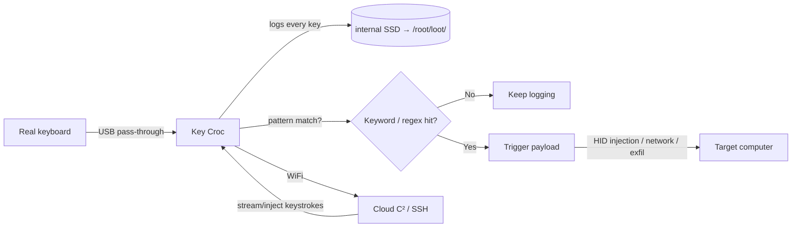

# Key Croc — 完整指南

> **一句話定位**：Key Croc 是一台偽裝成鍵盤轉接頭的「智慧型硬體鍵盤側錄器」——它記錄你打下的每個字，而且當你打出特定關鍵字（例如「密碼」、「password」）時，它會自動觸發預載的攻擊 Payload。

Key Croc 看起來像一個無害的 USB 鍵盤穿透轉接頭。夾在鍵盤和電腦之間，它會安靜地**記錄每一次按鍵**到內部儲存。但它遠不只是側錄器：使用**模式比對**，它監看按鍵串流中感興趣的字詞（一個關鍵字或正規表示式），並在比對到的瞬間觸發預載的**攻擊 payload** — 甚至複製鍵盤的硬體 ID，讓它與一般轉接頭無法區分。

它執行 DuckyScript **2.0**，這是*直譯式*的 — payload 直接從 `payload.txt` 原始碼執行，不需要編譯。搭配 WiFi + Cloud C²，操作者可以從任何地方觀看按鍵、注入按鍵、管理 payload。

> **⚠️ 僅限授權測試。** 鍵盤側錄是整個目錄中侵犯隱私最嚴重的攻擊。只對你自己的系統部署，或取得明確的書面授權。

---

## 規格一覽

| 項目 | 規格 |
|---|---|
| CPU | 四核 ARM Cortex-A7 @ 1.2 GHz |
| 儲存 | 8 GB 桌面級 SSD |
| 介面 | USB-A（host 端）+ USB-A（鍵盤端）+ 序列主控台 |
| 無線 | 內建 2.4 GHz Wi-Fi 天線（802.11 b/g/n） |
| OS | Debian Linux，root shell + SSH |
| Payload 語言 | DuckyScript 2.0（直譯式），外加 Bash |
| 鍵盤側錄 | 開箱即用、零設定 — 記錄到 `/root/loot/keystrokes.log` |
| Cloud C² | 支援 — 串流/注入按鍵、管理 payload、外洩 loot |
| 隱蔽性 | 側錄時 LED 關閉；複製鍵盤硬體 ID |
| 官方文件 | https://docs.hak5.org/key-croc |

## 構造

| 零件 | 用途 |
|---|---|
| USB-A（host 端） | 插進目標電腦 |
| USB-A（鍵盤端） | 真實鍵盤插在這裡（穿透） |
| 隱藏 arming 按鈕 | 插入時按下 → 變成隨身碟 |
| RGB LED | 側錄期間關閉（隱蔽）；設定/攻擊期間亮起 |
| 序列主控台 | 進階操作的完整 root shell |

---

## 資料流



---

## 快速入門 — 30 秒內開始側錄

### 步驟 1 — 不需要設定
Key Croc 開箱即開始側錄。只要：

1. 把 **host** 端插進目標電腦。
2. 把真實鍵盤插進**鍵盤**端。
3. 打字。每一次按鍵都會記錄到 `/root/loot/keystrokes.log`。

### 步驟 2 — 讀取 loot
插入時長按**隱藏 arming 按鈕**（或按住後重新連接），把 Croc 變成隨身碟，然後讀取日誌：

```text
2026-08-21 14:31:02  user typed: root
2026-08-21 14:31:05  user typed: P@ssw0rd
2026-08-21 14:31:10  user typed: https://yupitek.com
```

### 步驟 3 — SSH 進入（arming 模式）
把你的電腦 NIC 設為 `172.16.0.0/24`，然後：

```bash
ip addr add 172.16.0.2/24 dev eth0
# browse to http://172.16.0.1  (web UI)  or
ssh root@172.16.0.1        # password: hak5croc
```

從這裡你可以控制 WiFi、Cloud C² 與 payload。

---

## 模式比對 payload — 殺手級功能

除了側錄，告訴 Croc 在看到某些東西時*採取行動*：

```text
QUACK STRING hello       # DuckyScript 2.0 drops the classic STRING for QUACK
```

**範例 — 打出關鍵字時觸發：**

```text
MATCH_STRING password
QUACK STRING (recorded)
```

當受害者打出「password」（即使有退格修正的錯字），Croc 會：
1. 觸發比對到的 payload。
2. 可以儲存比對*之前*或*之後*打出的按鍵。
3. 觸發 payload — 它可以注入 HID 按鍵、轉向網路，或通知 Cloud C²。

**範例 — 比對到時通知 Cloud C²：**

```text
MATCH_REGEX (api[_-]?key|secret|token)
CLOUD_C2 "Keyword of interest typed!"
```

> **你可能會問：** *「有退格它怎麼還能比對？」* Croc 即時解碼按鍵串流，所以它理解的是打出的*結果*（處理退格），而不是原始按壓。這就是為什麼它的語言檔是單體式、預先產生，以精確解碼整個鍵盤。

---

## 攻擊模式

| 模式 | 模擬什麼 | 用途 |
|---|---|---|
| HID | 鍵盤 | 穿透 + 按鍵注入 |
| Ethernet | USB 網路卡 | 取得目標的網路存取，繞過周邊防火牆 |
| Storage | 隨身碟 | Arming、檔案傳輸 |
| Serial | 序列裝置 | 對主控台/嵌入式系統的巧妙攻擊 |

單一 payload 可以結合多種模式 — Croc 可以同時側錄*並*轉向到網路上。

---

## 進階

| 能力 | 怎麼做 |
|---|---|
| Cloud C² 即時檢視 | 即時串流按鍵；從瀏覽器注入你自己的按鍵 |
| 遠端 root shell | Cloud C² 或 SSH → 完整 Debian，內含 `nmap`、`responder`、`impacket`、`metasploit` |
| 網路轉向 | 模擬 USB 乙太網路 → 攻擊者在網路內取得立足點 |
| 正規表示式觸發 | `MATCH_REGEX` 用於模式，不只是固定關鍵字 |
| WiFi | 2.4 GHz 天線即使在目標桌下也能連到 C²/網路 |
| 直譯式 payload | 把 `payload.txt` 直接丟進正確資料夾 — 不需編譯 |

---

## 疑難排解

| 症狀 | 原因 | 修正 |
|---|---|---|
| 沒有記錄到按鍵 | 鍵盤沒有正確穿透，或 payload 模式 | 重新插好鍵盤；檢查 arming 與側錄狀態 |
| 找不到 arming 按鈕 | 它是隱藏的 | 用迴紋針；插入時按下 |
| `QUACK` 不被辨識 | 在 2.0 裝置上用 DuckyScript 3.0 指令 | Key Croc 是 DuckyScript 2.0 — 用 `QUACK`，不要用 `STRING` |
| Web UI/SSH 連不上 | 子網路錯誤 | 把 NIC 設為 `172.16.0.0/24` 並使用 `172.16.0.1` |
| Cloud C² 連不上 | WiFi 未設定 | 在 arming 模式設定中設定 WiFi；指向你的 C² 伺服器 |

---

## 相關資源

- [USB Rubber Ducky](/hak5/products/usb-rubber-ducky/) — DuckyScript 3.0（編譯式）概念
- [Bash Bunny Mark II](/hak5/products/bash-bunny-mark-ii/) — 多向量 USB 攻擊
- [Malicious Cable Detector](/hak5/products/malicious-cable-detector/) — 找出這類側錄器的防禦工具
- [韌體與下載](/hak5/firmware-downloads/) — keycroc payload 倉庫與韌體
- [疑難排解索引](/hak5/troubleshooting-index/)
- [Hak5 總覽](/hak5/)